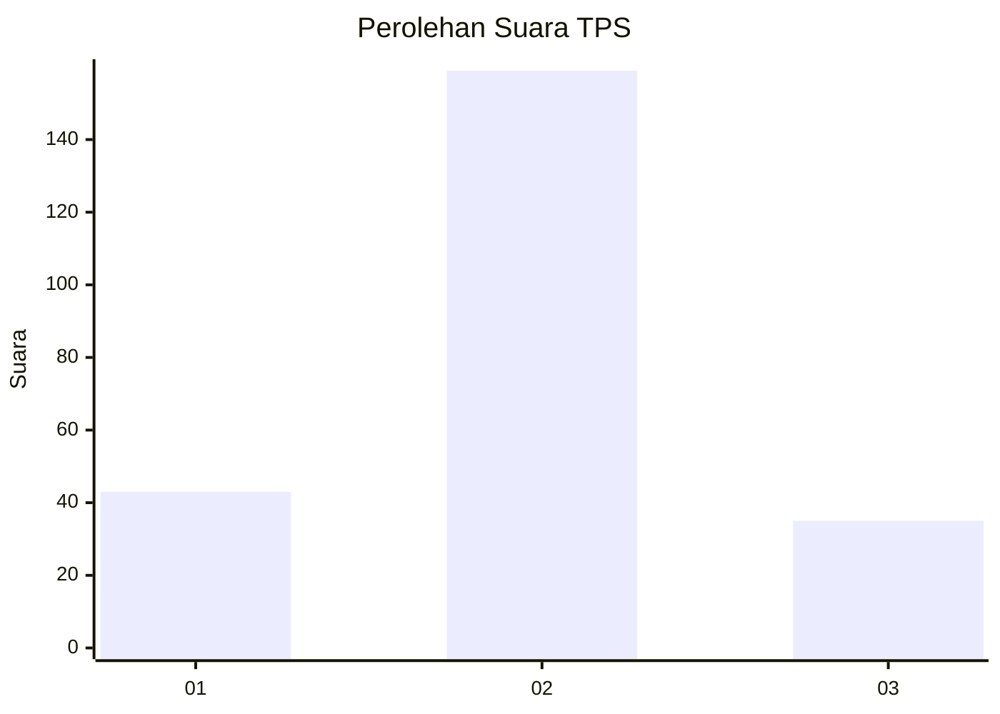
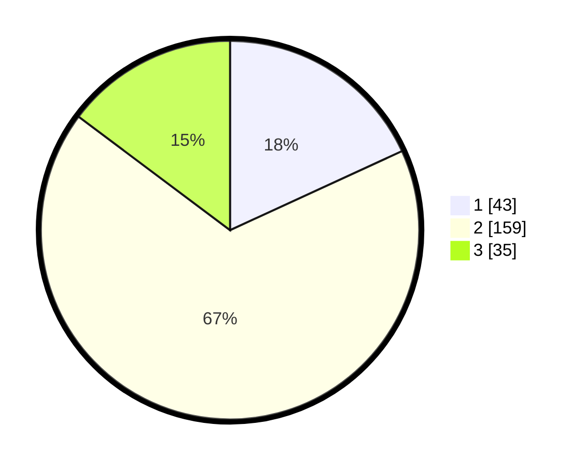

# Hasil

## Grafik

## Tabel

| No. | Nama Paslon    | Suara | Suara (raw) | Persentase |
|:--- |:-------------- | -----:| -----------:| ----------:|
| 1   | ANIES MUHAIMIN | 43    | [43][p-1]   | 18,14      |
| 2   | PRABOWO GIBRAN | 159   | [159][p-2]  | 67,09      |
| 3   | GANJAR MAHFUD  | 35    | [35][p-3]   | 14,77      |

[p-1]: https://github.com/gigit-pemilu/pemilu-2024-35-jawa-timur/blob/main/pilpres/hitung-suara/sub/35-jawa-timur/sub/07-malang/sub/19-pakisaji/sub/2003-gelanggang/sub/007-tps/sub/paslon-1.txt
[p-2]: https://github.com/gigit-pemilu/pemilu-2024-35-jawa-timur/blob/main/pilpres/hitung-suara/sub/35-jawa-timur/sub/07-malang/sub/19-pakisaji/sub/2003-gelanggang/sub/007-tps/sub/paslon-2.txt
[p-3]: https://github.com/gigit-pemilu/pemilu-2024-35-jawa-timur/blob/main/pilpres/hitung-suara/sub/35-jawa-timur/sub/07-malang/sub/19-pakisaji/sub/2003-gelanggang/sub/007-tps/sub/paslon-3.txt

## Foto C Plano

https://sirekap-obj-formc.kpu.go.id/58d0/pemilu/ppwp/35/07/19/20/03/3507192003007-20240304-194905--8656f472-b89c-4885-b61d-d55bb8478eb6.jpg

https://sirekap-obj-formc.kpu.go.id/58d0/pemilu/ppwp/35/07/19/20/03/3507192003007-20240214-204904--5df62669-6faa-4ca0-b525-67ab21e86169.jpg

https://sirekap-obj-formc.kpu.go.id/58d0/pemilu/ppwp/35/07/19/20/03/3507192003007-20240304-194920--856d4a07-cc9b-4637-a582-a5eeddd2be06.jpg

## Metadata

| Key        | Value               |
| ---------- | ------------------- |
| Time Stamp | 2024-03-04 20:00:00 |

