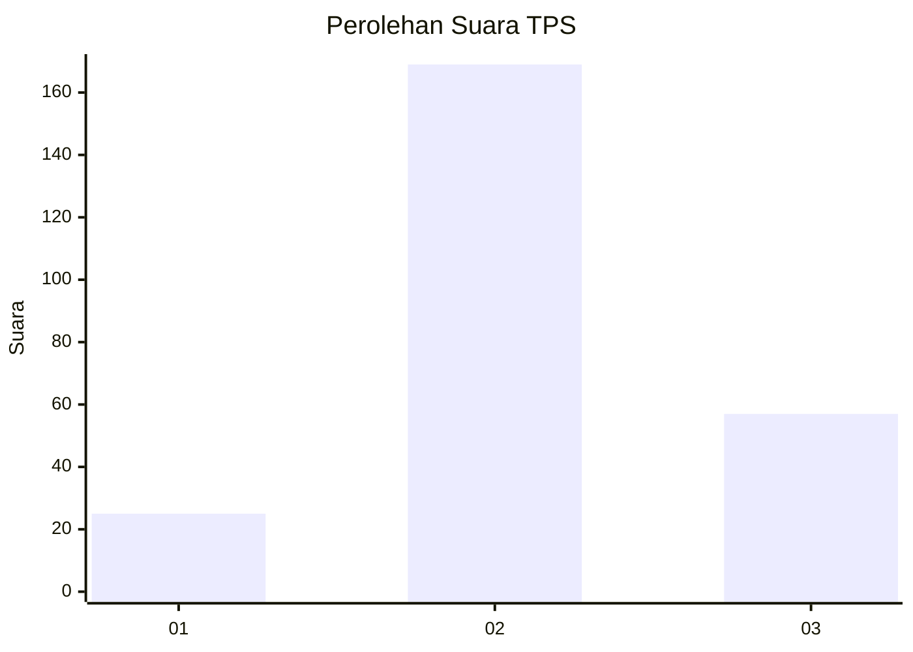
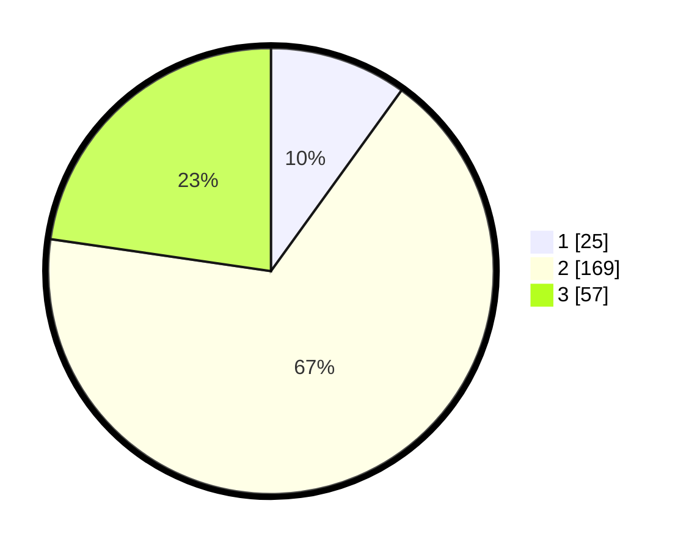

# Hasil

## Grafik

## Tabel

| No. | Nama Paslon    | Suara | Suara (raw) | Persentase |
|:--- |:-------------- | -----:| -----------:| ----------:|
| 1   | ANIES MUHAIMIN | 25    | [25][p-1]   | 9,96       |
| 2   | PRABOWO GIBRAN | 169   | [169][p-2]  | 67,33      |
| 3   | GANJAR MAHFUD  | 57    | [57][p-3]   | 22,71      |

[p-1]: https://github.com/gigit-pemilu/pemilu-2024/blob/main/pilpres/hitung-suara/sub/35-jawa-timur/sub/07-malang/sub/19-pakisaji/sub/2004-wonokerso/sub/009-tps/sub/paslon-1.txt
[p-2]: https://github.com/gigit-pemilu/pemilu-2024/blob/main/pilpres/hitung-suara/sub/35-jawa-timur/sub/07-malang/sub/19-pakisaji/sub/2004-wonokerso/sub/009-tps/sub/paslon-2.txt
[p-3]: https://github.com/gigit-pemilu/pemilu-2024/blob/main/pilpres/hitung-suara/sub/35-jawa-timur/sub/07-malang/sub/19-pakisaji/sub/2004-wonokerso/sub/009-tps/sub/paslon-3.txt

## Foto C Plano

https://sirekap-obj-formc.kpu.go.id/fe0c/pemilu/ppwp/35/07/19/20/04/3507192004009-20240214-155252--1f684795-3c0b-43af-b65a-be6f5e5db360.jpg

https://sirekap-obj-formc.kpu.go.id/fe0c/pemilu/ppwp/35/07/19/20/04/3507192004009-20240214-160058--146400b3-686d-4318-8c80-50c5bf1e7dd1.jpg

## Metadata

| Key        | Value               |
| ---------- | ------------------- |
| Time Stamp | 2024-02-24 22:31:28 |

