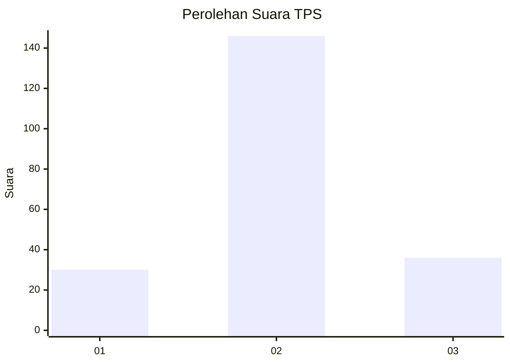
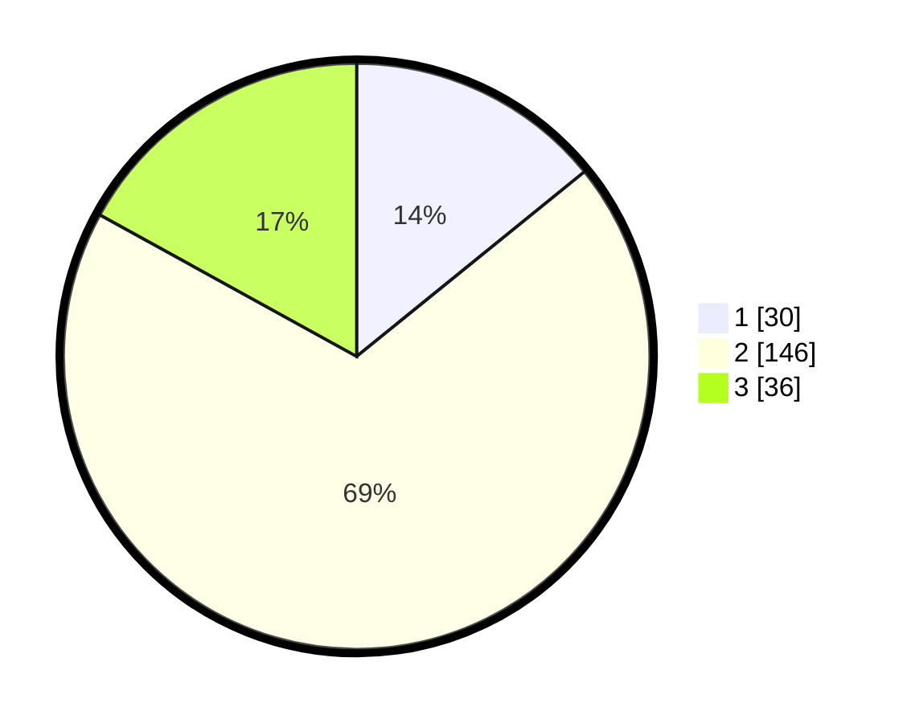

# Hasil

## Grafik

## Tabel

| No. | Nama Paslon    | Suara | Suara (raw) | Persentase |
|:--- |:-------------- | -----:| -----------:| ----------:|
| 1   | ANIES MUHAIMIN | 30    | [30][p-1]   | 14,15      |
| 2   | PRABOWO GIBRAN | 146   | [146][p-2]  | 68,87      |
| 3   | GANJAR MAHFUD  | 36    | [36][p-3]   | 16,98      |

[p-1]: https://github.com/gigit-pemilu/pemilu-2024-35-jawa-timur/blob/main/pilpres/hitung-suara/sub/35-jawa-timur/sub/07-malang/sub/19-pakisaji/sub/2005-karangduren/sub/002-tps/sub/paslon-1.txt
[p-2]: https://github.com/gigit-pemilu/pemilu-2024-35-jawa-timur/blob/main/pilpres/hitung-suara/sub/35-jawa-timur/sub/07-malang/sub/19-pakisaji/sub/2005-karangduren/sub/002-tps/sub/paslon-2.txt
[p-3]: https://github.com/gigit-pemilu/pemilu-2024-35-jawa-timur/blob/main/pilpres/hitung-suara/sub/35-jawa-timur/sub/07-malang/sub/19-pakisaji/sub/2005-karangduren/sub/002-tps/sub/paslon-3.txt

## Foto C Plano

https://sirekap-obj-formc.kpu.go.id/da48/pemilu/ppwp/35/07/19/20/05/3507192005002-20240304-200210--12c5a43a-e956-4e6f-9703-30fcfcb5f154.jpg

https://sirekap-obj-formc.kpu.go.id/da48/pemilu/ppwp/35/07/19/20/05/3507192005002-20240215-022823--f376abf1-3481-4d0c-bbd8-ac0e0d65e604.jpg

https://sirekap-obj-formc.kpu.go.id/da48/pemilu/ppwp/35/07/19/20/05/3507192005002-20240215-032707--987bfab0-0908-4249-ac0d-7286cc6e3401.jpg

## Metadata

| Key        | Value               |
| ---------- | ------------------- |
| Time Stamp | 2024-03-04 21:00:00 |

