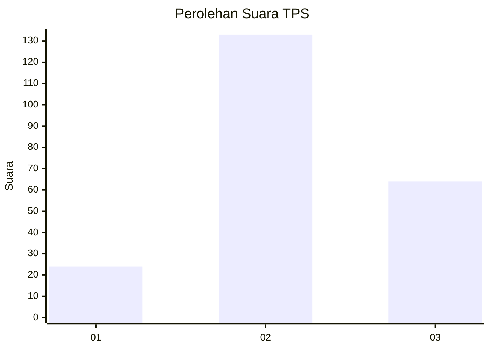
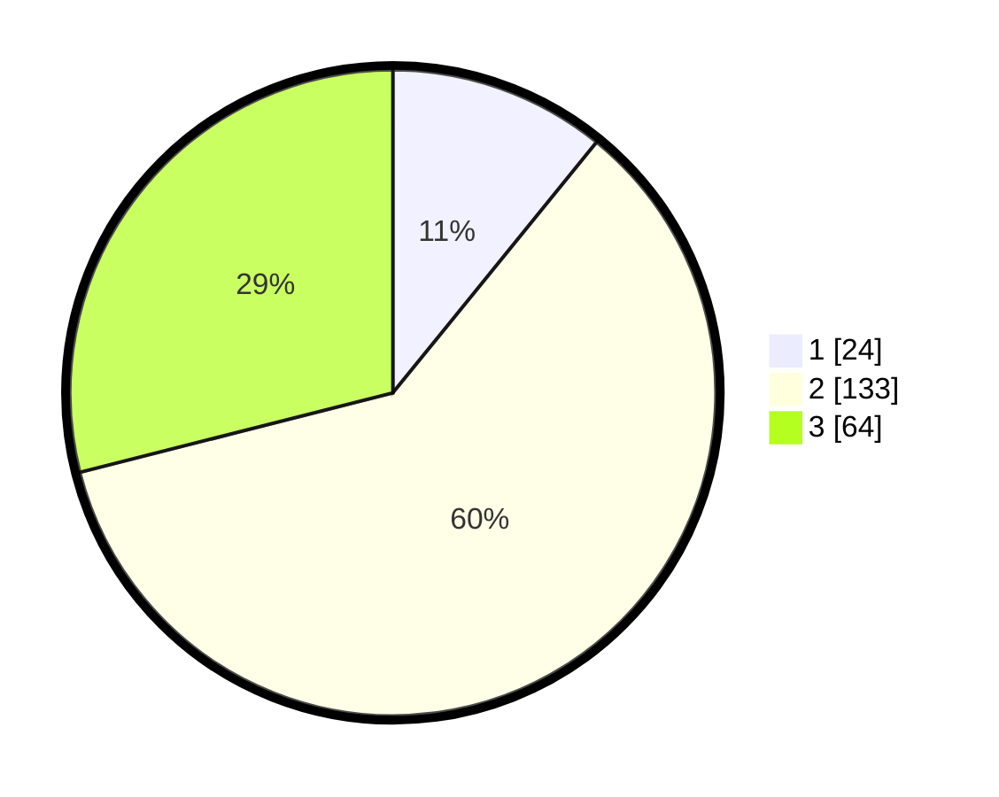

# Hasil

## Grafik

## Tabel

| No. | Nama Paslon    | Suara | Suara (raw) | Persentase |
|:--- |:-------------- | -----:| -----------:| ----------:|
| 1   | ANIES MUHAIMIN | 24    | [24][p-1]   | 10,86      |
| 2   | PRABOWO GIBRAN | 133   | [133][p-2]  | 60,18      |
| 3   | GANJAR MAHFUD  | 64    | [64][p-3]   | 28,96      |

[p-1]: https://github.com/gigit-pemilu/pemilu-2024/blob/main/pilpres/hitung-suara/sub/35-jawa-timur/sub/07-malang/sub/19-pakisaji/sub/2005-karangduren/sub/003-tps/sub/paslon-1.txt
[p-2]: https://github.com/gigit-pemilu/pemilu-2024/blob/main/pilpres/hitung-suara/sub/35-jawa-timur/sub/07-malang/sub/19-pakisaji/sub/2005-karangduren/sub/003-tps/sub/paslon-2.txt
[p-3]: https://github.com/gigit-pemilu/pemilu-2024/blob/main/pilpres/hitung-suara/sub/35-jawa-timur/sub/07-malang/sub/19-pakisaji/sub/2005-karangduren/sub/003-tps/sub/paslon-3.txt

## Foto C Plano

https://sirekap-obj-formc.kpu.go.id/60b3/pemilu/ppwp/35/07/19/20/05/3507192005003-20240304-200300--dc3e563f-21c6-4d03-8dbf-9da40b934b3c.jpg

https://sirekap-obj-formc.kpu.go.id/60b3/pemilu/ppwp/35/07/19/20/05/3507192005003-20240218-182842--6e078ea4-52ef-4d31-8da8-47e65a5c7ad5.jpg

https://sirekap-obj-formc.kpu.go.id/60b3/pemilu/ppwp/35/07/19/20/05/3507192005003-20240218-182902--732a7bbc-9642-4927-bb9b-909353feb983.jpg

## Metadata

| Key        | Value               |
| ---------- | ------------------- |
| Time Stamp | 2024-03-04 21:00:00 |

