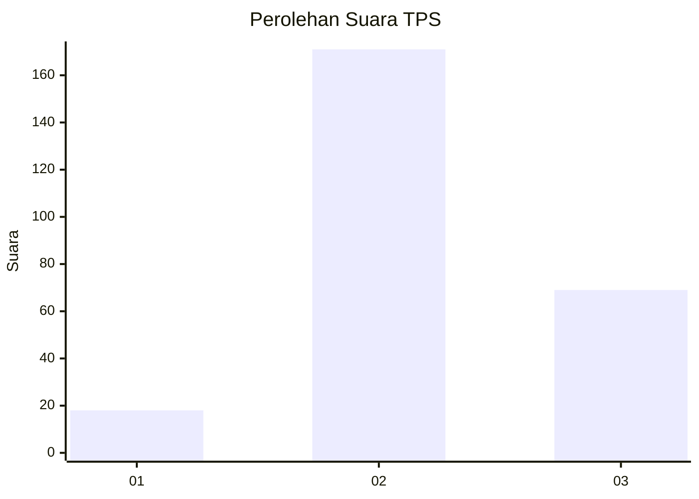

# Hasil

## Grafik

## Tabel

| No. | Nama Paslon    | Suara | Suara (raw) | Persentase |
|:--- |:-------------- | -----:| -----------:| ----------:|
| 1   | ANIES MUHAIMIN | 18    | [18][p-1]   | 6,98       |
| 2   | PRABOWO GIBRAN | 171   | [171][p-2]  | 66,28      |
| 3   | GANJAR MAHFUD  | 69    | [69][p-3]   | 26,74      |

[p-1]: https://github.com/gigit-pemilu/pemilu-2024-35-jawa-timur/blob/main/pilpres/hitung-suara/sub/35-jawa-timur/sub/07-malang/sub/19-pakisaji/sub/2005-karangduren/sub/014-tps/sub/paslon-1.txt
[p-2]: https://github.com/gigit-pemilu/pemilu-2024-35-jawa-timur/blob/main/pilpres/hitung-suara/sub/35-jawa-timur/sub/07-malang/sub/19-pakisaji/sub/2005-karangduren/sub/014-tps/sub/paslon-2.txt
[p-3]: https://github.com/gigit-pemilu/pemilu-2024-35-jawa-timur/blob/main/pilpres/hitung-suara/sub/35-jawa-timur/sub/07-malang/sub/19-pakisaji/sub/2005-karangduren/sub/014-tps/sub/paslon-3.txt

## Foto C Plano

https://sirekap-obj-formc.kpu.go.id/829a/pemilu/ppwp/35/07/19/20/05/3507192005014-20240214-211724--0cc0bf3b-cdbb-4087-a456-83051da80d34.jpg

https://sirekap-obj-formc.kpu.go.id/829a/pemilu/ppwp/35/07/19/20/05/3507192005014-20240215-013428--b9349db3-f5df-47ad-98b0-14bb9499a91d.jpg

https://sirekap-obj-formc.kpu.go.id/829a/pemilu/ppwp/35/07/19/20/05/3507192005014-20240304-201005--c9bd6fc8-9a48-40e7-8c60-5cf07adb8eae.jpg

## Metadata

| Key        | Value               |
| ---------- | ------------------- |
| Time Stamp | 2024-03-04 21:00:00 |

