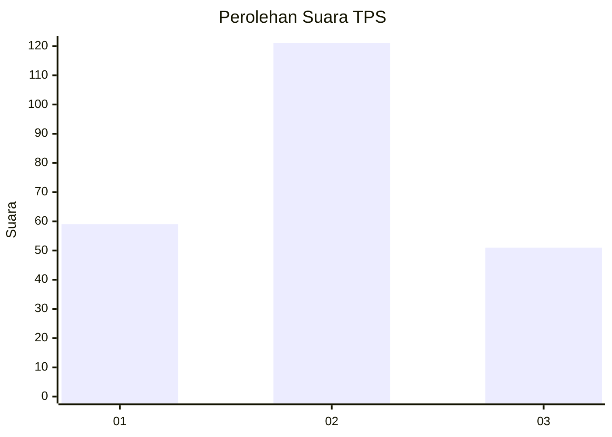
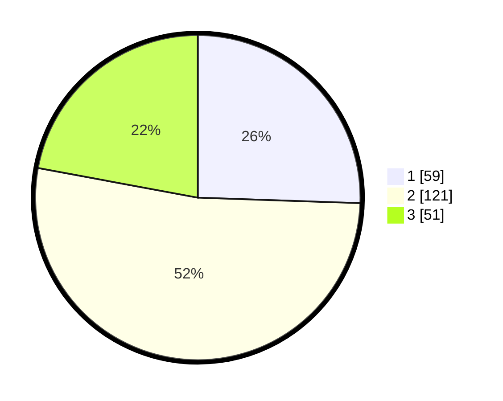

# Hasil

## Grafik

## Tabel

| No. | Nama Paslon    | Suara | Suara (raw) | Persentase |
|:--- |:-------------- | -----:| -----------:| ----------:|
| 1   | ANIES MUHAIMIN | 59    | [59][p-1]   | 25,54      |
| 2   | PRABOWO GIBRAN | 121   | [121][p-2]  | 52,38      |
| 3   | GANJAR MAHFUD  | 51    | [51][p-3]   | 22,08      |

[p-1]: https://github.com/gigit-pemilu/pemilu-2024/blob/main/pilpres/hitung-suara/sub/35-jawa-timur/sub/07-malang/sub/19-pakisaji/sub/2007-pakisaji/sub/002-tps/sub/paslon-1.txt
[p-2]: https://github.com/gigit-pemilu/pemilu-2024/blob/main/pilpres/hitung-suara/sub/35-jawa-timur/sub/07-malang/sub/19-pakisaji/sub/2007-pakisaji/sub/002-tps/sub/paslon-2.txt
[p-3]: https://github.com/gigit-pemilu/pemilu-2024/blob/main/pilpres/hitung-suara/sub/35-jawa-timur/sub/07-malang/sub/19-pakisaji/sub/2007-pakisaji/sub/002-tps/sub/paslon-3.txt

## Foto C Plano

https://sirekap-obj-formc.kpu.go.id/eb3f/pemilu/ppwp/35/07/19/20/07/3507192007002-20240304-202002--c198a92c-1ed2-4ca9-8a9e-d5f0e36ec21c.jpg

https://sirekap-obj-formc.kpu.go.id/eb3f/pemilu/ppwp/35/07/19/20/07/3507192007002-20240214-211523--70a0458e-431a-4331-b410-bf3984ca452f.jpg

https://sirekap-obj-formc.kpu.go.id/eb3f/pemilu/ppwp/35/07/19/20/07/3507192007002-20240214-211545--7c63dc91-2a40-46ca-9161-8555490c98d1.jpg

## Metadata

| Key        | Value               |
| ---------- | ------------------- |
| Time Stamp | 2024-03-04 21:00:00 |

