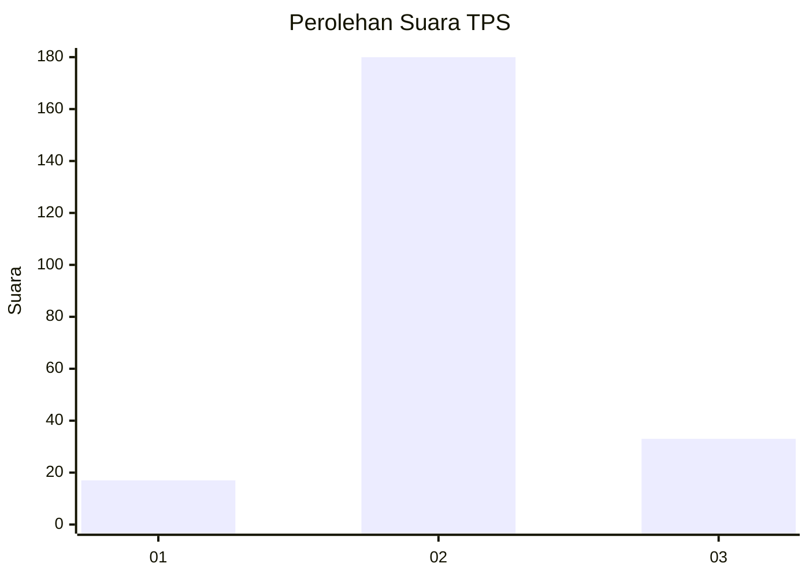

# Hasil

## Grafik

## Tabel

| No. | Nama Paslon    | Suara | Suara (raw) | Persentase |
|:--- |:-------------- | -----:| -----------:| ----------:|
| 1   | ANIES MUHAIMIN | 17    | [17][p-1]   | 7,39       |
| 2   | PRABOWO GIBRAN | 180   | [180][p-2]  | 78,26      |
| 3   | GANJAR MAHFUD  | 33    | [33][p-3]   | 14,35      |

[p-1]: https://github.com/gigit-pemilu/pemilu-2024/blob/main/pilpres/hitung-suara/sub/35-jawa-timur/sub/07-malang/sub/19-pakisaji/sub/2007-pakisaji/sub/017-tps/sub/paslon-1.txt
[p-2]: https://github.com/gigit-pemilu/pemilu-2024/blob/main/pilpres/hitung-suara/sub/35-jawa-timur/sub/07-malang/sub/19-pakisaji/sub/2007-pakisaji/sub/017-tps/sub/paslon-2.txt
[p-3]: https://github.com/gigit-pemilu/pemilu-2024/blob/main/pilpres/hitung-suara/sub/35-jawa-timur/sub/07-malang/sub/19-pakisaji/sub/2007-pakisaji/sub/017-tps/sub/paslon-3.txt

## Foto C Plano

https://sirekap-obj-formc.kpu.go.id/2385/pemilu/ppwp/35/07/19/20/07/3507192007017-20240304-202406--646308c0-e976-461f-80aa-5f3d46d16db5.jpg

https://sirekap-obj-formc.kpu.go.id/2385/pemilu/ppwp/35/07/19/20/07/3507192007017-20240217-143451--54d69f7c-80fc-447a-9159-c3fe33b2fab4.jpg

https://sirekap-obj-formc.kpu.go.id/2385/pemilu/ppwp/35/07/19/20/07/3507192007017-20240217-143048--8371527e-219f-4942-9227-895f61482745.jpg

## Metadata

| Key        | Value               |
| ---------- | ------------------- |
| Time Stamp | 2024-03-04 21:00:00 |

