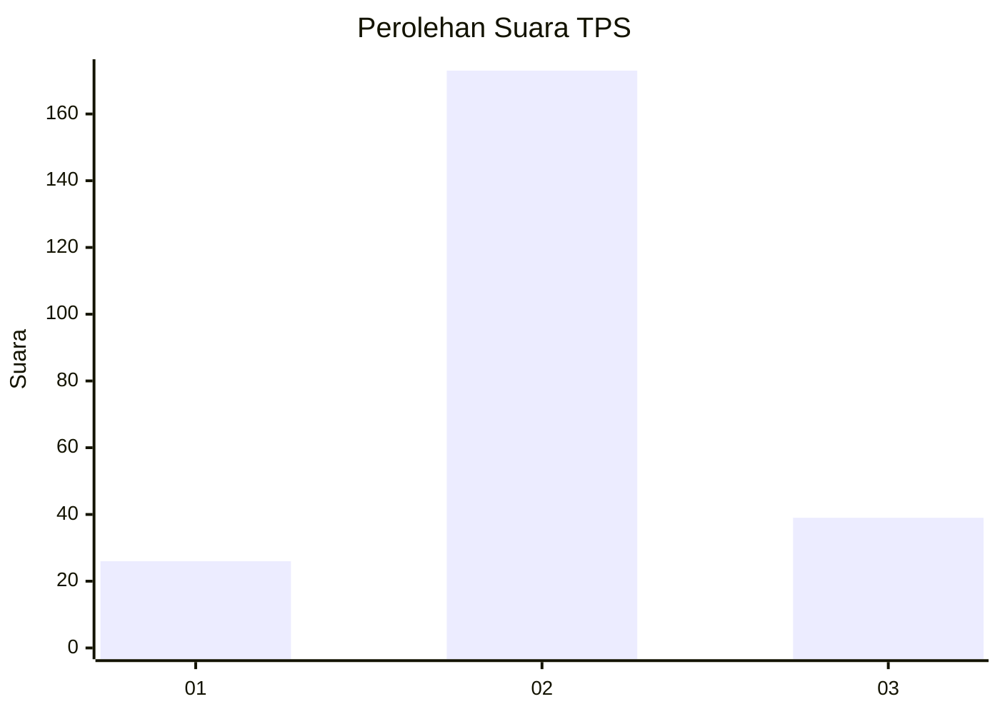
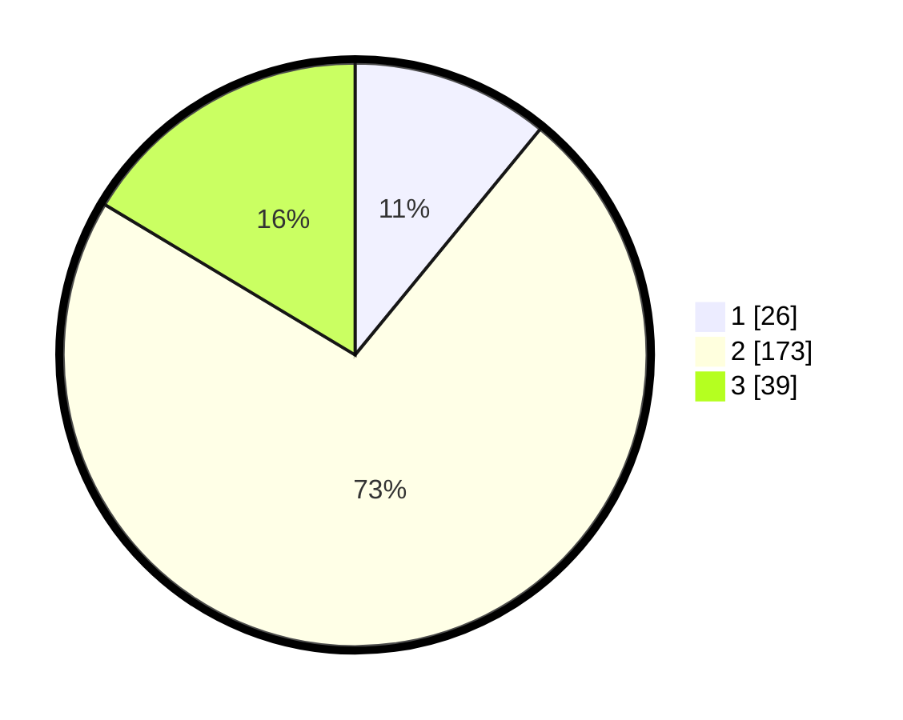

# Hasil

## Grafik

## Tabel

| No. | Nama Paslon    | Suara | Suara (raw) | Persentase |
|:--- |:-------------- | -----:| -----------:| ----------:|
| 1   | ANIES MUHAIMIN | 26    | [26][p-1]   | 10,92      |
| 2   | PRABOWO GIBRAN | 173   | [173][p-2]  | 72,69      |
| 3   | GANJAR MAHFUD  | 39    | [39][p-3]   | 16,39      |

[p-1]: https://github.com/gigit-pemilu/pemilu-2024-35-jawa-timur/blob/main/pilpres/hitung-suara/sub/35-jawa-timur/sub/07-malang/sub/19-pakisaji/sub/2007-pakisaji/sub/019-tps/sub/paslon-1.txt
[p-2]: https://github.com/gigit-pemilu/pemilu-2024-35-jawa-timur/blob/main/pilpres/hitung-suara/sub/35-jawa-timur/sub/07-malang/sub/19-pakisaji/sub/2007-pakisaji/sub/019-tps/sub/paslon-2.txt
[p-3]: https://github.com/gigit-pemilu/pemilu-2024-35-jawa-timur/blob/main/pilpres/hitung-suara/sub/35-jawa-timur/sub/07-malang/sub/19-pakisaji/sub/2007-pakisaji/sub/019-tps/sub/paslon-3.txt

## Foto C Plano

https://sirekap-obj-formc.kpu.go.id/4987/pemilu/ppwp/35/07/19/20/07/3507192007019-20240214-233749--507e6325-ca47-4353-89a8-f25991624c89.jpg

https://sirekap-obj-formc.kpu.go.id/4987/pemilu/ppwp/35/07/19/20/07/3507192007019-20240214-233757--3c1a08fe-3cee-47cb-99a7-1848d1f07380.jpg

https://sirekap-obj-formc.kpu.go.id/4987/pemilu/ppwp/35/07/19/20/07/3507192007019-20240214-233802--3e9752d4-30e4-4274-a7d5-6139e8208dfa.jpg

## Metadata

| Key        | Value               |
| ---------- | ------------------- |
| Time Stamp | 2024-02-25 21:00:00 |

