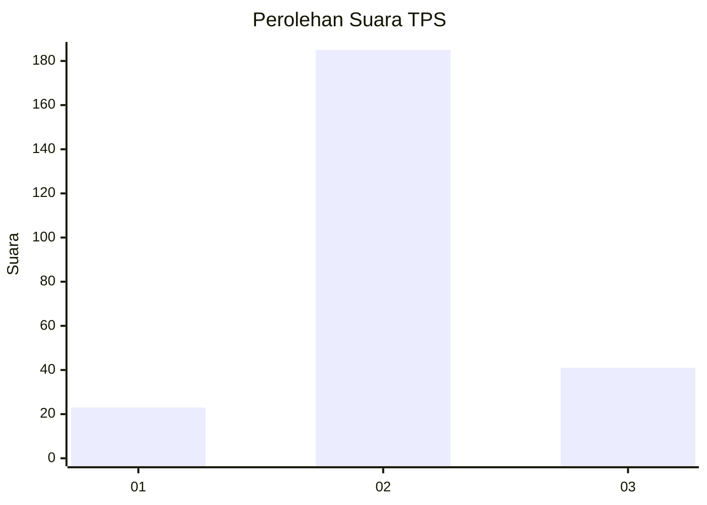
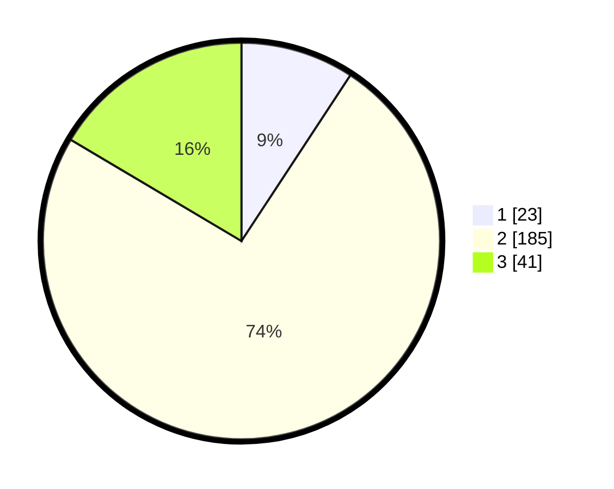

# Hasil

## Grafik

## Tabel

| No. | Nama Paslon    | Suara | Suara (raw) | Persentase |
|:--- |:-------------- | -----:| -----------:| ----------:|
| 1   | ANIES MUHAIMIN | 23    | [23][p-1]   | 9,24       |
| 2   | PRABOWO GIBRAN | 185   | [185][p-2]  | 74,30      |
| 3   | GANJAR MAHFUD  | 41    | [41][p-3]   | 16,47      |

[p-1]: https://github.com/gigit-pemilu/pemilu-2024/blob/main/pilpres/hitung-suara/sub/35-jawa-timur/sub/07-malang/sub/19-pakisaji/sub/2008-jatisari/sub/007-tps/sub/paslon-1.txt
[p-2]: https://github.com/gigit-pemilu/pemilu-2024/blob/main/pilpres/hitung-suara/sub/35-jawa-timur/sub/07-malang/sub/19-pakisaji/sub/2008-jatisari/sub/007-tps/sub/paslon-2.txt
[p-3]: https://github.com/gigit-pemilu/pemilu-2024/blob/main/pilpres/hitung-suara/sub/35-jawa-timur/sub/07-malang/sub/19-pakisaji/sub/2008-jatisari/sub/007-tps/sub/paslon-3.txt

## Foto C Plano

https://sirekap-obj-formc.kpu.go.id/fe81/pemilu/ppwp/35/07/19/20/08/3507192008007-20240215-121047--eadbe5a7-d2ec-41c3-88eb-243ff3a42f1f.jpg

https://sirekap-obj-formc.kpu.go.id/fe81/pemilu/ppwp/35/07/19/20/08/3507192008007-20240215-121052--ff210a9b-8e45-42c4-9e00-12c80ea89f00.jpg

https://sirekap-obj-formc.kpu.go.id/fe81/pemilu/ppwp/35/07/19/20/08/3507192008007-20240304-195441--43d23ec1-fda1-401f-b6d3-eb648fcd4865.jpg

## Metadata

| Key        | Value               |
| ---------- | ------------------- |
| Time Stamp | 2024-03-04 20:00:00 |

