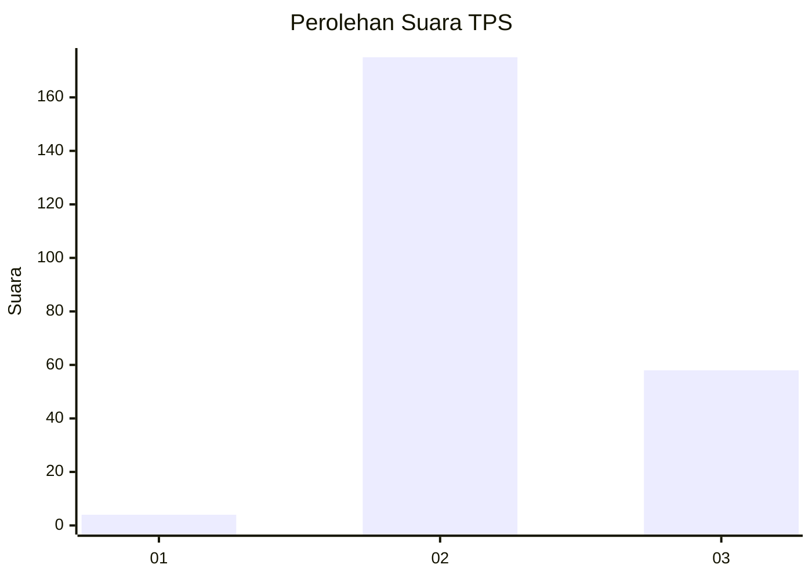
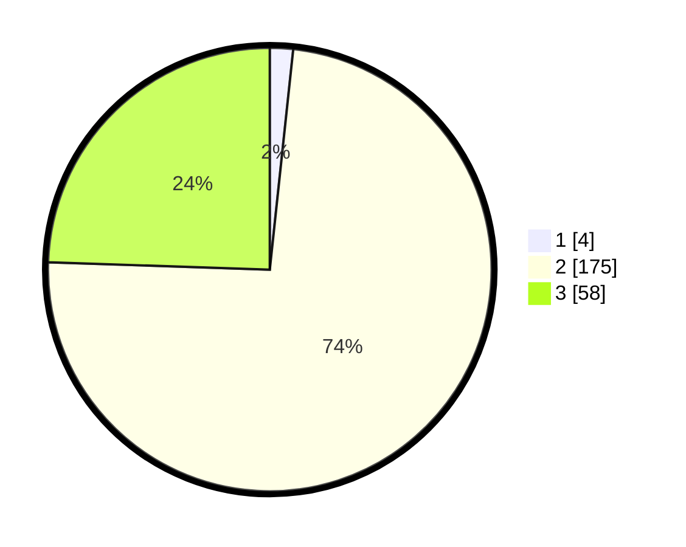

# Hasil

## Grafik

## Tabel

| No. | Nama Paslon    | Suara | Suara (raw) | Persentase |
|:--- |:-------------- | -----:| -----------:| ----------:|
| 1   | ANIES MUHAIMIN | 4     | [4][p-1]    | 1,69       |
| 2   | PRABOWO GIBRAN | 175   | [175][p-2]  | 73,84      |
| 3   | GANJAR MAHFUD  | 58    | [58][p-3]   | 24,47      |

[p-1]: https://github.com/gigit-pemilu/pemilu-2024-35-jawa-timur/blob/main/pilpres/hitung-suara/sub/35-jawa-timur/sub/07-malang/sub/19-pakisaji/sub/2008-jatisari/sub/012-tps/sub/paslon-1.txt
[p-2]: https://github.com/gigit-pemilu/pemilu-2024-35-jawa-timur/blob/main/pilpres/hitung-suara/sub/35-jawa-timur/sub/07-malang/sub/19-pakisaji/sub/2008-jatisari/sub/012-tps/sub/paslon-2.txt
[p-3]: https://github.com/gigit-pemilu/pemilu-2024-35-jawa-timur/blob/main/pilpres/hitung-suara/sub/35-jawa-timur/sub/07-malang/sub/19-pakisaji/sub/2008-jatisari/sub/012-tps/sub/paslon-3.txt

## Foto C Plano

https://sirekap-obj-formc.kpu.go.id/d51e/pemilu/ppwp/35/07/19/20/08/3507192008012-20240214-185409--31ec59a2-6514-462c-b28a-6a362cf53d80.jpg

https://sirekap-obj-formc.kpu.go.id/d51e/pemilu/ppwp/35/07/19/20/08/3507192008012-20240214-185415--664824d5-f21f-4ddd-bcef-72e55c475d3e.jpg

https://sirekap-obj-formc.kpu.go.id/d51e/pemilu/ppwp/35/07/19/20/08/3507192008012-20240304-195552--5fc79c55-3f3f-479b-a255-c5f222b74736.jpg

## Metadata

| Key        | Value               |
| ---------- | ------------------- |
| Time Stamp | 2024-03-04 20:00:00 |

