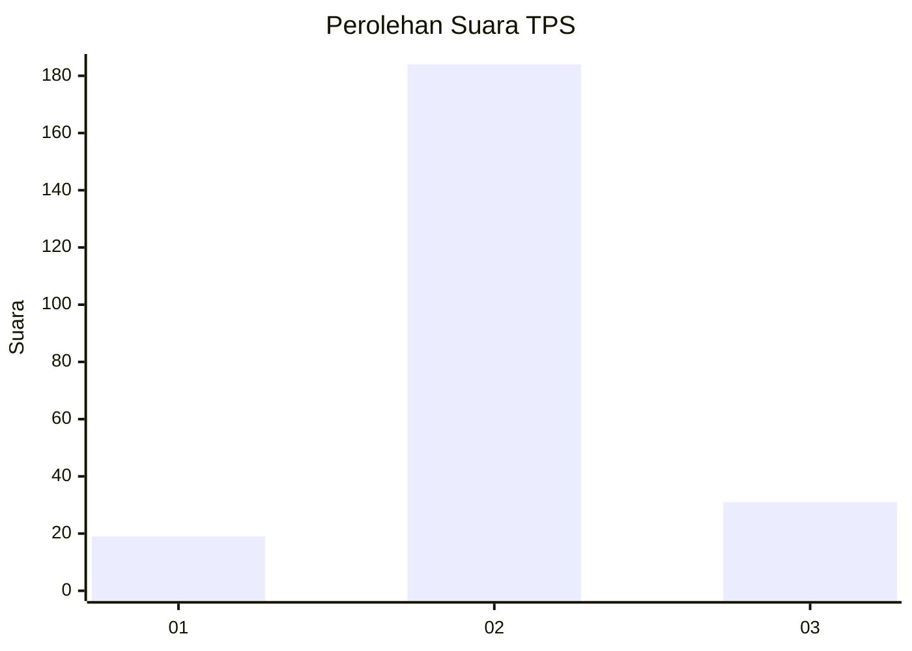
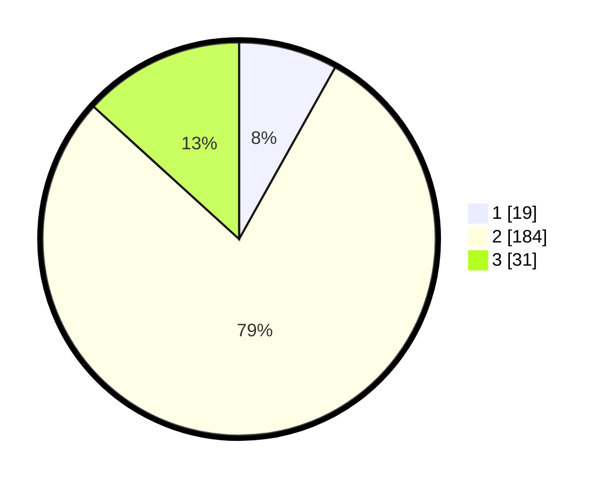

# Hasil

## Grafik

## Tabel

| No. | Nama Paslon    | Suara | Suara (raw) | Persentase |
|:--- |:-------------- | -----:| -----------:| ----------:|
| 1   | ANIES MUHAIMIN | 19    | [19][p-1]   | 8,12       |
| 2   | PRABOWO GIBRAN | 184   | [184][p-2]  | 78,63      |
| 3   | GANJAR MAHFUD  | 31    | [31][p-3]   | 13,25      |

[p-1]: https://github.com/gigit-pemilu/pemilu-2024/blob/main/pilpres/hitung-suara/sub/35-jawa-timur/sub/07-malang/sub/19-pakisaji/sub/2008-jatisari/sub/014-tps/sub/paslon-1.txt
[p-2]: https://github.com/gigit-pemilu/pemilu-2024/blob/main/pilpres/hitung-suara/sub/35-jawa-timur/sub/07-malang/sub/19-pakisaji/sub/2008-jatisari/sub/014-tps/sub/paslon-2.txt
[p-3]: https://github.com/gigit-pemilu/pemilu-2024/blob/main/pilpres/hitung-suara/sub/35-jawa-timur/sub/07-malang/sub/19-pakisaji/sub/2008-jatisari/sub/014-tps/sub/paslon-3.txt

## Foto C Plano

https://sirekap-obj-formc.kpu.go.id/6ccc/pemilu/ppwp/35/07/19/20/08/3507192008014-20240304-200000--88390813-65d2-4f16-adc2-a4bdc0f5239e.jpg

https://sirekap-obj-formc.kpu.go.id/6ccc/pemilu/ppwp/35/07/19/20/08/3507192008014-20240215-003537--421048d6-2063-4fb9-95b2-68e6a526bb19.jpg

https://sirekap-obj-formc.kpu.go.id/6ccc/pemilu/ppwp/35/07/19/20/08/3507192008014-20240215-003628--78927ec3-ac89-4b49-8192-5a3893eb4daf.jpg

## Metadata

| Key        | Value               |
| ---------- | ------------------- |
| Time Stamp | 2024-03-04 21:00:00 |

