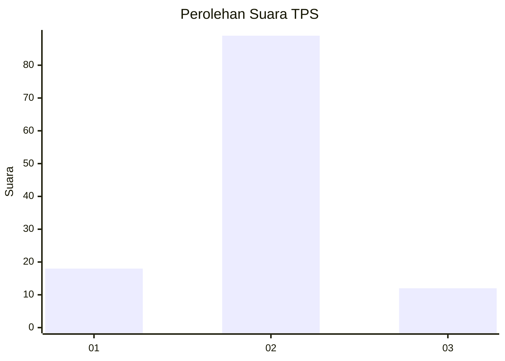
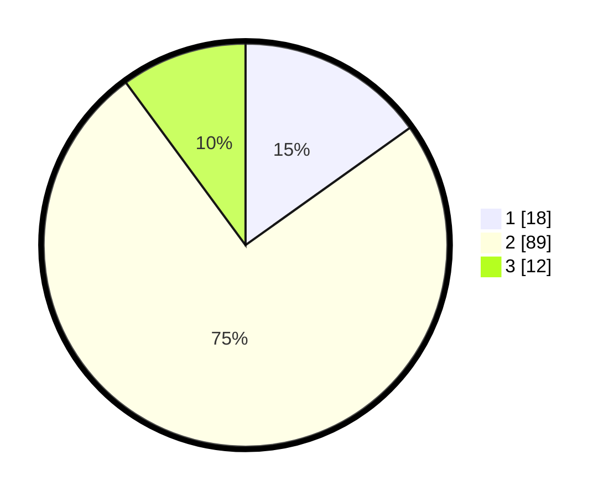

# Hasil

## Grafik

## Tabel

| No. | Nama Paslon    | Suara | Suara (raw) | Persentase |
|:--- |:-------------- | -----:| -----------:| ----------:|
| 1   | ANIES MUHAIMIN | 18    | [18][p-1]   | 15,13      |
| 2   | PRABOWO GIBRAN | 89    | [89][p-2]   | 74,79      |
| 3   | GANJAR MAHFUD  | 12    | [12][p-3]   | 10,08      |

[p-1]: https://github.com/gigit-pemilu/pemilu-2024/blob/main/pilpres/hitung-suara/sub/35-jawa-timur/sub/07-malang/sub/19-pakisaji/sub/2008-jatisari/sub/016-tps/sub/paslon-1.txt
[p-2]: https://github.com/gigit-pemilu/pemilu-2024/blob/main/pilpres/hitung-suara/sub/35-jawa-timur/sub/07-malang/sub/19-pakisaji/sub/2008-jatisari/sub/016-tps/sub/paslon-2.txt
[p-3]: https://github.com/gigit-pemilu/pemilu-2024/blob/main/pilpres/hitung-suara/sub/35-jawa-timur/sub/07-malang/sub/19-pakisaji/sub/2008-jatisari/sub/016-tps/sub/paslon-3.txt

## Foto C Plano

https://sirekap-obj-formc.kpu.go.id/e2c7/pemilu/ppwp/35/07/19/20/08/3507192008016-20240304-200031--7bec0298-f24a-4cf4-b24c-2569755288c6.jpg

https://sirekap-obj-formc.kpu.go.id/e2c7/pemilu/ppwp/35/07/19/20/08/3507192008016-20240219-195812--45b97ee1-0685-4cf5-8c72-20297266ec75.jpg

https://sirekap-obj-formc.kpu.go.id/e2c7/pemilu/ppwp/35/07/19/20/08/3507192008016-20240304-200050--bbed08b8-d3fe-49d1-aa1b-8585e5c349db.jpg

## Metadata

| Key        | Value               |
| ---------- | ------------------- |
| Time Stamp | 2024-03-04 21:00:00 |

