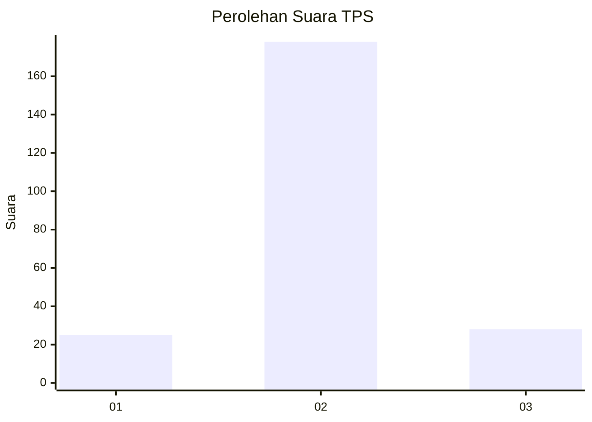
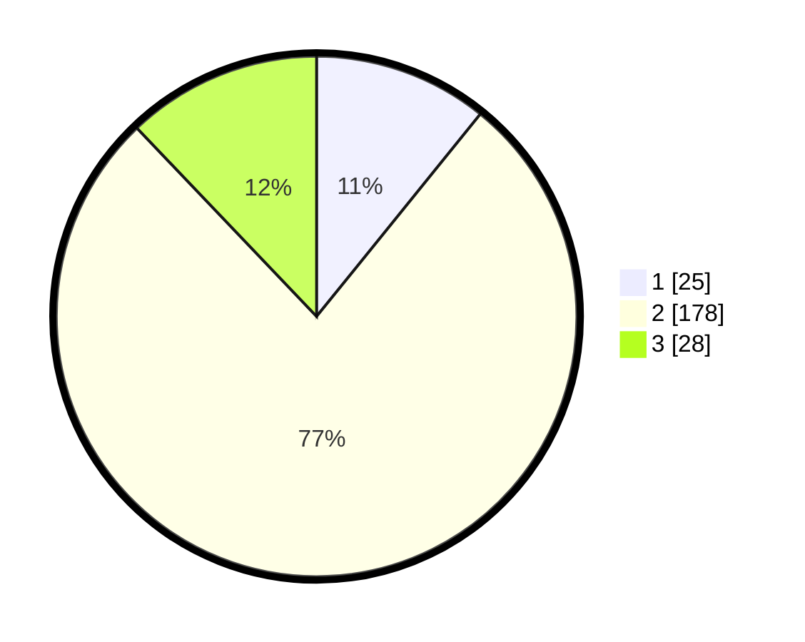

# Hasil

## Grafik

## Tabel

| No. | Nama Paslon    | Suara | Suara (raw) | Persentase |
|:--- |:-------------- | -----:| -----------:| ----------:|
| 1   | ANIES MUHAIMIN | 25    | [25][p-1]   | 10,82      |
| 2   | PRABOWO GIBRAN | 178   | [178][p-2]  | 77,06      |
| 3   | GANJAR MAHFUD  | 28    | [28][p-3]   | 12,12      |

[p-1]: https://github.com/gigit-pemilu/pemilu-2024/blob/main/pilpres/hitung-suara/sub/35-jawa-timur/sub/07-malang/sub/19-pakisaji/sub/2009-wadung/sub/007-tps/sub/paslon-1.txt
[p-2]: https://github.com/gigit-pemilu/pemilu-2024/blob/main/pilpres/hitung-suara/sub/35-jawa-timur/sub/07-malang/sub/19-pakisaji/sub/2009-wadung/sub/007-tps/sub/paslon-2.txt
[p-3]: https://github.com/gigit-pemilu/pemilu-2024/blob/main/pilpres/hitung-suara/sub/35-jawa-timur/sub/07-malang/sub/19-pakisaji/sub/2009-wadung/sub/007-tps/sub/paslon-3.txt

## Foto C Plano

https://sirekap-obj-formc.kpu.go.id/0864/pemilu/ppwp/35/07/19/20/09/3507192009007-20240217-103950--1f273d97-ca12-49f4-b832-9de4be9a4988.jpg

https://sirekap-obj-formc.kpu.go.id/0864/pemilu/ppwp/35/07/19/20/09/3507192009007-20240217-163642--7e9f0118-bc3d-40f1-b356-ad58e641a925.jpg

https://sirekap-obj-formc.kpu.go.id/0864/pemilu/ppwp/35/07/19/20/09/3507192009007-20240217-163656--d6e665c3-8536-486d-82d8-41cd927e077d.jpg

## Metadata

| Key        | Value               |
| ---------- | ------------------- |
| Time Stamp | 2024-02-24 22:31:28 |

