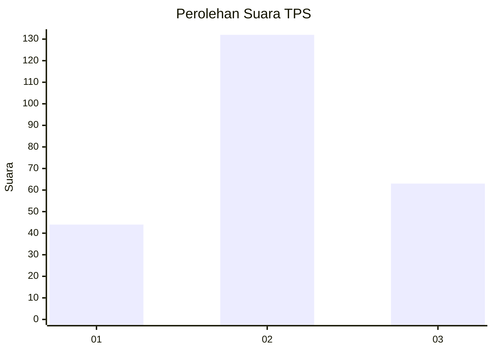
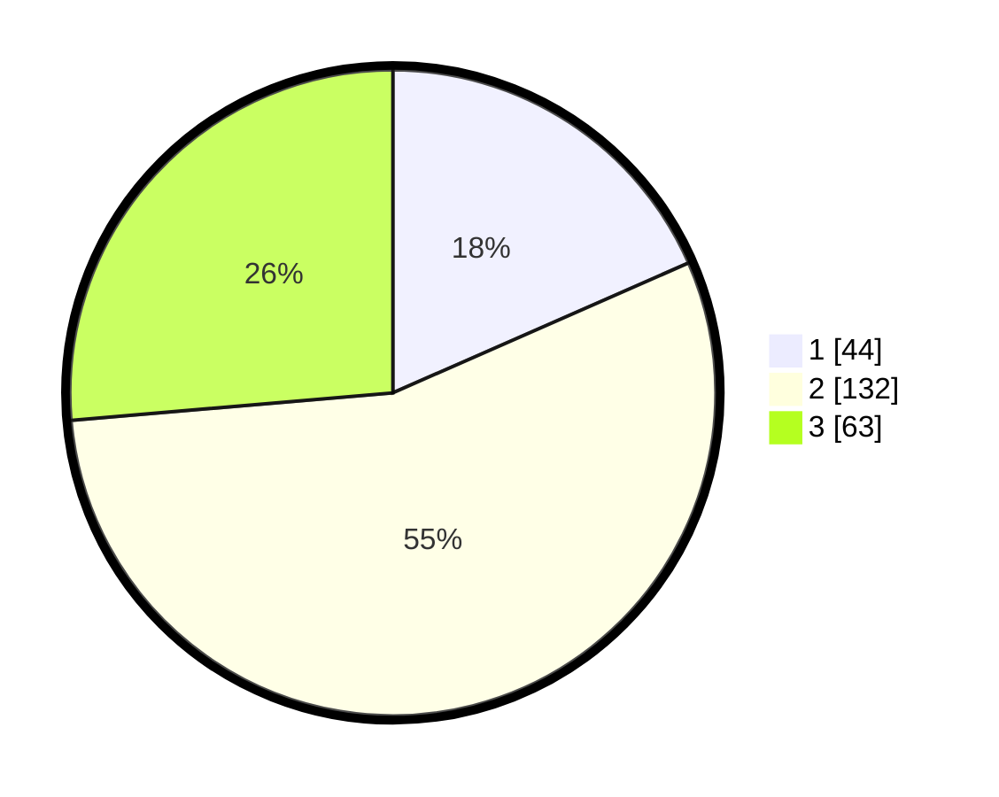

# Hasil

## Grafik

## Tabel

| No. | Nama Paslon    | Suara | Suara (raw) | Persentase |
|:--- |:-------------- | -----:| -----------:| ----------:|
| 1   | ANIES MUHAIMIN | 44    | [44][p-1]   | 18,41      |
| 2   | PRABOWO GIBRAN | 132   | [132][p-2]  | 55,23      |
| 3   | GANJAR MAHFUD  | 63    | [63][p-3]   | 26,36      |

[p-1]: https://github.com/gigit-pemilu/pemilu-2024-35-jawa-timur/blob/main/pilpres/hitung-suara/sub/35-jawa-timur/sub/07-malang/sub/19-pakisaji/sub/2010-genengan/sub/019-tps/sub/paslon-1.txt
[p-2]: https://github.com/gigit-pemilu/pemilu-2024-35-jawa-timur/blob/main/pilpres/hitung-suara/sub/35-jawa-timur/sub/07-malang/sub/19-pakisaji/sub/2010-genengan/sub/019-tps/sub/paslon-2.txt
[p-3]: https://github.com/gigit-pemilu/pemilu-2024-35-jawa-timur/blob/main/pilpres/hitung-suara/sub/35-jawa-timur/sub/07-malang/sub/19-pakisaji/sub/2010-genengan/sub/019-tps/sub/paslon-3.txt

## Foto C Plano

https://sirekap-obj-formc.kpu.go.id/643e/pemilu/ppwp/35/07/19/20/10/3507192010019-20240215-051311--2fdd42b3-db87-46c2-877a-85a170b77f42.jpg

https://sirekap-obj-formc.kpu.go.id/643e/pemilu/ppwp/35/07/19/20/10/3507192010019-20240216-142117--f58b3a88-e3bc-4975-965b-d800bb94f744.jpg

https://sirekap-obj-formc.kpu.go.id/643e/pemilu/ppwp/35/07/19/20/10/3507192010019-20240216-142116--0aa9feba-b271-46f5-9401-34cf36f704ad.jpg

## Metadata

| Key        | Value               |
| ---------- | ------------------- |
| Time Stamp | 2024-02-22 21:00:00 |

