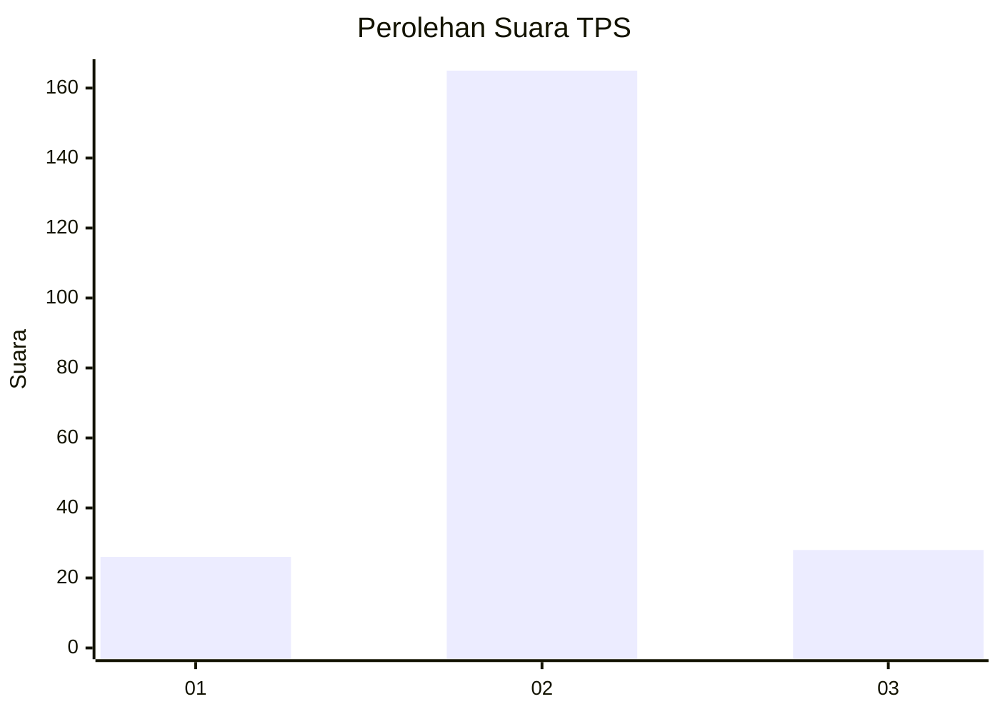
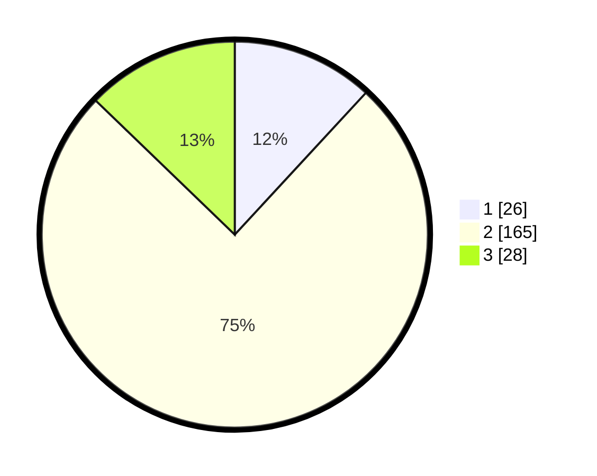

# Hasil

## Grafik

## Tabel

| No. | Nama Paslon    | Suara | Suara (raw) | Persentase |
|:--- |:-------------- | -----:| -----------:| ----------:|
| 1   | ANIES MUHAIMIN | 26    | [26][p-1]   | 11,87      |
| 2   | PRABOWO GIBRAN | 165   | [165][p-2]  | 75,34      |
| 3   | GANJAR MAHFUD  | 28    | [28][p-3]   | 12,79      |

[p-1]: https://github.com/gigit-pemilu/pemilu-2024-35-jawa-timur/blob/main/pilpres/hitung-suara/sub/35-jawa-timur/sub/07-malang/sub/19-pakisaji/sub/2012-kebonagung/sub/031-tps/sub/paslon-1.txt
[p-2]: https://github.com/gigit-pemilu/pemilu-2024-35-jawa-timur/blob/main/pilpres/hitung-suara/sub/35-jawa-timur/sub/07-malang/sub/19-pakisaji/sub/2012-kebonagung/sub/031-tps/sub/paslon-2.txt
[p-3]: https://github.com/gigit-pemilu/pemilu-2024-35-jawa-timur/blob/main/pilpres/hitung-suara/sub/35-jawa-timur/sub/07-malang/sub/19-pakisaji/sub/2012-kebonagung/sub/031-tps/sub/paslon-3.txt

## Foto C Plano

https://sirekap-obj-formc.kpu.go.id/c884/pemilu/ppwp/35/07/19/20/12/3507192012031-20240215-031909--d6faa41f-27c0-421a-8d10-4f1064a556fa.jpg

https://sirekap-obj-formc.kpu.go.id/c884/pemilu/ppwp/35/07/19/20/12/3507192012031-20240215-032035--4c0598f9-0e18-4b39-bbc3-858e3c25eed5.jpg

https://sirekap-obj-formc.kpu.go.id/c884/pemilu/ppwp/35/07/19/20/12/3507192012031-20240304-201754--0a47779a-b4f6-4c23-9127-5a6c0b2c2612.jpg

## Metadata

| Key        | Value               |
| ---------- | ------------------- |
| Time Stamp | 2024-03-04 21:00:00 |

