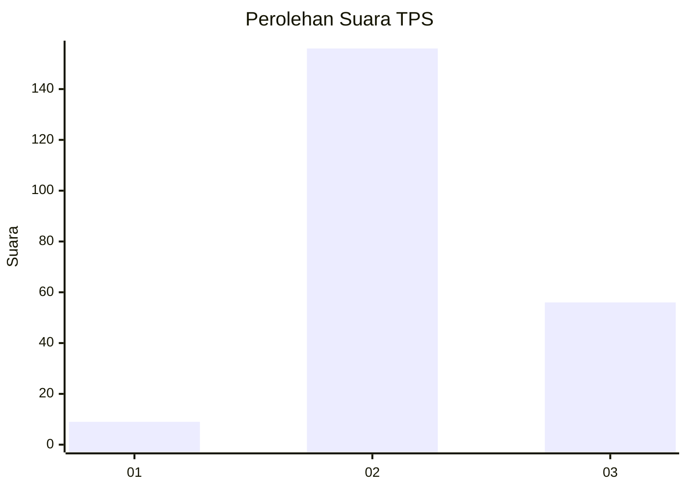
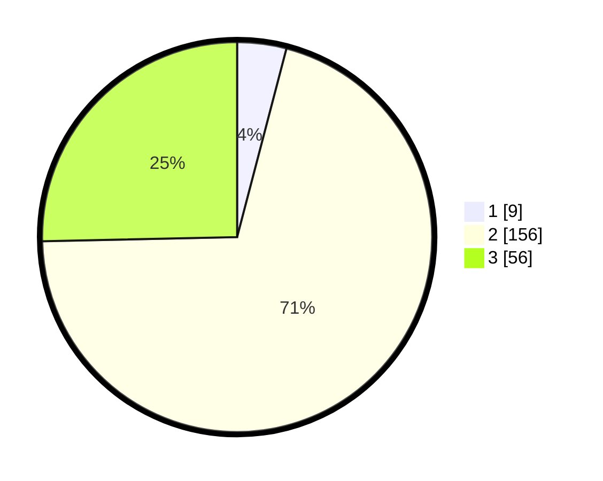

# Hasil

## Grafik

## Tabel

| No. | Nama Paslon    | Suara | Suara (raw) | Persentase |
|:--- |:-------------- | -----:| -----------:| ----------:|
| 1   | ANIES MUHAIMIN | 9     | [9][p-1]    | 4,07       |
| 2   | PRABOWO GIBRAN | 156   | [156][p-2]  | 70,59      |
| 3   | GANJAR MAHFUD  | 56    | [56][p-3]   | 25,34      |

[p-1]: https://github.com/gigit-pemilu/pemilu-2024-35-jawa-timur/blob/main/pilpres/hitung-suara/sub/35-jawa-timur/sub/07-malang/sub/20-ngajum/sub/2001-ngajum/sub/002-tps/sub/paslon-1.txt
[p-2]: https://github.com/gigit-pemilu/pemilu-2024-35-jawa-timur/blob/main/pilpres/hitung-suara/sub/35-jawa-timur/sub/07-malang/sub/20-ngajum/sub/2001-ngajum/sub/002-tps/sub/paslon-2.txt
[p-3]: https://github.com/gigit-pemilu/pemilu-2024-35-jawa-timur/blob/main/pilpres/hitung-suara/sub/35-jawa-timur/sub/07-malang/sub/20-ngajum/sub/2001-ngajum/sub/002-tps/sub/paslon-3.txt

## Foto C Plano

https://sirekap-obj-formc.kpu.go.id/cbf0/pemilu/ppwp/35/07/20/20/01/3507202001002-20240216-232534--d24ca9ae-8f6d-4e2e-9054-6ccfa7ad7221.jpg

https://sirekap-obj-formc.kpu.go.id/cbf0/pemilu/ppwp/35/07/20/20/01/3507202001002-20240216-232709--17606def-0534-4927-a8e4-25a4da60371a.jpg

https://sirekap-obj-formc.kpu.go.id/cbf0/pemilu/ppwp/35/07/20/20/01/3507202001002-20240216-232832--8172b439-495e-4f38-9813-f5370b3e574b.jpg

## Metadata

| Key        | Value               |
| ---------- | ------------------- |
| Time Stamp | 2024-02-17 11:30:03 |

