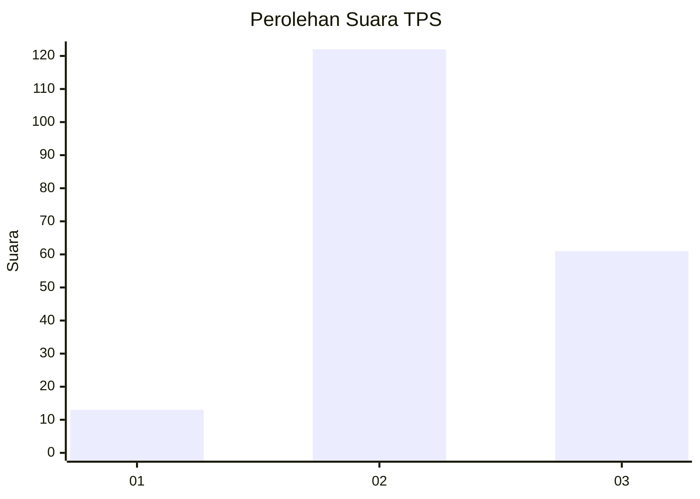
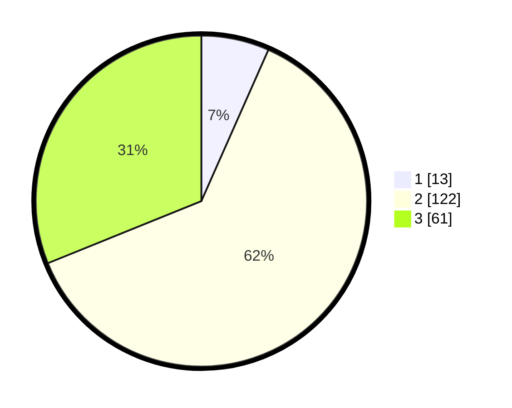

# Hasil

## Grafik

## Tabel

| No. | Nama Paslon    | Suara | Suara (raw) | Persentase |
|:--- |:-------------- | -----:| -----------:| ----------:|
| 1   | ANIES MUHAIMIN | 13    | [13][p-1]   | 6,63       |
| 2   | PRABOWO GIBRAN | 122   | [122][p-2]  | 62,24      |
| 3   | GANJAR MAHFUD  | 61    | [61][p-3]   | 31,12      |

[p-1]: https://github.com/gigit-pemilu/pemilu-2024/blob/main/pilpres/hitung-suara/sub/35-jawa-timur/sub/07-malang/sub/20-ngajum/sub/2002-palaan/sub/002-tps/sub/paslon-1.txt
[p-2]: https://github.com/gigit-pemilu/pemilu-2024/blob/main/pilpres/hitung-suara/sub/35-jawa-timur/sub/07-malang/sub/20-ngajum/sub/2002-palaan/sub/002-tps/sub/paslon-2.txt
[p-3]: https://github.com/gigit-pemilu/pemilu-2024/blob/main/pilpres/hitung-suara/sub/35-jawa-timur/sub/07-malang/sub/20-ngajum/sub/2002-palaan/sub/002-tps/sub/paslon-3.txt

## Foto C Plano

https://sirekap-obj-formc.kpu.go.id/a23c/pemilu/ppwp/35/07/20/20/02/3507202002002-20240215-003253--43be4576-31c6-4edc-9dc6-2a6c20675f38.jpg

https://sirekap-obj-formc.kpu.go.id/a23c/pemilu/ppwp/35/07/20/20/02/3507202002002-20240215-003352--9f3b40fd-ab64-491e-b75c-7122c681661f.jpg

https://sirekap-obj-formc.kpu.go.id/a23c/pemilu/ppwp/35/07/20/20/02/3507202002002-20240215-003439--162a3ae8-d8bd-4079-b0d5-3b9be233c731.jpg

## Metadata

| Key        | Value               |
| ---------- | ------------------- |
| Time Stamp | 2024-02-17 16:00:02 |

