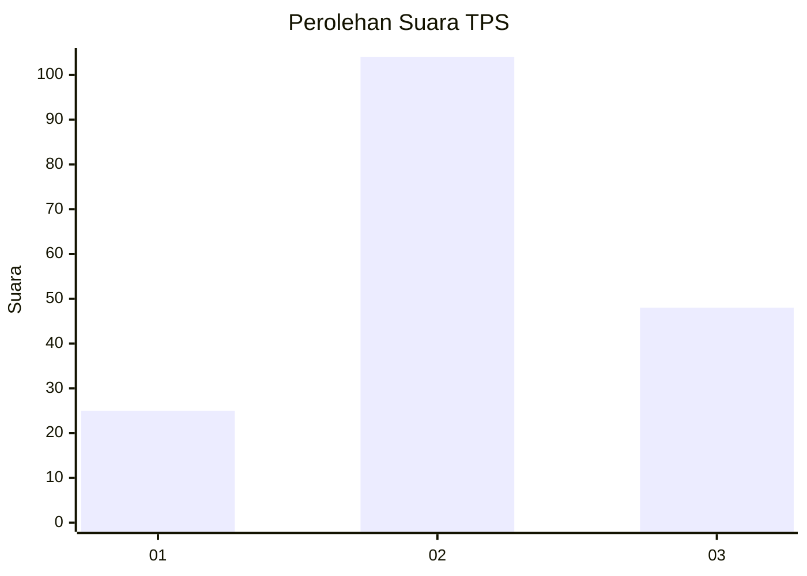
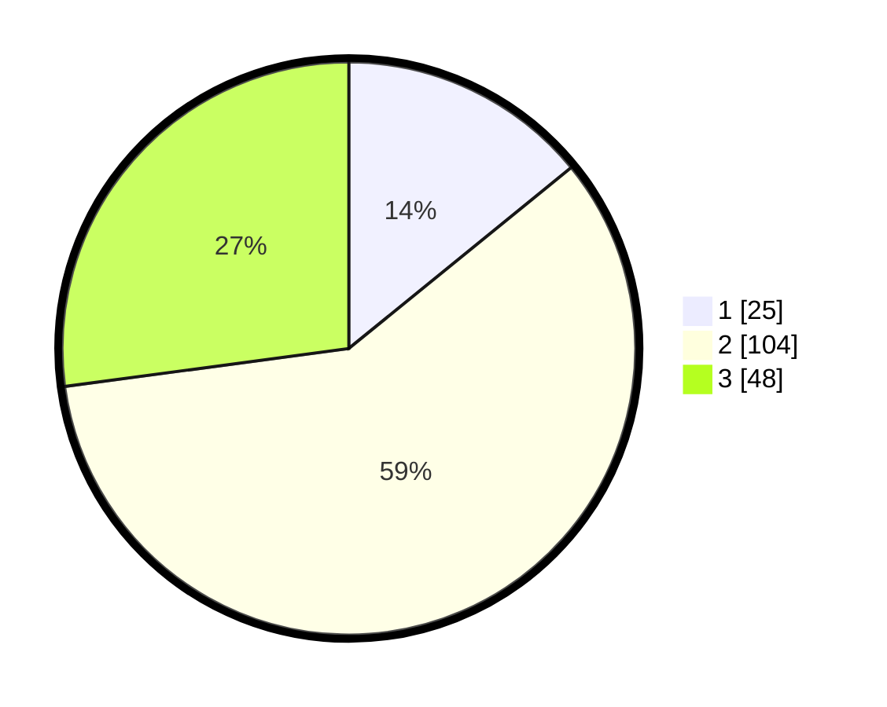

# Hasil

## Grafik

## Tabel

| No. | Nama Paslon    | Suara | Suara (raw) | Persentase |
|:--- |:-------------- | -----:| -----------:| ----------:|
| 1   | ANIES MUHAIMIN | 25    | [25][p-1]   | 14,12      |
| 2   | PRABOWO GIBRAN | 104   | [104][p-2]  | 58,76      |
| 3   | GANJAR MAHFUD  | 48    | [48][p-3]   | 27,12      |

[p-1]: https://github.com/gigit-pemilu/pemilu-2024/blob/main/pilpres/hitung-suara/sub/35-jawa-timur/sub/07-malang/sub/20-ngajum/sub/2002-palaan/sub/004-tps/sub/paslon-1.txt
[p-2]: https://github.com/gigit-pemilu/pemilu-2024/blob/main/pilpres/hitung-suara/sub/35-jawa-timur/sub/07-malang/sub/20-ngajum/sub/2002-palaan/sub/004-tps/sub/paslon-2.txt
[p-3]: https://github.com/gigit-pemilu/pemilu-2024/blob/main/pilpres/hitung-suara/sub/35-jawa-timur/sub/07-malang/sub/20-ngajum/sub/2002-palaan/sub/004-tps/sub/paslon-3.txt

## Foto C Plano

https://sirekap-obj-formc.kpu.go.id/c529/pemilu/ppwp/35/07/20/20/02/3507202002004-20240215-011121--4e305a62-94e0-490c-a6d7-d4d53be76382.jpg

https://sirekap-obj-formc.kpu.go.id/c529/pemilu/ppwp/35/07/20/20/02/3507202002004-20240215-011216--fde88bdc-2760-4b7d-ac93-fad90c240654.jpg

https://sirekap-obj-formc.kpu.go.id/c529/pemilu/ppwp/35/07/20/20/02/3507202002004-20240215-011259--a8463515-8f55-437b-a44b-240111fa9328.jpg

## Metadata

| Key        | Value               |
| ---------- | ------------------- |
| Time Stamp | 2024-02-17 16:00:02 |

