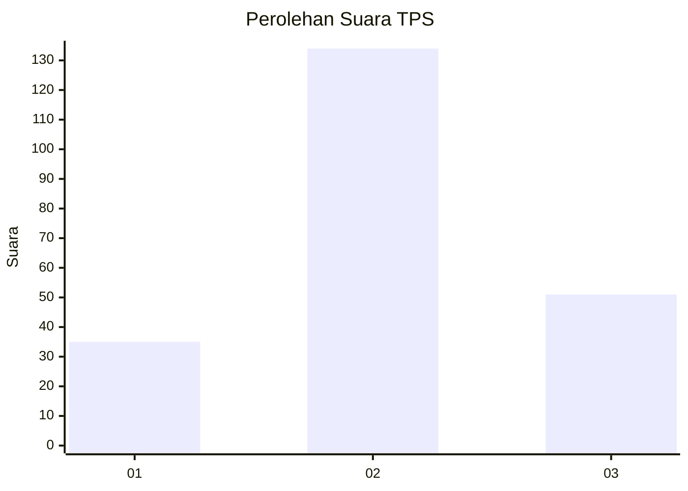
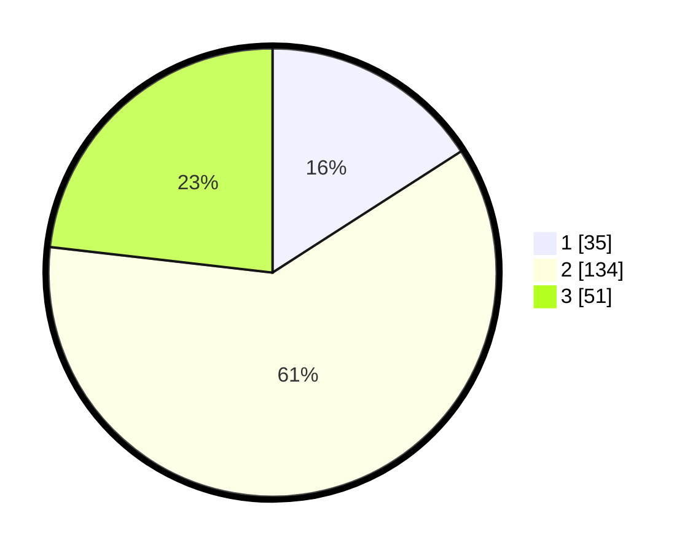

# Hasil

## Grafik

## Tabel

| No. | Nama Paslon    | Suara | Suara (raw) | Persentase |
|:--- |:-------------- | -----:| -----------:| ----------:|
| 1   | ANIES MUHAIMIN | 35    | [35][p-1]   | 15,91      |
| 2   | PRABOWO GIBRAN | 134   | [134][p-2]  | 60,91      |
| 3   | GANJAR MAHFUD  | 51    | [51][p-3]   | 23,18      |

[p-1]: https://github.com/gigit-pemilu/pemilu-2024/blob/main/pilpres/hitung-suara/sub/35-jawa-timur/sub/07-malang/sub/20-ngajum/sub/2004-banjarsari/sub/002-tps/sub/paslon-1.txt
[p-2]: https://github.com/gigit-pemilu/pemilu-2024/blob/main/pilpres/hitung-suara/sub/35-jawa-timur/sub/07-malang/sub/20-ngajum/sub/2004-banjarsari/sub/002-tps/sub/paslon-2.txt
[p-3]: https://github.com/gigit-pemilu/pemilu-2024/blob/main/pilpres/hitung-suara/sub/35-jawa-timur/sub/07-malang/sub/20-ngajum/sub/2004-banjarsari/sub/002-tps/sub/paslon-3.txt

## Foto C Plano

https://sirekap-obj-formc.kpu.go.id/70ac/pemilu/ppwp/35/07/20/20/04/3507202004002-20240214-234614--e67c0e54-0022-4a3a-9a63-3653ce5991f6.jpg

https://sirekap-obj-formc.kpu.go.id/70ac/pemilu/ppwp/35/07/20/20/04/3507202004002-20240217-210127--7255b075-a9b5-4b06-800e-c5a1e12c00e3.jpg

https://sirekap-obj-formc.kpu.go.id/70ac/pemilu/ppwp/35/07/20/20/04/3507202004002-20240217-210138--988a4d74-c47b-4f30-9ea2-2382a85cf176.jpg

## Metadata

| Key        | Value               |
| ---------- | ------------------- |
| Time Stamp | 2024-02-19 06:16:00 |

