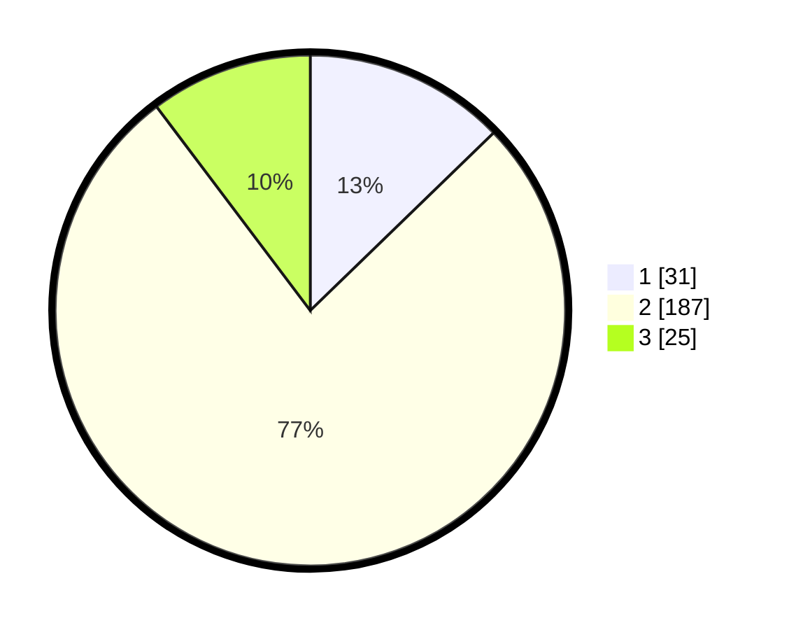

# Hasil

## Grafik

## Tabel

| No. | Nama Paslon    | Suara | Suara (raw) | Persentase |
|:--- |:-------------- | -----:| -----------:| ----------:|
| 1   | ANIES MUHAIMIN | 31    | [31][p-1]   | 12,76      |
| 2   | PRABOWO GIBRAN | 187   | [187][p-2]  | 76,95      |
| 3   | GANJAR MAHFUD  | 25    | [25][p-3]   | 10,29      |

[p-1]: https://github.com/gigit-pemilu/pemilu-2024/blob/main/pilpres/hitung-suara/sub/35-jawa-timur/sub/07-malang/sub/20-ngajum/sub/2005-kranggan/sub/002-tps/sub/paslon-1.txt
[p-2]: https://github.com/gigit-pemilu/pemilu-2024/blob/main/pilpres/hitung-suara/sub/35-jawa-timur/sub/07-malang/sub/20-ngajum/sub/2005-kranggan/sub/002-tps/sub/paslon-2.txt
[p-3]: https://github.com/gigit-pemilu/pemilu-2024/blob/main/pilpres/hitung-suara/sub/35-jawa-timur/sub/07-malang/sub/20-ngajum/sub/2005-kranggan/sub/002-tps/sub/paslon-3.txt

## Foto C Plano

https://sirekap-obj-formc.kpu.go.id/8f22/pemilu/ppwp/35/07/20/20/05/3507202005002-20240217-221957--47a375ef-a54d-4534-bc43-991879d0625b.jpg

https://sirekap-obj-formc.kpu.go.id/8f22/pemilu/ppwp/35/07/20/20/05/3507202005002-20240217-222119--8fe4bc15-f5fb-4114-be69-c6fe08aa1ee6.jpg

https://sirekap-obj-formc.kpu.go.id/8f22/pemilu/ppwp/35/07/20/20/05/3507202005002-20240217-223524--b1d6b7ac-825c-46a3-b47d-97df9cd860a2.jpg

## Metadata

| Key        | Value               |
| ---------- | ------------------- |
| Time Stamp | 2024-02-19 06:16:00 |

