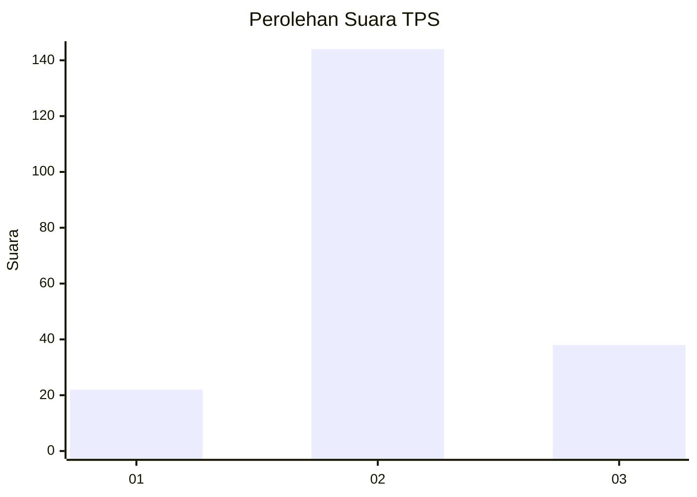
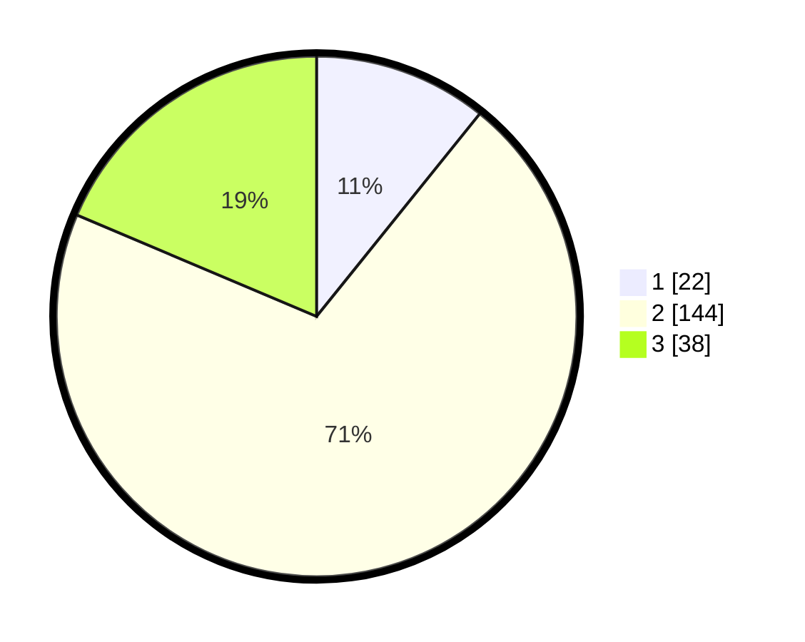

# Hasil

## Grafik

## Tabel

| No. | Nama Paslon    | Suara | Suara (raw) | Persentase |
|:--- |:-------------- | -----:| -----------:| ----------:|
| 1   | ANIES MUHAIMIN | 22    | [22][p-1]   | 10,78      |
| 2   | PRABOWO GIBRAN | 144   | [144][p-2]  | 70,59      |
| 3   | GANJAR MAHFUD  | 38    | [38][p-3]   | 18,63      |

[p-1]: https://github.com/gigit-pemilu/pemilu-2024/blob/main/pilpres/hitung-suara/sub/35-jawa-timur/sub/07-malang/sub/22-dau/sub/2001-kucur/sub/001-tps/sub/paslon-1.txt
[p-2]: https://github.com/gigit-pemilu/pemilu-2024/blob/main/pilpres/hitung-suara/sub/35-jawa-timur/sub/07-malang/sub/22-dau/sub/2001-kucur/sub/001-tps/sub/paslon-2.txt
[p-3]: https://github.com/gigit-pemilu/pemilu-2024/blob/main/pilpres/hitung-suara/sub/35-jawa-timur/sub/07-malang/sub/22-dau/sub/2001-kucur/sub/001-tps/sub/paslon-3.txt

## Foto C Plano

https://sirekap-obj-formc.kpu.go.id/5c83/pemilu/ppwp/35/07/22/20/01/3507222001001-20240214-215543--303e2b9e-a71b-45a7-be9c-edfc59923ee5.jpg

https://sirekap-obj-formc.kpu.go.id/5c83/pemilu/ppwp/35/07/22/20/01/3507222001001-20240214-215633--40b17838-6872-4033-966b-1b832f09064c.jpg

https://sirekap-obj-formc.kpu.go.id/5c83/pemilu/ppwp/35/07/22/20/01/3507222001001-20240214-215735--02f693dd-7498-4619-a401-03ef6fa00fcf.jpg

## Metadata

| Key        | Value               |
| ---------- | ------------------- |
| Time Stamp | 2024-02-24 22:31:28 |

