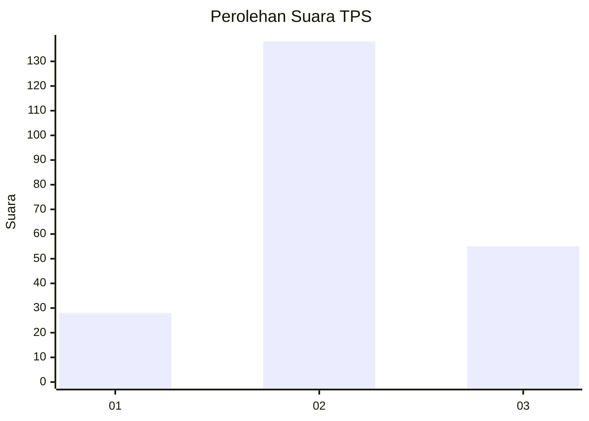
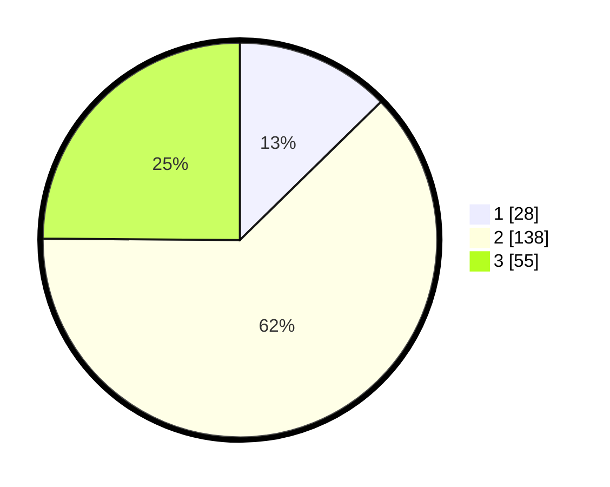

# Hasil

## Grafik

## Tabel

| No. | Nama Paslon    | Suara | Suara (raw) | Persentase |
|:--- |:-------------- | -----:| -----------:| ----------:|
| 1   | ANIES MUHAIMIN | 28    | [28][p-1]   | 12,67      |
| 2   | PRABOWO GIBRAN | 138   | [138][p-2]  | 62,44      |
| 3   | GANJAR MAHFUD  | 55    | [55][p-3]   | 24,89      |

[p-1]: https://github.com/gigit-pemilu/pemilu-2024/blob/main/pilpres/hitung-suara/sub/35-jawa-timur/sub/07-malang/sub/22-dau/sub/2001-kucur/sub/003-tps/sub/paslon-1.txt
[p-2]: https://github.com/gigit-pemilu/pemilu-2024/blob/main/pilpres/hitung-suara/sub/35-jawa-timur/sub/07-malang/sub/22-dau/sub/2001-kucur/sub/003-tps/sub/paslon-2.txt
[p-3]: https://github.com/gigit-pemilu/pemilu-2024/blob/main/pilpres/hitung-suara/sub/35-jawa-timur/sub/07-malang/sub/22-dau/sub/2001-kucur/sub/003-tps/sub/paslon-3.txt

## Foto C Plano

https://sirekap-obj-formc.kpu.go.id/77c9/pemilu/ppwp/35/07/22/20/01/3507222001003-20240214-234731--eb382d3d-b7b6-4766-899e-c71d362f3b42.jpg

https://sirekap-obj-formc.kpu.go.id/77c9/pemilu/ppwp/35/07/22/20/01/3507222001003-20240214-234939--b87fbbff-b0fd-405c-9be9-43376f6fd5b7.jpg

https://sirekap-obj-formc.kpu.go.id/77c9/pemilu/ppwp/35/07/22/20/01/3507222001003-20240214-235228--49ada7cf-7824-4052-9ca2-d483b504a165.jpg

## Metadata

| Key        | Value               |
| ---------- | ------------------- |
| Time Stamp | 2024-02-24 22:31:28 |

