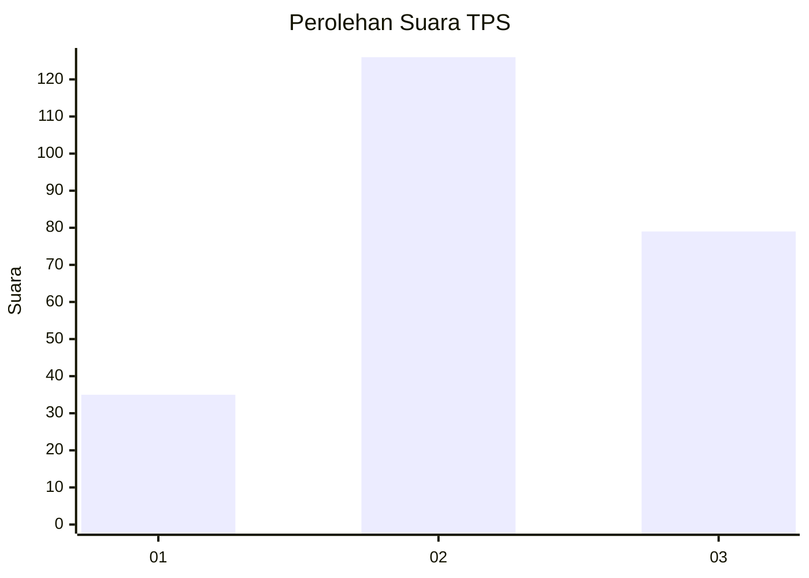
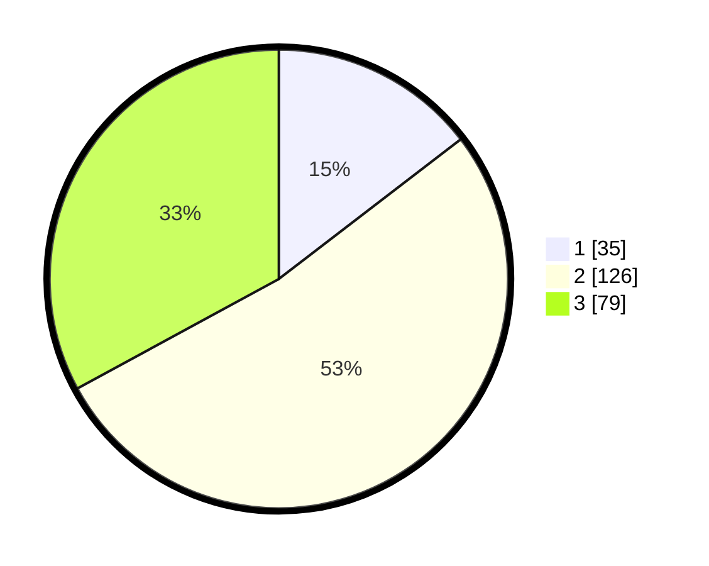

# Hasil

## Grafik

## Tabel

| No. | Nama Paslon    | Suara | Suara (raw) | Persentase |
|:--- |:-------------- | -----:| -----------:| ----------:|
| 1   | ANIES MUHAIMIN | 35    | [35][p-1]   | 14,58      |
| 2   | PRABOWO GIBRAN | 126   | [126][p-2]  | 52,50      |
| 3   | GANJAR MAHFUD  | 79    | [79][p-3]   | 32,92      |

[p-1]: https://github.com/gigit-pemilu/pemilu-2024-35-jawa-timur/blob/main/pilpres/hitung-suara/sub/35-jawa-timur/sub/07-malang/sub/22-dau/sub/2001-kucur/sub/010-tps/sub/paslon-1.txt
[p-2]: https://github.com/gigit-pemilu/pemilu-2024-35-jawa-timur/blob/main/pilpres/hitung-suara/sub/35-jawa-timur/sub/07-malang/sub/22-dau/sub/2001-kucur/sub/010-tps/sub/paslon-2.txt
[p-3]: https://github.com/gigit-pemilu/pemilu-2024-35-jawa-timur/blob/main/pilpres/hitung-suara/sub/35-jawa-timur/sub/07-malang/sub/22-dau/sub/2001-kucur/sub/010-tps/sub/paslon-3.txt

## Foto C Plano

https://sirekap-obj-formc.kpu.go.id/abc9/pemilu/ppwp/35/07/22/20/01/3507222001010-20240215-020316--bcb3398e-47a0-4b80-9e95-83349e315b51.jpg

https://sirekap-obj-formc.kpu.go.id/abc9/pemilu/ppwp/35/07/22/20/01/3507222001010-20240215-020450--b813968d-5103-4cff-b54a-a0a416d5852b.jpg

https://sirekap-obj-formc.kpu.go.id/abc9/pemilu/ppwp/35/07/22/20/01/3507222001010-20240215-020613--8d80fa14-3a26-4c8c-a57f-3b9a39523a2d.jpg

## Metadata

| Key        | Value               |
| ---------- | ------------------- |
| Time Stamp | 2024-02-24 22:31:28 |

