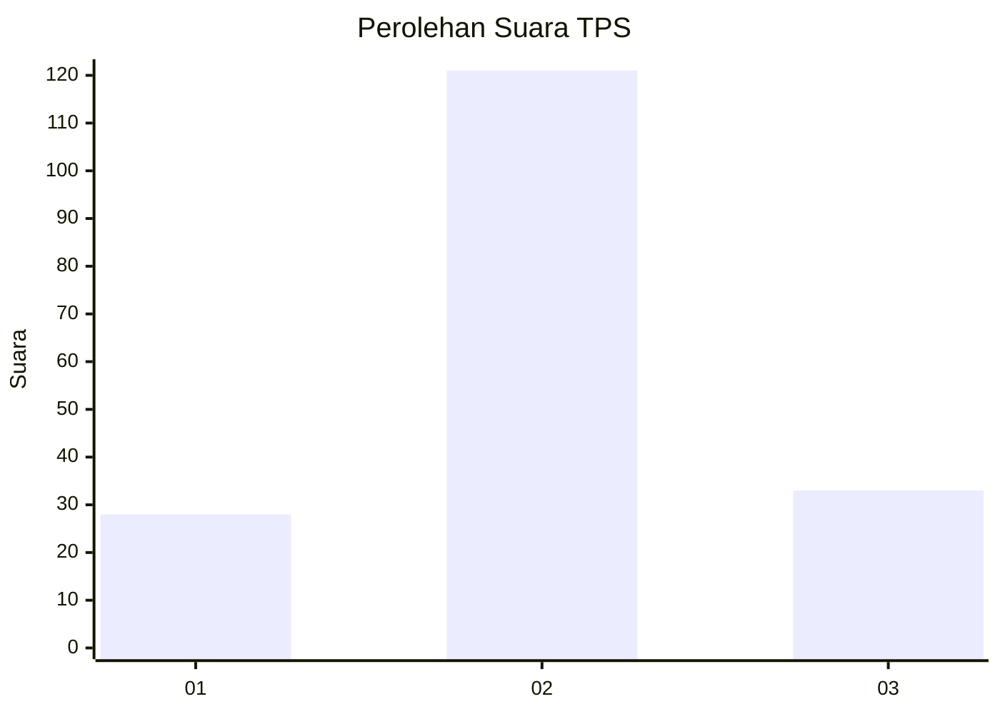
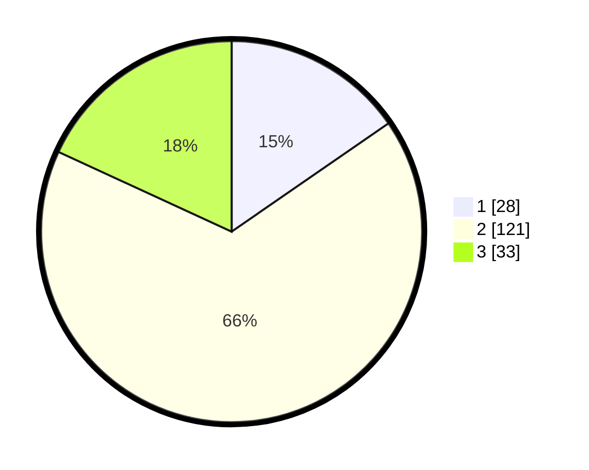

# Hasil

## Grafik

## Tabel

| No. | Nama Paslon    | Suara | Suara (raw) | Persentase |
|:--- |:-------------- | -----:| -----------:| ----------:|
| 1   | ANIES MUHAIMIN | 28    | [28][p-1]   | 15,38      |
| 2   | PRABOWO GIBRAN | 121   | [121][p-2]  | 66,48      |
| 3   | GANJAR MAHFUD  | 33    | [33][p-3]   | 18,13      |

[p-1]: https://github.com/gigit-pemilu/pemilu-2024/blob/main/pilpres/hitung-suara/sub/35-jawa-timur/sub/07-malang/sub/22-dau/sub/2001-kucur/sub/020-tps/sub/paslon-1.txt
[p-2]: https://github.com/gigit-pemilu/pemilu-2024/blob/main/pilpres/hitung-suara/sub/35-jawa-timur/sub/07-malang/sub/22-dau/sub/2001-kucur/sub/020-tps/sub/paslon-2.txt
[p-3]: https://github.com/gigit-pemilu/pemilu-2024/blob/main/pilpres/hitung-suara/sub/35-jawa-timur/sub/07-malang/sub/22-dau/sub/2001-kucur/sub/020-tps/sub/paslon-3.txt

## Foto C Plano

https://sirekap-obj-formc.kpu.go.id/74e4/pemilu/ppwp/35/07/22/20/01/3507222001020-20240214-141001--8bf1c3bc-7be9-47b3-a9e2-928fb482971f.jpg

https://sirekap-obj-formc.kpu.go.id/74e4/pemilu/ppwp/35/07/22/20/01/3507222001020-20240214-141742--34a52b63-de17-4619-a3ab-5c488167f568.jpg

https://sirekap-obj-formc.kpu.go.id/74e4/pemilu/ppwp/35/07/22/20/01/3507222001020-20240214-141848--2ff3508f-997b-4caf-bd71-b6f84421b8ff.jpg

## Metadata

| Key        | Value               |
| ---------- | ------------------- |
| Time Stamp | 2024-02-14 21:46:01 |

