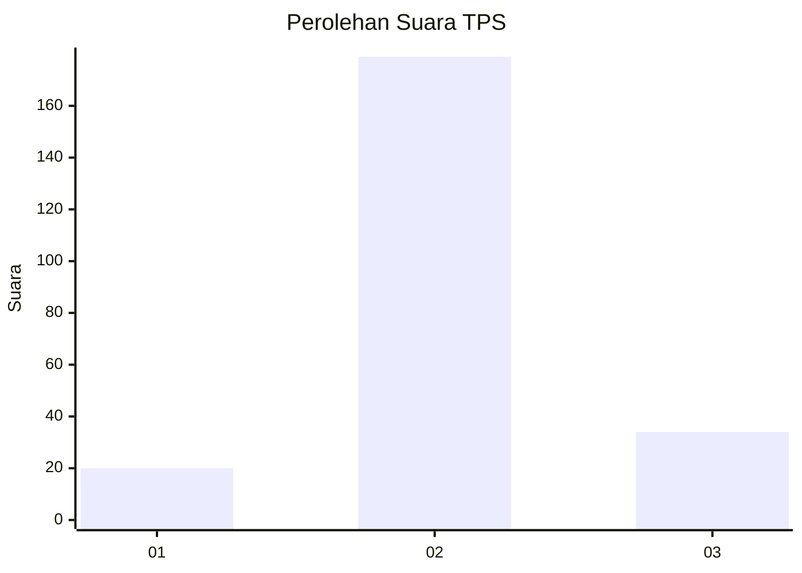

# Hasil

## Grafik

## Tabel

| No. | Nama Paslon    | Suara | Suara (raw) | Persentase |
|:--- |:-------------- | -----:| -----------:| ----------:|
| 1   | ANIES MUHAIMIN | 20    | [20][p-1]   | 8,58       |
| 2   | PRABOWO GIBRAN | 179   | [179][p-2]  | 76,82      |
| 3   | GANJAR MAHFUD  | 34    | [34][p-3]   | 14,59      |

[p-1]: https://github.com/gigit-pemilu/pemilu-2024-35-jawa-timur/blob/main/pilpres/hitung-suara/sub/35-jawa-timur/sub/07-malang/sub/22-dau/sub/2002-kalisongo/sub/003-tps/sub/paslon-1.txt
[p-2]: https://github.com/gigit-pemilu/pemilu-2024-35-jawa-timur/blob/main/pilpres/hitung-suara/sub/35-jawa-timur/sub/07-malang/sub/22-dau/sub/2002-kalisongo/sub/003-tps/sub/paslon-2.txt
[p-3]: https://github.com/gigit-pemilu/pemilu-2024-35-jawa-timur/blob/main/pilpres/hitung-suara/sub/35-jawa-timur/sub/07-malang/sub/22-dau/sub/2002-kalisongo/sub/003-tps/sub/paslon-3.txt

## Foto C Plano

https://sirekap-obj-formc.kpu.go.id/62f6/pemilu/ppwp/35/07/22/20/02/3507222002003-20240214-214028--05f57b48-3400-4c9b-99c5-df99d397a07a.jpg

https://sirekap-obj-formc.kpu.go.id/62f6/pemilu/ppwp/35/07/22/20/02/3507222002003-20240214-213945--4597cc8c-3759-4658-a779-f2bea8cf6a10.jpg

https://sirekap-obj-formc.kpu.go.id/62f6/pemilu/ppwp/35/07/22/20/02/3507222002003-20240214-213841--29198a38-a3ff-45aa-8fbb-1c140cbe2b38.jpg

## Metadata

| Key        | Value               |
| ---------- | ------------------- |
| Time Stamp | 2024-02-24 22:31:28 |

