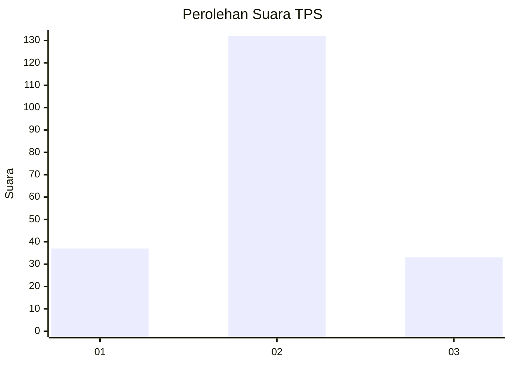
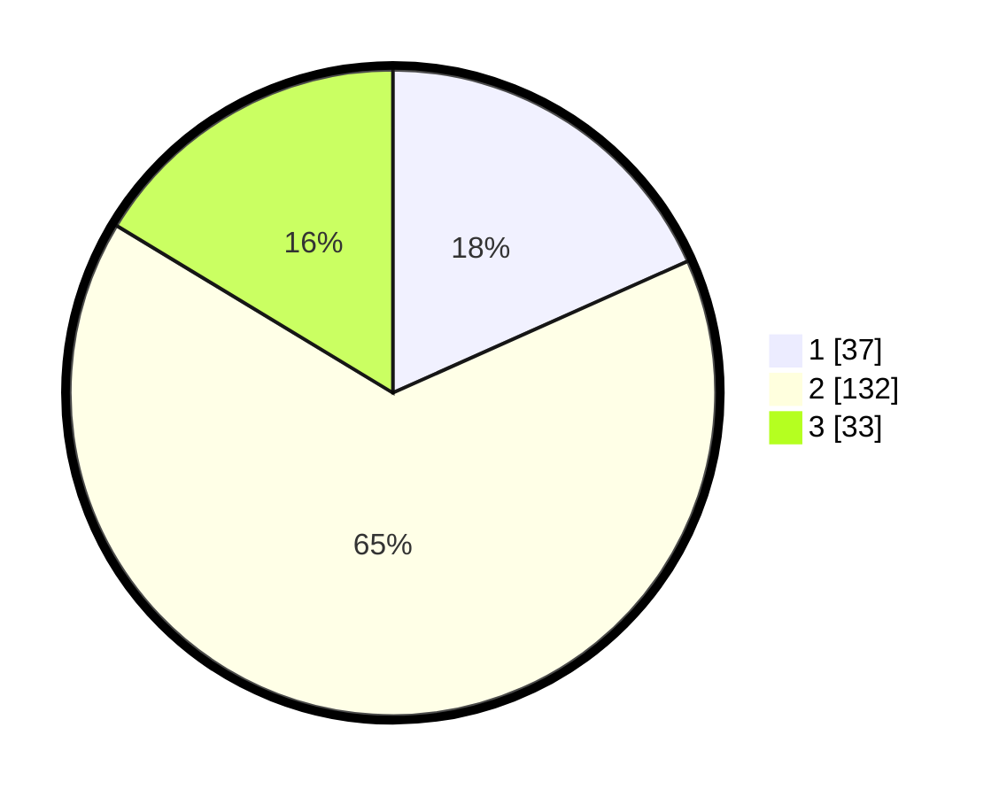

# Hasil

## Grafik

## Tabel

| No. | Nama Paslon    | Suara | Suara (raw) | Persentase |
|:--- |:-------------- | -----:| -----------:| ----------:|
| 1   | ANIES MUHAIMIN | 37    | [37][p-1]   | 18,32      |
| 2   | PRABOWO GIBRAN | 132   | [132][p-2]  | 65,35      |
| 3   | GANJAR MAHFUD  | 33    | [33][p-3]   | 16,34      |

[p-1]: https://github.com/gigit-pemilu/pemilu-2024-35-jawa-timur/blob/main/pilpres/hitung-suara/sub/35-jawa-timur/sub/07-malang/sub/22-dau/sub/2002-kalisongo/sub/005-tps/sub/paslon-1.txt
[p-2]: https://github.com/gigit-pemilu/pemilu-2024-35-jawa-timur/blob/main/pilpres/hitung-suara/sub/35-jawa-timur/sub/07-malang/sub/22-dau/sub/2002-kalisongo/sub/005-tps/sub/paslon-2.txt
[p-3]: https://github.com/gigit-pemilu/pemilu-2024-35-jawa-timur/blob/main/pilpres/hitung-suara/sub/35-jawa-timur/sub/07-malang/sub/22-dau/sub/2002-kalisongo/sub/005-tps/sub/paslon-3.txt

## Foto C Plano

https://sirekap-obj-formc.kpu.go.id/d4f6/pemilu/ppwp/35/07/22/20/02/3507222002005-20240214-225103--b6b49a3a-ffc4-42ba-a278-7e2e87f0f68f.jpg

https://sirekap-obj-formc.kpu.go.id/d4f6/pemilu/ppwp/35/07/22/20/02/3507222002005-20240214-225314--8e6e5c9f-584e-4f66-b5e6-d618b7ef2cfb.jpg

https://sirekap-obj-formc.kpu.go.id/d4f6/pemilu/ppwp/35/07/22/20/02/3507222002005-20240214-230322--dd90f118-06cf-4d36-a24d-080c04293981.jpg

## Metadata

| Key        | Value               |
| ---------- | ------------------- |
| Time Stamp | 2024-02-15 12:00:28 |

