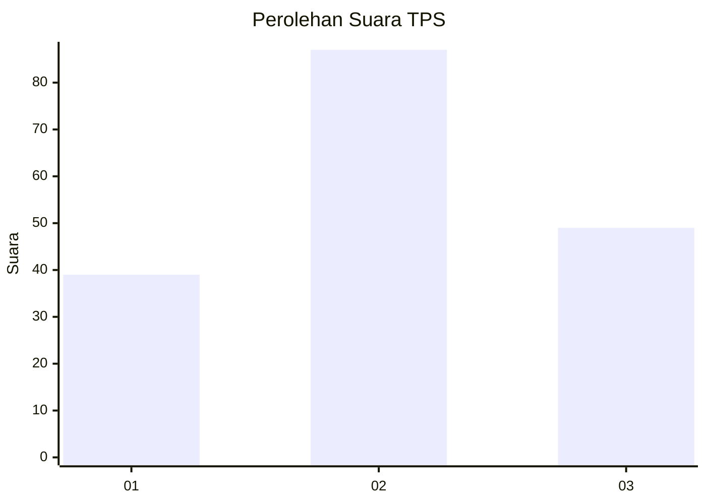
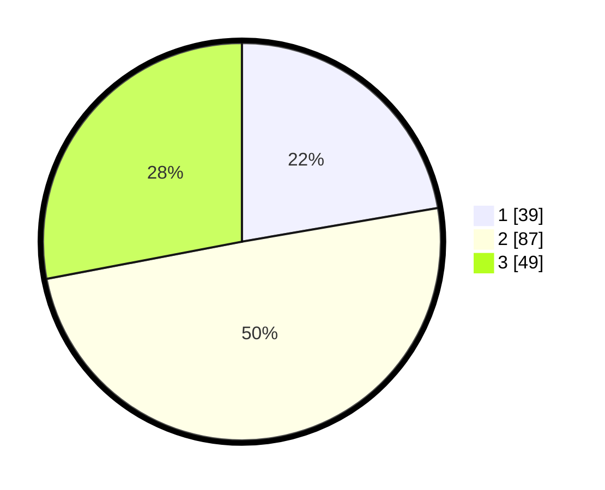

# Hasil

## Grafik

## Tabel

| No. | Nama Paslon    | Suara | Suara (raw) | Persentase |
|:--- |:-------------- | -----:| -----------:| ----------:|
| 1   | ANIES MUHAIMIN | 39    | [39][p-1]   | 22,29      |
| 2   | PRABOWO GIBRAN | 87    | [87][p-2]   | 49,71      |
| 3   | GANJAR MAHFUD  | 49    | [49][p-3]   | 28,00      |

[p-1]: https://github.com/gigit-pemilu/pemilu-2024/blob/main/pilpres/hitung-suara/sub/35-jawa-timur/sub/07-malang/sub/22-dau/sub/2002-kalisongo/sub/023-tps/sub/paslon-1.txt
[p-2]: https://github.com/gigit-pemilu/pemilu-2024/blob/main/pilpres/hitung-suara/sub/35-jawa-timur/sub/07-malang/sub/22-dau/sub/2002-kalisongo/sub/023-tps/sub/paslon-2.txt
[p-3]: https://github.com/gigit-pemilu/pemilu-2024/blob/main/pilpres/hitung-suara/sub/35-jawa-timur/sub/07-malang/sub/22-dau/sub/2002-kalisongo/sub/023-tps/sub/paslon-3.txt

## Foto C Plano

https://sirekap-obj-formc.kpu.go.id/f663/pemilu/ppwp/35/07/22/20/02/3507222002023-20240215-001210--ac4a1c16-618b-4ab2-a782-b62ae5982502.jpg

https://sirekap-obj-formc.kpu.go.id/f663/pemilu/ppwp/35/07/22/20/02/3507222002023-20240215-001111--3841aca1-6a4a-486e-9338-0d12359e332a.jpg

https://sirekap-obj-formc.kpu.go.id/f663/pemilu/ppwp/35/07/22/20/02/3507222002023-20240215-001309--8bc447d1-90f9-48eb-9d53-fb061fcd7443.jpg

## Metadata

| Key        | Value               |
| ---------- | ------------------- |
| Time Stamp | 2024-02-24 22:31:28 |

