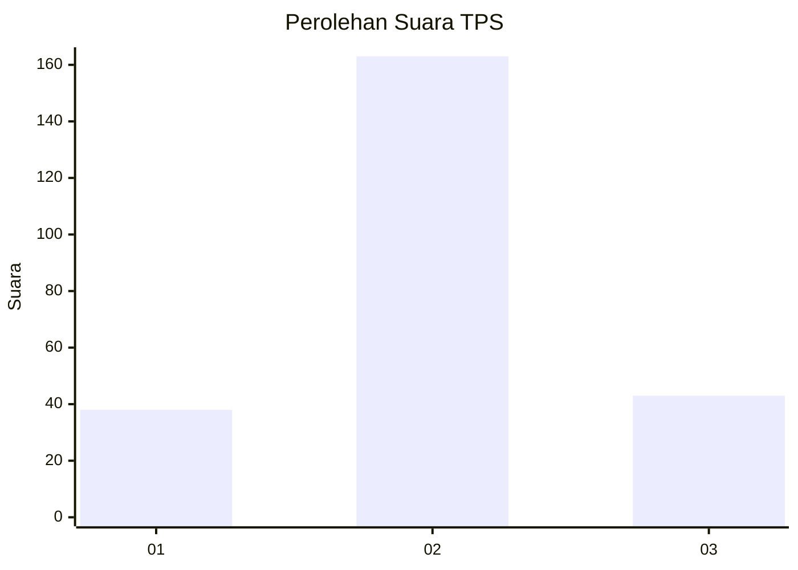
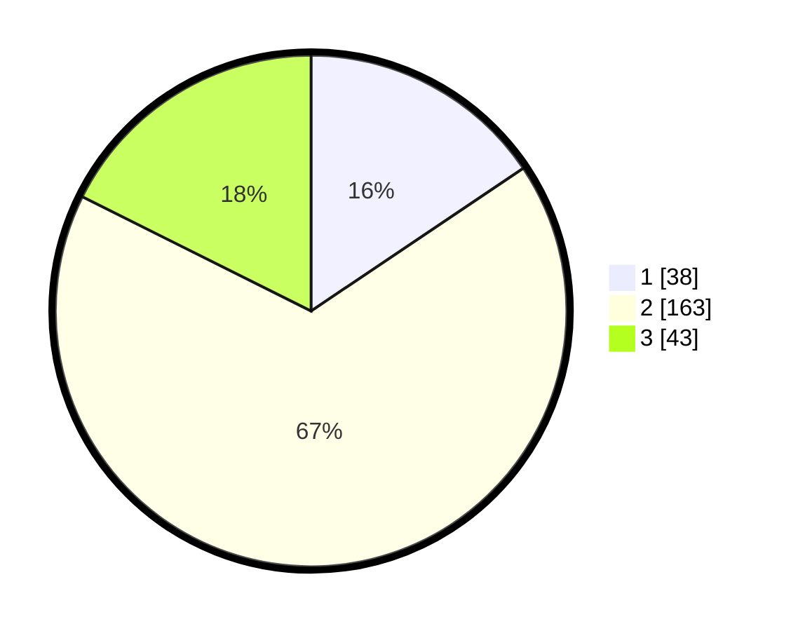

# Hasil

## Grafik

## Tabel

| No. | Nama Paslon    | Suara | Suara (raw) | Persentase |
|:--- |:-------------- | -----:| -----------:| ----------:|
| 1   | ANIES MUHAIMIN | 38    | [38][p-1]   | 15,57      |
| 2   | PRABOWO GIBRAN | 163   | [163][p-2]  | 66,80      |
| 3   | GANJAR MAHFUD  | 43    | [43][p-3]   | 17,62      |

[p-1]: https://github.com/gigit-pemilu/pemilu-2024-35-jawa-timur/blob/main/pilpres/hitung-suara/sub/35-jawa-timur/sub/07-malang/sub/22-dau/sub/2003-karangwidoro/sub/002-tps/sub/paslon-1.txt
[p-2]: https://github.com/gigit-pemilu/pemilu-2024-35-jawa-timur/blob/main/pilpres/hitung-suara/sub/35-jawa-timur/sub/07-malang/sub/22-dau/sub/2003-karangwidoro/sub/002-tps/sub/paslon-2.txt
[p-3]: https://github.com/gigit-pemilu/pemilu-2024-35-jawa-timur/blob/main/pilpres/hitung-suara/sub/35-jawa-timur/sub/07-malang/sub/22-dau/sub/2003-karangwidoro/sub/002-tps/sub/paslon-3.txt

## Foto C Plano

https://sirekap-obj-formc.kpu.go.id/46ee/pemilu/ppwp/35/07/22/20/03/3507222003002-20240214-212926--96aa172d-c9b2-4562-a78c-385d5f1326b3.jpg

https://sirekap-obj-formc.kpu.go.id/46ee/pemilu/ppwp/35/07/22/20/03/3507222003002-20240214-213302--1e7bbdf8-5cd3-4cc9-86a4-a2600281ca14.jpg

https://sirekap-obj-formc.kpu.go.id/46ee/pemilu/ppwp/35/07/22/20/03/3507222003002-20240214-213101--123a0d9d-054c-4e19-92fe-d1cf43788867.jpg

## Metadata

| Key        | Value               |
| ---------- | ------------------- |
| Time Stamp | 2024-02-24 22:31:28 |

