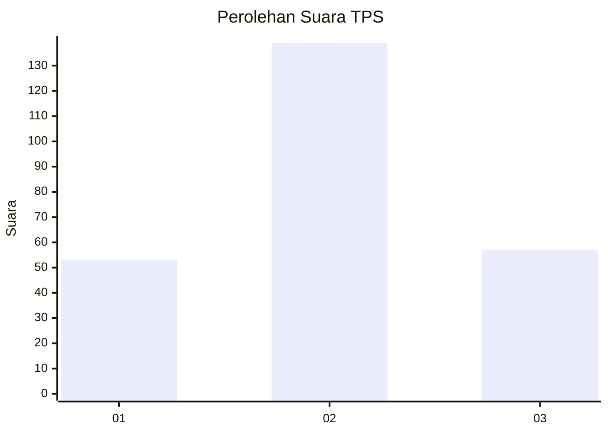
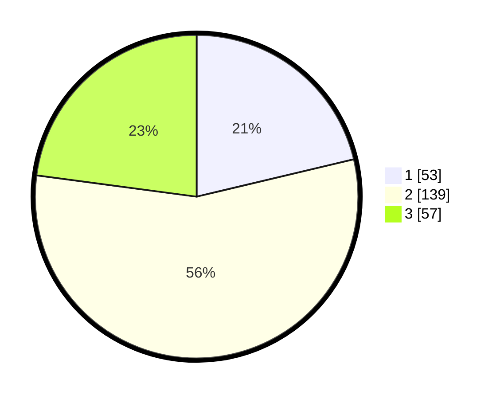

# Hasil

## Grafik

## Tabel

| No. | Nama Paslon    | Suara | Suara (raw) | Persentase |
|:--- |:-------------- | -----:| -----------:| ----------:|
| 1   | ANIES MUHAIMIN | 53    | [53][p-1]   | 21,29      |
| 2   | PRABOWO GIBRAN | 139   | [139][p-2]  | 55,82      |
| 3   | GANJAR MAHFUD  | 57    | [57][p-3]   | 22,89      |

[p-1]: https://github.com/gigit-pemilu/pemilu-2024-35-jawa-timur/blob/main/pilpres/hitung-suara/sub/35-jawa-timur/sub/07-malang/sub/22-dau/sub/2003-karangwidoro/sub/013-tps/sub/paslon-1.txt
[p-2]: https://github.com/gigit-pemilu/pemilu-2024-35-jawa-timur/blob/main/pilpres/hitung-suara/sub/35-jawa-timur/sub/07-malang/sub/22-dau/sub/2003-karangwidoro/sub/013-tps/sub/paslon-2.txt
[p-3]: https://github.com/gigit-pemilu/pemilu-2024-35-jawa-timur/blob/main/pilpres/hitung-suara/sub/35-jawa-timur/sub/07-malang/sub/22-dau/sub/2003-karangwidoro/sub/013-tps/sub/paslon-3.txt

## Foto C Plano

https://sirekap-obj-formc.kpu.go.id/b5f6/pemilu/ppwp/35/07/22/20/03/3507222003013-20240215-034104--bdd4b733-abb3-4e11-bff2-e1f9757bb29b.jpg

https://sirekap-obj-formc.kpu.go.id/b5f6/pemilu/ppwp/35/07/22/20/03/3507222003013-20240215-034354--2dc7986a-4ecf-4ae2-bc0c-d77c2ef1864c.jpg

https://sirekap-obj-formc.kpu.go.id/b5f6/pemilu/ppwp/35/07/22/20/03/3507222003013-20240215-034615--5b9dd2f9-0168-4196-b3bc-c2bf58e858b6.jpg

## Metadata

| Key        | Value               |
| ---------- | ------------------- |
| Time Stamp | 2024-02-25 22:00:00 |

