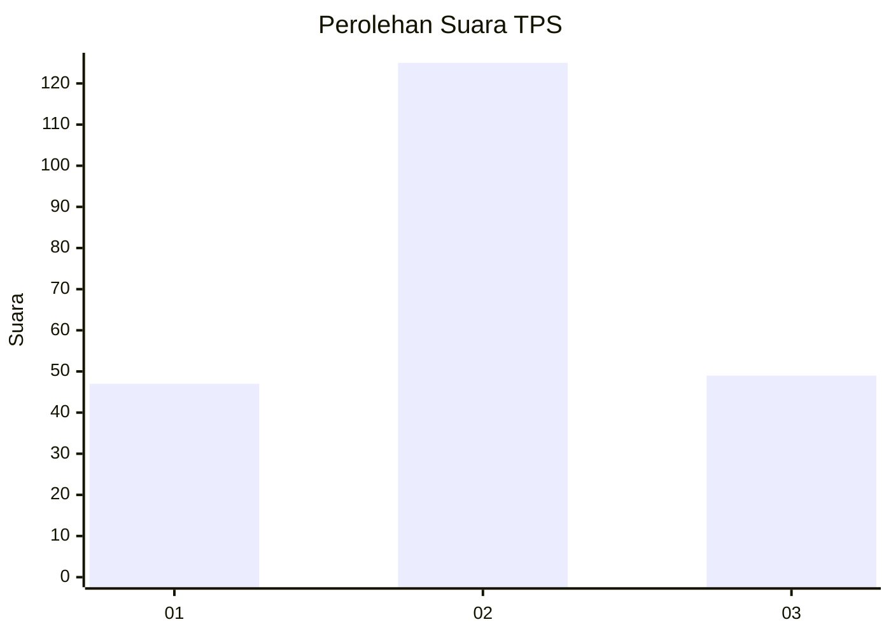
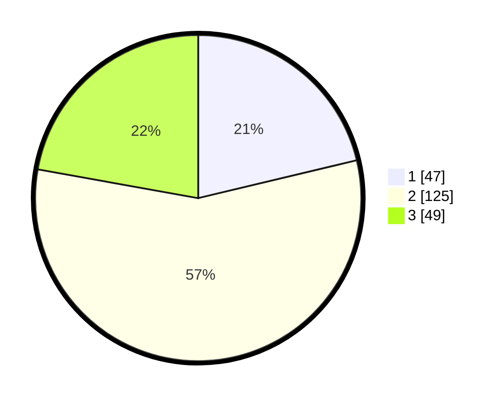

# Hasil

## Grafik

## Tabel

| No. | Nama Paslon    | Suara | Suara (raw) | Persentase |
|:--- |:-------------- | -----:| -----------:| ----------:|
| 1   | ANIES MUHAIMIN | 47    | [47][p-1]   | 21,27      |
| 2   | PRABOWO GIBRAN | 125   | [125][p-2]  | 56,56      |
| 3   | GANJAR MAHFUD  | 49    | [49][p-3]   | 22,17      |

[p-1]: https://github.com/gigit-pemilu/pemilu-2024/blob/main/pilpres/hitung-suara/sub/35-jawa-timur/sub/07-malang/sub/22-dau/sub/2004-petungsewu/sub/007-tps/sub/paslon-1.txt
[p-2]: https://github.com/gigit-pemilu/pemilu-2024/blob/main/pilpres/hitung-suara/sub/35-jawa-timur/sub/07-malang/sub/22-dau/sub/2004-petungsewu/sub/007-tps/sub/paslon-2.txt
[p-3]: https://github.com/gigit-pemilu/pemilu-2024/blob/main/pilpres/hitung-suara/sub/35-jawa-timur/sub/07-malang/sub/22-dau/sub/2004-petungsewu/sub/007-tps/sub/paslon-3.txt

## Foto C Plano

https://sirekap-obj-formc.kpu.go.id/ba7f/pemilu/ppwp/35/07/22/20/04/3507222004007-20240214-225152--5ed42b6a-bf96-47ea-bc72-33f47620dfef.jpg

https://sirekap-obj-formc.kpu.go.id/ba7f/pemilu/ppwp/35/07/22/20/04/3507222004007-20240214-225235--13a89bfa-fb3a-432f-a1e6-0db19e20b9c8.jpg

https://sirekap-obj-formc.kpu.go.id/ba7f/pemilu/ppwp/35/07/22/20/04/3507222004007-20240214-225427--6d75501c-aade-428a-8257-2d37c411e046.jpg

## Metadata

| Key        | Value               |
| ---------- | ------------------- |
| Time Stamp | 2024-02-25 12:00:00 |

