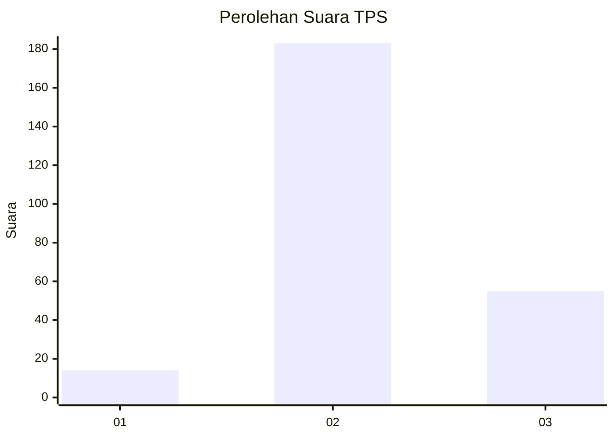
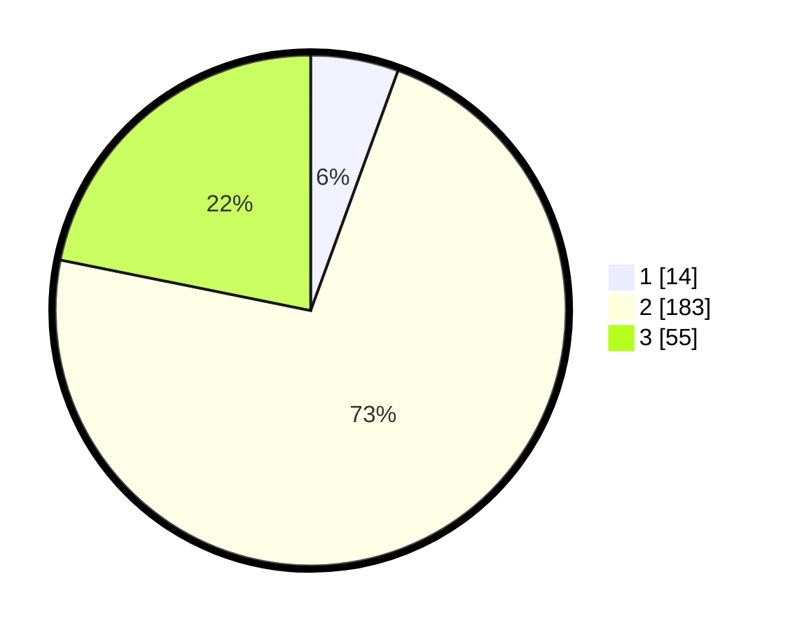

# Hasil

## Grafik

## Tabel

| No. | Nama Paslon    | Suara | Suara (raw) | Persentase |
|:--- |:-------------- | -----:| -----------:| ----------:|
| 1   | ANIES MUHAIMIN | 14    | [14][p-1]   | 5,56       |
| 2   | PRABOWO GIBRAN | 183   | [183][p-2]  | 72,62      |
| 3   | GANJAR MAHFUD  | 55    | [55][p-3]   | 21,83      |

[p-1]: https://github.com/gigit-pemilu/pemilu-2024-35-jawa-timur/blob/main/pilpres/hitung-suara/sub/35-jawa-timur/sub/07-malang/sub/22-dau/sub/2005-selorejo/sub/009-tps/sub/paslon-1.txt
[p-2]: https://github.com/gigit-pemilu/pemilu-2024-35-jawa-timur/blob/main/pilpres/hitung-suara/sub/35-jawa-timur/sub/07-malang/sub/22-dau/sub/2005-selorejo/sub/009-tps/sub/paslon-2.txt
[p-3]: https://github.com/gigit-pemilu/pemilu-2024-35-jawa-timur/blob/main/pilpres/hitung-suara/sub/35-jawa-timur/sub/07-malang/sub/22-dau/sub/2005-selorejo/sub/009-tps/sub/paslon-3.txt

## Foto C Plano

https://sirekap-obj-formc.kpu.go.id/284b/pemilu/ppwp/35/07/22/20/05/3507222005009-20240214-230036--3f774c74-c545-4314-bde8-855e56e944e4.jpg

https://sirekap-obj-formc.kpu.go.id/284b/pemilu/ppwp/35/07/22/20/05/3507222005009-20240214-225938--739b61ca-582e-487b-9c1e-9b736783cbf4.jpg

https://sirekap-obj-formc.kpu.go.id/284b/pemilu/ppwp/35/07/22/20/05/3507222005009-20240214-230013--a27dfaa5-89e8-4e9a-bae2-524cf9a96ff5.jpg

## Metadata

| Key        | Value               |
| ---------- | ------------------- |
| Time Stamp | 2024-02-25 15:00:00 |

