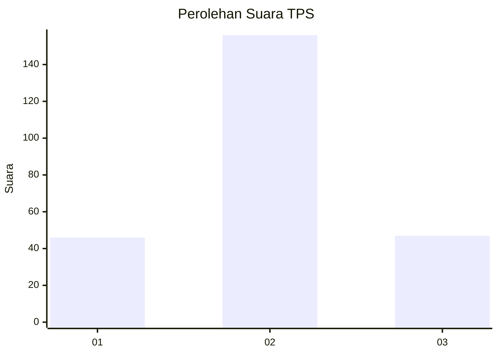
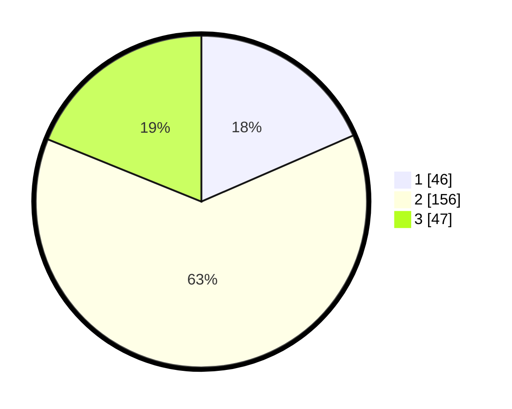

# Hasil

## Grafik

## Tabel

| No. | Nama Paslon    | Suara | Suara (raw) | Persentase |
|:--- |:-------------- | -----:| -----------:| ----------:|
| 1   | ANIES MUHAIMIN | 46    | [46][p-1]   | 18,47      |
| 2   | PRABOWO GIBRAN | 156   | [156][p-2]  | 62,65      |
| 3   | GANJAR MAHFUD  | 47    | [47][p-3]   | 18,88      |

[p-1]: https://github.com/gigit-pemilu/pemilu-2024-35-jawa-timur/blob/main/pilpres/hitung-suara/sub/35-jawa-timur/sub/07-malang/sub/22-dau/sub/2006-tegalweru/sub/003-tps/sub/paslon-1.txt
[p-2]: https://github.com/gigit-pemilu/pemilu-2024-35-jawa-timur/blob/main/pilpres/hitung-suara/sub/35-jawa-timur/sub/07-malang/sub/22-dau/sub/2006-tegalweru/sub/003-tps/sub/paslon-2.txt
[p-3]: https://github.com/gigit-pemilu/pemilu-2024-35-jawa-timur/blob/main/pilpres/hitung-suara/sub/35-jawa-timur/sub/07-malang/sub/22-dau/sub/2006-tegalweru/sub/003-tps/sub/paslon-3.txt

## Foto C Plano

https://sirekap-obj-formc.kpu.go.id/9a24/pemilu/ppwp/35/07/22/20/06/3507222006003-20240214-205828--3bfa757f-cf79-4cb6-b5a2-72dc654aa0a8.jpg

https://sirekap-obj-formc.kpu.go.id/9a24/pemilu/ppwp/35/07/22/20/06/3507222006003-20240214-205938--e29619b5-2dd3-4370-bd81-ac70cb21a1b8.jpg

## Metadata

| Key        | Value               |
| ---------- | ------------------- |
| Time Stamp | 2024-02-24 22:31:28 |

