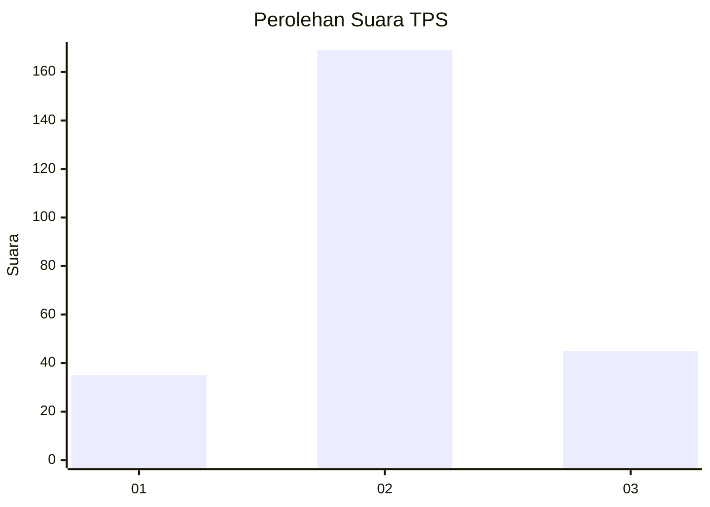
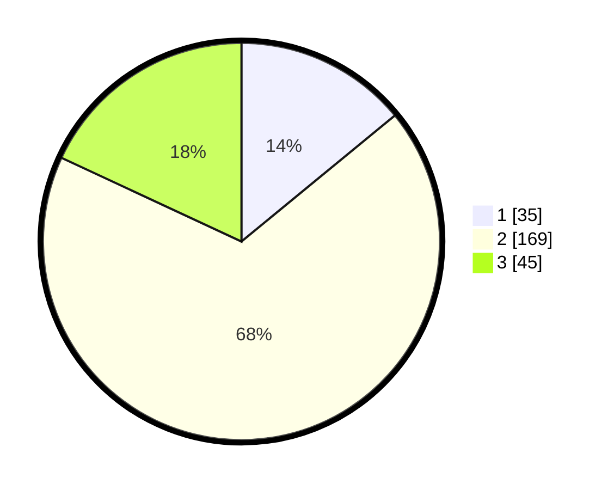

# Hasil

## Grafik

## Tabel

| No. | Nama Paslon    | Suara | Suara (raw) | Persentase |
|:--- |:-------------- | -----:| -----------:| ----------:|
| 1   | ANIES MUHAIMIN | 35    | [35][p-1]   | 14,06      |
| 2   | PRABOWO GIBRAN | 169   | [169][p-2]  | 67,87      |
| 3   | GANJAR MAHFUD  | 45    | [45][p-3]   | 18,07      |

[p-1]: https://github.com/gigit-pemilu/pemilu-2024-35-jawa-timur/blob/main/pilpres/hitung-suara/sub/35-jawa-timur/sub/07-malang/sub/22-dau/sub/2006-tegalweru/sub/005-tps/sub/paslon-1.txt
[p-2]: https://github.com/gigit-pemilu/pemilu-2024-35-jawa-timur/blob/main/pilpres/hitung-suara/sub/35-jawa-timur/sub/07-malang/sub/22-dau/sub/2006-tegalweru/sub/005-tps/sub/paslon-2.txt
[p-3]: https://github.com/gigit-pemilu/pemilu-2024-35-jawa-timur/blob/main/pilpres/hitung-suara/sub/35-jawa-timur/sub/07-malang/sub/22-dau/sub/2006-tegalweru/sub/005-tps/sub/paslon-3.txt

## Foto C Plano

https://sirekap-obj-formc.kpu.go.id/992c/pemilu/ppwp/35/07/22/20/06/3507222006005-20240215-035052--71d5abfd-ebf5-4bbd-9eff-2426f08e6495.jpg

https://sirekap-obj-formc.kpu.go.id/992c/pemilu/ppwp/35/07/22/20/06/3507222006005-20240215-035731--98ad120f-cc7c-43e0-9c89-d2de4ee5bf12.jpg

https://sirekap-obj-formc.kpu.go.id/992c/pemilu/ppwp/35/07/22/20/06/3507222006005-20240215-035825--3fd30b63-48be-499c-bc5c-9d26b164c524.jpg

## Metadata

| Key        | Value               |
| ---------- | ------------------- |
| Time Stamp | 2024-02-15 12:00:28 |

