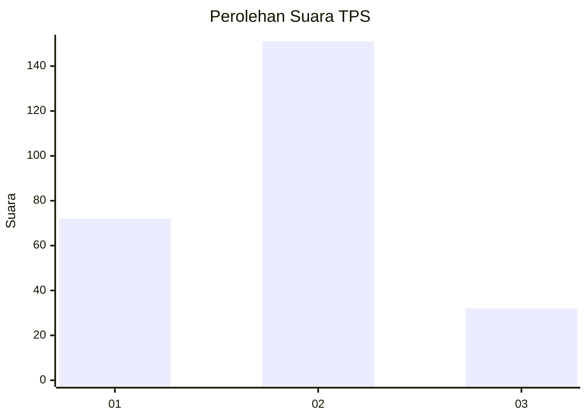
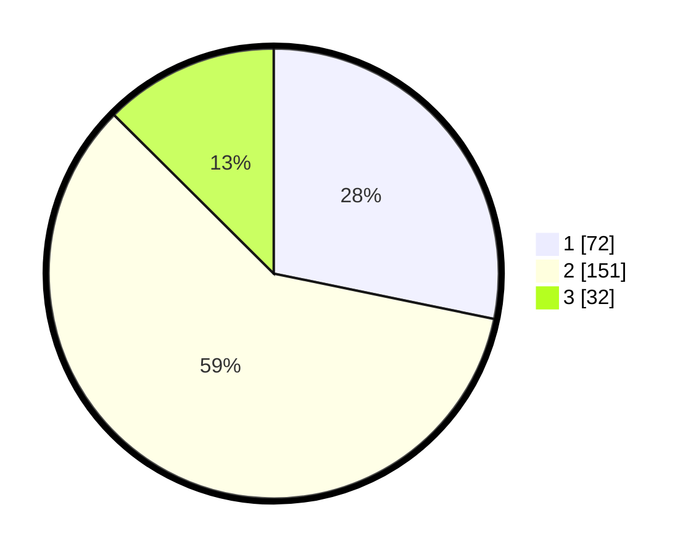

# Hasil

## Grafik

## Tabel

| No. | Nama Paslon    | Suara | Suara (raw) | Persentase |
|:--- |:-------------- | -----:| -----------:| ----------:|
| 1   | ANIES MUHAIMIN | 72    | [72][p-1]   | 28,24      |
| 2   | PRABOWO GIBRAN | 151   | [151][p-2]  | 59,22      |
| 3   | GANJAR MAHFUD  | 32    | [32][p-3]   | 12,55      |

[p-1]: https://github.com/gigit-pemilu/pemilu-2024/blob/main/pilpres/hitung-suara/sub/35-jawa-timur/sub/07-malang/sub/22-dau/sub/2007-landungsari/sub/002-tps/sub/paslon-1.txt
[p-2]: https://github.com/gigit-pemilu/pemilu-2024/blob/main/pilpres/hitung-suara/sub/35-jawa-timur/sub/07-malang/sub/22-dau/sub/2007-landungsari/sub/002-tps/sub/paslon-2.txt
[p-3]: https://github.com/gigit-pemilu/pemilu-2024/blob/main/pilpres/hitung-suara/sub/35-jawa-timur/sub/07-malang/sub/22-dau/sub/2007-landungsari/sub/002-tps/sub/paslon-3.txt

## Foto C Plano

https://sirekap-obj-formc.kpu.go.id/fed9/pemilu/ppwp/35/07/22/20/07/3507222007002-20240214-224001--b25771d8-46ad-4e7b-8110-6691ddc5e16b.jpg

https://sirekap-obj-formc.kpu.go.id/fed9/pemilu/ppwp/35/07/22/20/07/3507222007002-20240214-232914--12b199ab-ce97-41ec-b892-3333d1003f66.jpg

https://sirekap-obj-formc.kpu.go.id/fed9/pemilu/ppwp/35/07/22/20/07/3507222007002-20240214-233253--46bb847f-8382-4ab3-98ab-3d9c3899a8c6.jpg

## Metadata

| Key        | Value               |
| ---------- | ------------------- |
| Time Stamp | 2024-02-25 17:00:00 |

