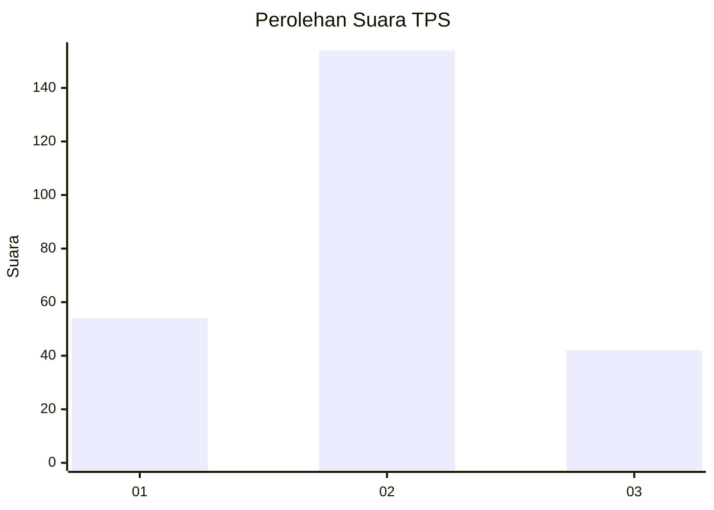

# Hasil

## Grafik

## Tabel

| No. | Nama Paslon    | Suara | Suara (raw) | Persentase |
|:--- |:-------------- | -----:| -----------:| ----------:|
| 1   | ANIES MUHAIMIN | 54    | [54][p-1]   | 21,60      |
| 2   | PRABOWO GIBRAN | 154   | [154][p-2]  | 61,60      |
| 3   | GANJAR MAHFUD  | 42    | [42][p-3]   | 16,80      |

[p-1]: https://github.com/gigit-pemilu/pemilu-2024/blob/main/pilpres/hitung-suara/sub/35-jawa-timur/sub/07-malang/sub/22-dau/sub/2007-landungsari/sub/003-tps/sub/paslon-1.txt
[p-2]: https://github.com/gigit-pemilu/pemilu-2024/blob/main/pilpres/hitung-suara/sub/35-jawa-timur/sub/07-malang/sub/22-dau/sub/2007-landungsari/sub/003-tps/sub/paslon-2.txt
[p-3]: https://github.com/gigit-pemilu/pemilu-2024/blob/main/pilpres/hitung-suara/sub/35-jawa-timur/sub/07-malang/sub/22-dau/sub/2007-landungsari/sub/003-tps/sub/paslon-3.txt

## Foto C Plano

https://sirekap-obj-formc.kpu.go.id/719c/pemilu/ppwp/35/07/22/20/07/3507222007003-20240215-022843--dc545740-462d-4063-a6ea-4ea443de6bc2.jpg

https://sirekap-obj-formc.kpu.go.id/719c/pemilu/ppwp/35/07/22/20/07/3507222007003-20240215-023218--cb920a64-e467-426f-8f3f-54a1033fb200.jpg

https://sirekap-obj-formc.kpu.go.id/719c/pemilu/ppwp/35/07/22/20/07/3507222007003-20240215-023424--4c56bfb0-0f0f-4f9c-9b37-470158e734bf.jpg

## Metadata

| Key        | Value               |
| ---------- | ------------------- |
| Time Stamp | 2024-02-24 22:31:28 |

