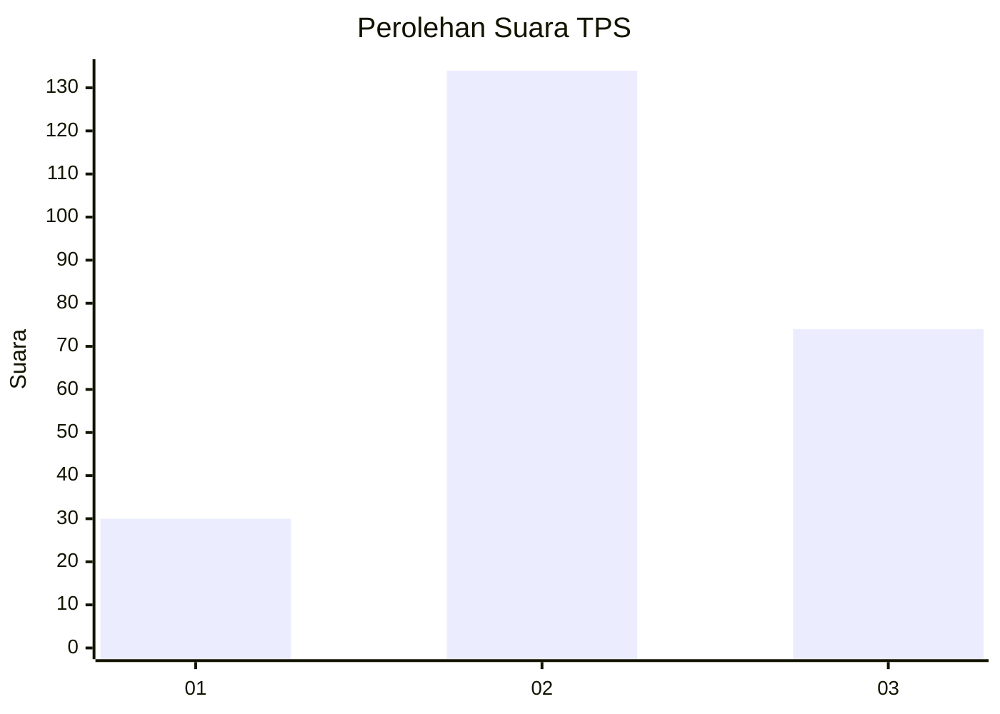
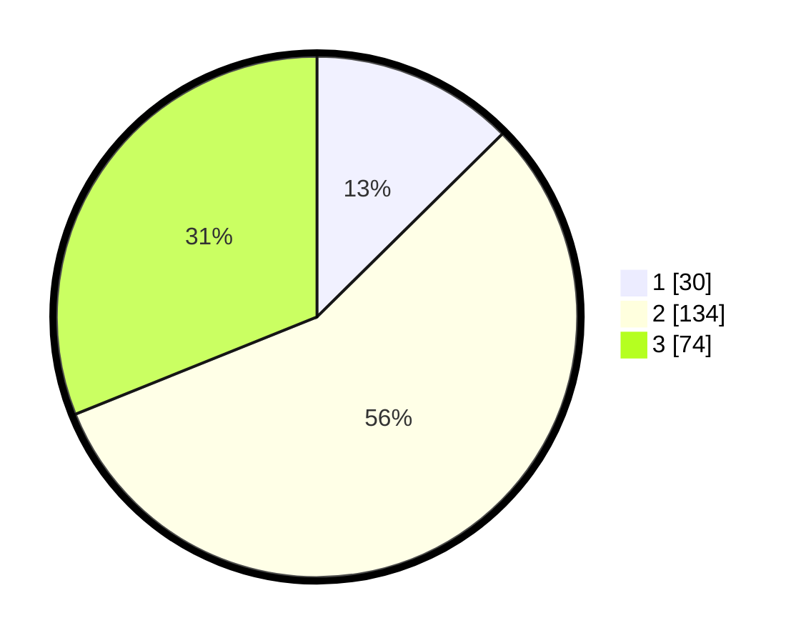

# Hasil

## Grafik

## Tabel

| No. | Nama Paslon    | Suara | Suara (raw) | Persentase |
|:--- |:-------------- | -----:| -----------:| ----------:|
| 1   | ANIES MUHAIMIN | 30    | [30][p-1]   | 12,61      |
| 2   | PRABOWO GIBRAN | 134   | [134][p-2]  | 56,30      |
| 3   | GANJAR MAHFUD  | 74    | [74][p-3]   | 31,09      |

[p-1]: https://github.com/gigit-pemilu/pemilu-2024-35-jawa-timur/blob/main/pilpres/hitung-suara/sub/35-jawa-timur/sub/07-malang/sub/22-dau/sub/2007-landungsari/sub/006-tps/sub/paslon-1.txt
[p-2]: https://github.com/gigit-pemilu/pemilu-2024-35-jawa-timur/blob/main/pilpres/hitung-suara/sub/35-jawa-timur/sub/07-malang/sub/22-dau/sub/2007-landungsari/sub/006-tps/sub/paslon-2.txt
[p-3]: https://github.com/gigit-pemilu/pemilu-2024-35-jawa-timur/blob/main/pilpres/hitung-suara/sub/35-jawa-timur/sub/07-malang/sub/22-dau/sub/2007-landungsari/sub/006-tps/sub/paslon-3.txt

## Foto C Plano

https://sirekap-obj-formc.kpu.go.id/a89f/pemilu/ppwp/35/07/22/20/07/3507222007006-20240214-211806--a5e992fd-a4b6-49be-b0cb-7039f43a471a.jpg

https://sirekap-obj-formc.kpu.go.id/a89f/pemilu/ppwp/35/07/22/20/07/3507222007006-20240214-211859--f47dc01d-feaf-487d-baf5-009b07727175.jpg

https://sirekap-obj-formc.kpu.go.id/a89f/pemilu/ppwp/35/07/22/20/07/3507222007006-20240214-211929--5484b53c-7dea-4a90-a8b5-da2a40f1ddbb.jpg

## Metadata

| Key        | Value               |
| ---------- | ------------------- |
| Time Stamp | 2024-02-25 12:00:00 |

