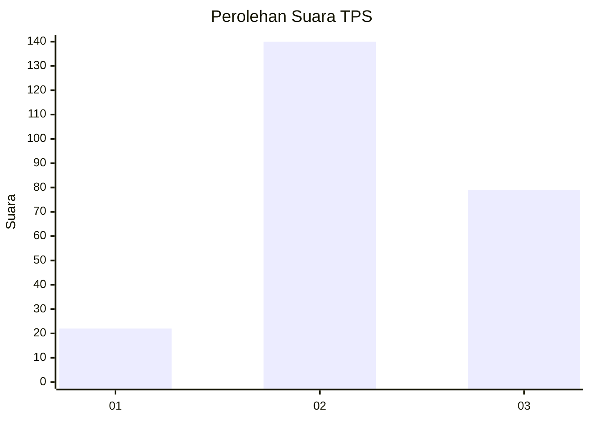
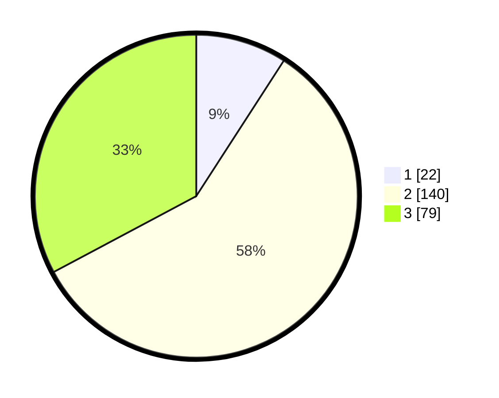

# Hasil

## Grafik

## Tabel

| No. | Nama Paslon    | Suara | Suara (raw) | Persentase |
|:--- |:-------------- | -----:| -----------:| ----------:|
| 1   | ANIES MUHAIMIN | 22    | [22][p-1]   | 9,13       |
| 2   | PRABOWO GIBRAN | 140   | [140][p-2]  | 58,09      |
| 3   | GANJAR MAHFUD  | 79    | [79][p-3]   | 32,78      |

[p-1]: https://github.com/gigit-pemilu/pemilu-2024/blob/main/pilpres/hitung-suara/sub/35-jawa-timur/sub/07-malang/sub/22-dau/sub/2007-landungsari/sub/007-tps/sub/paslon-1.txt
[p-2]: https://github.com/gigit-pemilu/pemilu-2024/blob/main/pilpres/hitung-suara/sub/35-jawa-timur/sub/07-malang/sub/22-dau/sub/2007-landungsari/sub/007-tps/sub/paslon-2.txt
[p-3]: https://github.com/gigit-pemilu/pemilu-2024/blob/main/pilpres/hitung-suara/sub/35-jawa-timur/sub/07-malang/sub/22-dau/sub/2007-landungsari/sub/007-tps/sub/paslon-3.txt

## Foto C Plano

https://sirekap-obj-formc.kpu.go.id/e549/pemilu/ppwp/35/07/22/20/07/3507222007007-20240214-221158--601e4c43-f34b-452f-93d8-cfe6a0373378.jpg

https://sirekap-obj-formc.kpu.go.id/e549/pemilu/ppwp/35/07/22/20/07/3507222007007-20240214-221300--56ad213a-830f-4697-9b63-37561c704f7e.jpg

https://sirekap-obj-formc.kpu.go.id/e549/pemilu/ppwp/35/07/22/20/07/3507222007007-20240214-221414--df77733b-45ba-4be5-a73e-063cbfc00ef0.jpg

## Metadata

| Key        | Value               |
| ---------- | ------------------- |
| Time Stamp | 2024-03-01 22:00:00 |

