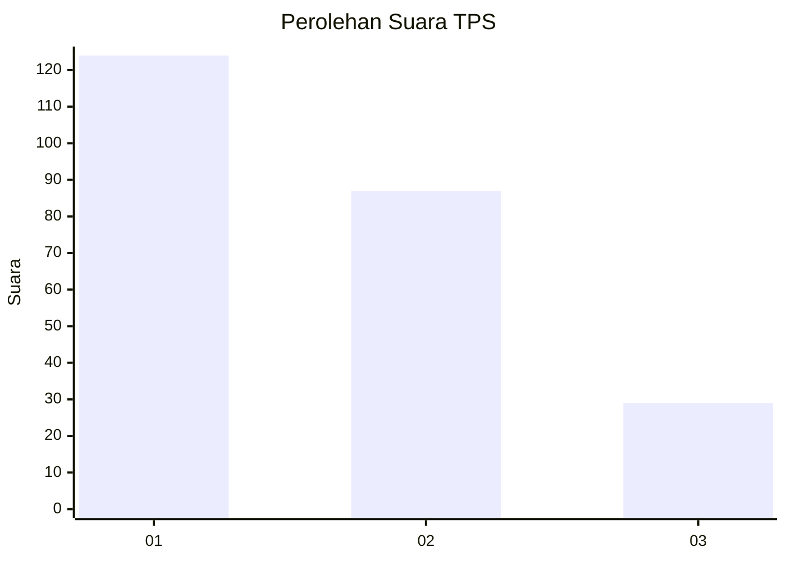
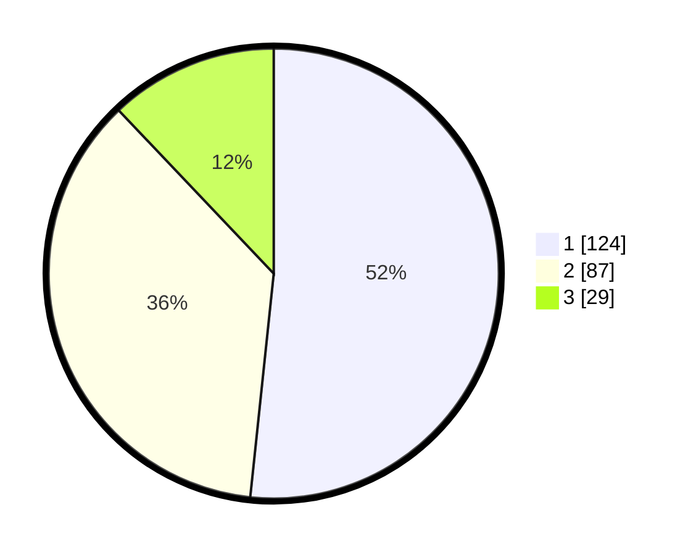

# Hasil

## Grafik

## Tabel

| No. | Nama Paslon    | Suara | Suara (raw) | Persentase |
|:--- |:-------------- | -----:| -----------:| ----------:|
| 1   | ANIES MUHAIMIN | 124   | [124][p-1]  | 51,67      |
| 2   | PRABOWO GIBRAN | 87    | [87][p-2]   | 36,25      |
| 3   | GANJAR MAHFUD  | 29    | [29][p-3]   | 12,08      |

[p-1]: https://github.com/gigit-pemilu/pemilu-2024-35-jawa-timur/blob/main/pilpres/hitung-suara/sub/35-jawa-timur/sub/07-malang/sub/22-dau/sub/2007-landungsari/sub/021-tps/sub/paslon-1.txt
[p-2]: https://github.com/gigit-pemilu/pemilu-2024-35-jawa-timur/blob/main/pilpres/hitung-suara/sub/35-jawa-timur/sub/07-malang/sub/22-dau/sub/2007-landungsari/sub/021-tps/sub/paslon-2.txt
[p-3]: https://github.com/gigit-pemilu/pemilu-2024-35-jawa-timur/blob/main/pilpres/hitung-suara/sub/35-jawa-timur/sub/07-malang/sub/22-dau/sub/2007-landungsari/sub/021-tps/sub/paslon-3.txt

## Foto C Plano

https://sirekap-obj-formc.kpu.go.id/53a3/pemilu/ppwp/35/07/22/20/07/3507222007021-20240215-021220--248ad8ad-86e8-458f-a7a9-410a6ebe939b.jpg

https://sirekap-obj-formc.kpu.go.id/53a3/pemilu/ppwp/35/07/22/20/07/3507222007021-20240215-024407--82ff3b3d-1b91-4173-9352-7d54bc4f1f16.jpg

https://sirekap-obj-formc.kpu.go.id/53a3/pemilu/ppwp/35/07/22/20/07/3507222007021-20240215-021416--9705e390-1842-4705-820e-e8361b71b82c.jpg

## Metadata

| Key        | Value               |
| ---------- | ------------------- |
| Time Stamp | 2024-02-15 15:30:25 |

