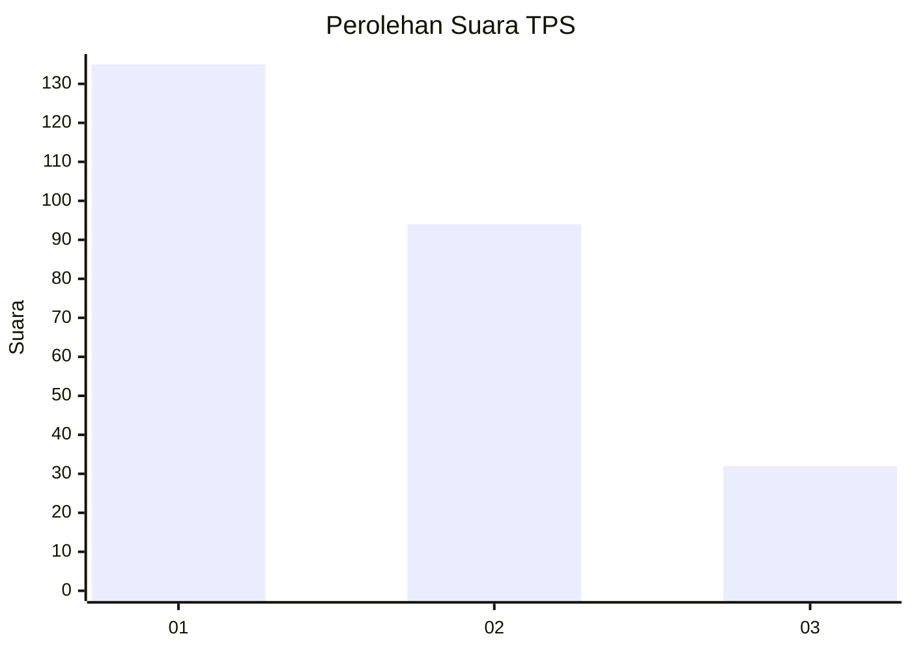
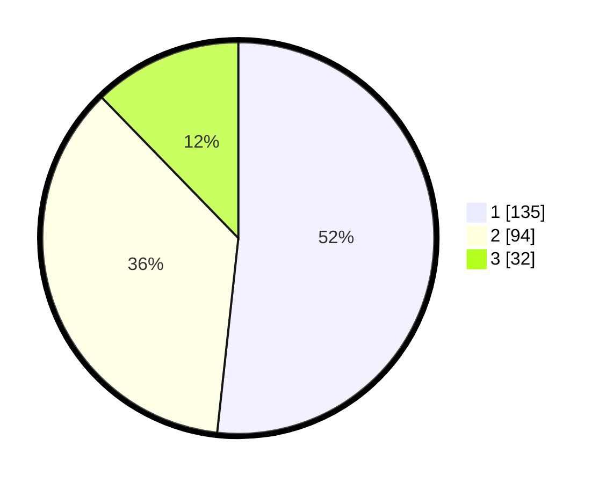

# Hasil

## Grafik

## Tabel

| No. | Nama Paslon    | Suara | Suara (raw) | Persentase |
|:--- |:-------------- | -----:| -----------:| ----------:|
| 1   | ANIES MUHAIMIN | 135   | [135][p-1]  | 51,72      |
| 2   | PRABOWO GIBRAN | 94    | [94][p-2]   | 36,02      |
| 3   | GANJAR MAHFUD  | 32    | [32][p-3]   | 12,26      |

[p-1]: https://github.com/gigit-pemilu/pemilu-2024-35-jawa-timur/blob/main/pilpres/hitung-suara/sub/35-jawa-timur/sub/07-malang/sub/22-dau/sub/2007-landungsari/sub/022-tps/sub/paslon-1.txt
[p-2]: https://github.com/gigit-pemilu/pemilu-2024-35-jawa-timur/blob/main/pilpres/hitung-suara/sub/35-jawa-timur/sub/07-malang/sub/22-dau/sub/2007-landungsari/sub/022-tps/sub/paslon-2.txt
[p-3]: https://github.com/gigit-pemilu/pemilu-2024-35-jawa-timur/blob/main/pilpres/hitung-suara/sub/35-jawa-timur/sub/07-malang/sub/22-dau/sub/2007-landungsari/sub/022-tps/sub/paslon-3.txt

## Foto C Plano

https://sirekap-obj-formc.kpu.go.id/5bf8/pemilu/ppwp/35/07/22/20/07/3507222007022-20240214-222106--e00a3f40-ae1f-429a-89dd-b7b4129bd41f.jpg

https://sirekap-obj-formc.kpu.go.id/5bf8/pemilu/ppwp/35/07/22/20/07/3507222007022-20240214-222141--1ae0bfc2-300f-482b-9777-721f13ae07e4.jpg

https://sirekap-obj-formc.kpu.go.id/5bf8/pemilu/ppwp/35/07/22/20/07/3507222007022-20240214-222215--416fd494-8a5c-478b-8e02-2fa5f79b3086.jpg

## Metadata

| Key        | Value               |
| ---------- | ------------------- |
| Time Stamp | 2024-02-25 00:00:00 |

