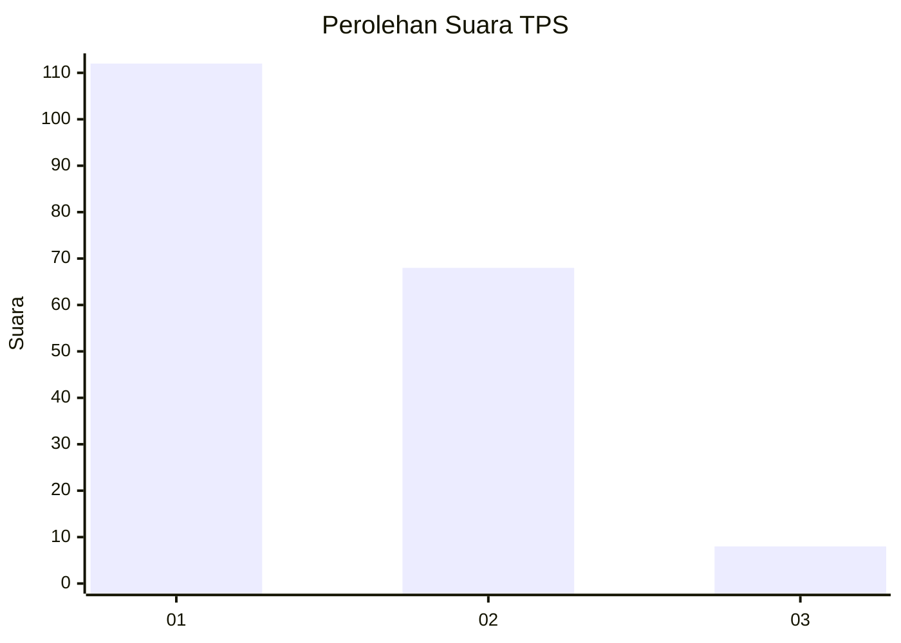
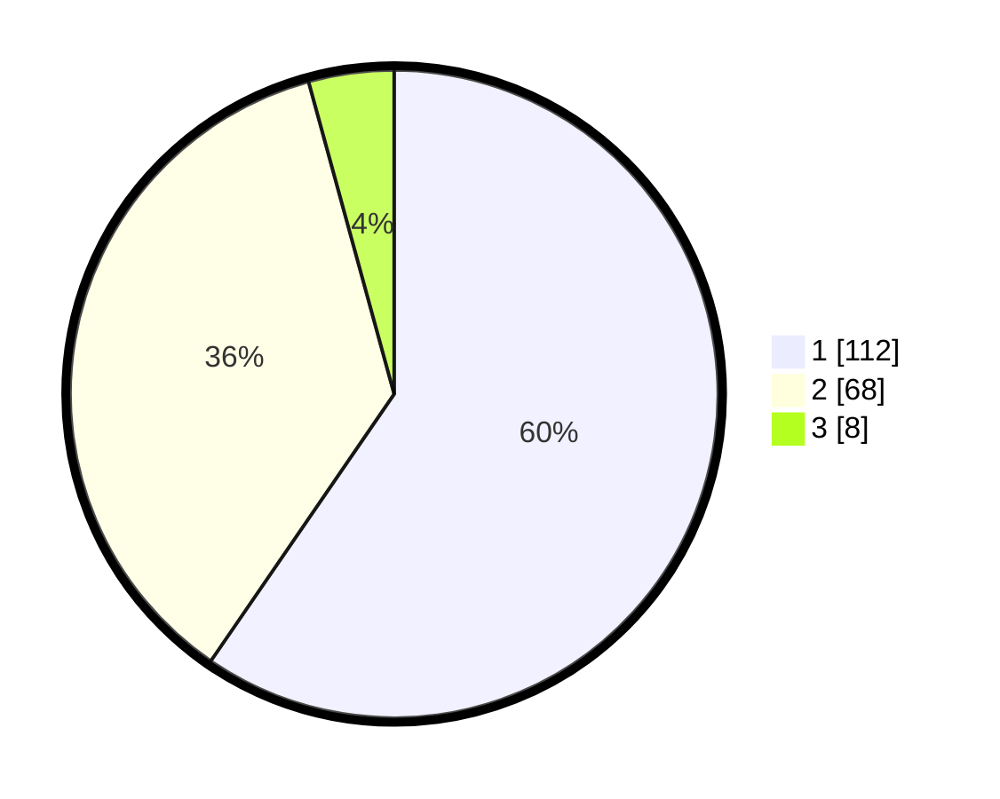

# Hasil

## Grafik

## Tabel

| No. | Nama Paslon    | Suara | Suara (raw) | Persentase |
|:--- |:-------------- | -----:| -----------:| ----------:|
| 1   | ANIES MUHAIMIN | 112   | [112][p-1]  | 59,57      |
| 2   | PRABOWO GIBRAN | 68    | [68][p-2]   | 36,17      |
| 3   | GANJAR MAHFUD  | 8     | [8][p-3]    | 4,26       |

[p-1]: https://github.com/gigit-pemilu/pemilu-2024-35-jawa-timur/blob/main/pilpres/hitung-suara/sub/35-jawa-timur/sub/07-malang/sub/22-dau/sub/2007-landungsari/sub/023-tps/sub/paslon-1.txt
[p-2]: https://github.com/gigit-pemilu/pemilu-2024-35-jawa-timur/blob/main/pilpres/hitung-suara/sub/35-jawa-timur/sub/07-malang/sub/22-dau/sub/2007-landungsari/sub/023-tps/sub/paslon-2.txt
[p-3]: https://github.com/gigit-pemilu/pemilu-2024-35-jawa-timur/blob/main/pilpres/hitung-suara/sub/35-jawa-timur/sub/07-malang/sub/22-dau/sub/2007-landungsari/sub/023-tps/sub/paslon-3.txt

## Foto C Plano

https://sirekap-obj-formc.kpu.go.id/5396/pemilu/ppwp/35/07/22/20/07/3507222007023-20240215-023959--5885e6c2-f7b2-44c4-ad6a-bdae72465da1.jpg

https://sirekap-obj-formc.kpu.go.id/5396/pemilu/ppwp/35/07/22/20/07/3507222007023-20240215-045128--3a14c44e-37de-4398-b1bb-aef90616f570.jpg

https://sirekap-obj-formc.kpu.go.id/5396/pemilu/ppwp/35/07/22/20/07/3507222007023-20240215-014918--32ddb165-eee9-4bc9-ab4f-374a96d97b48.jpg

## Metadata

| Key        | Value               |
| ---------- | ------------------- |
| Time Stamp | 2024-02-25 22:00:00 |

