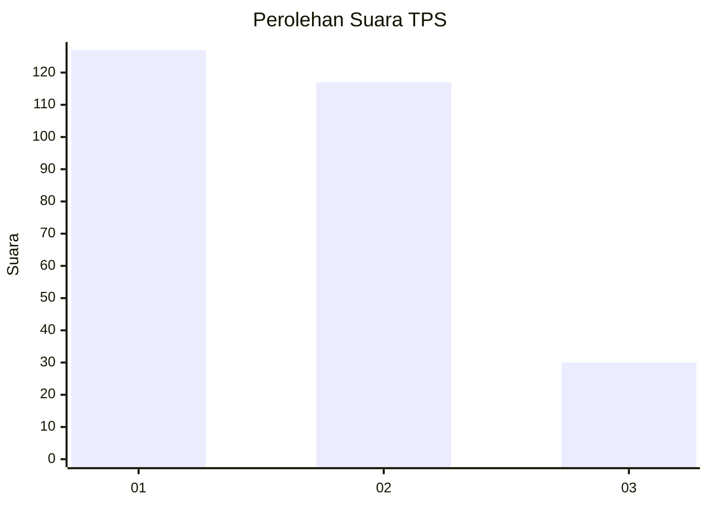
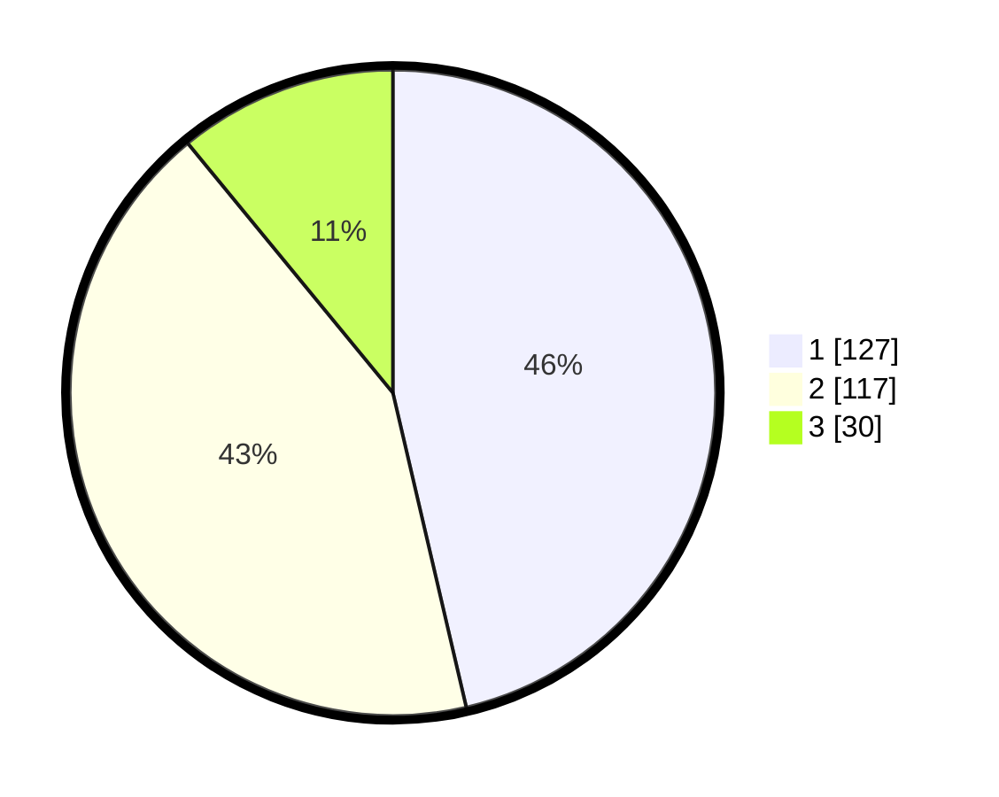

# Hasil

## Grafik

## Tabel

| No. | Nama Paslon    | Suara | Suara (raw) | Persentase |
|:--- |:-------------- | -----:| -----------:| ----------:|
| 1   | ANIES MUHAIMIN | 127   | [127][p-1]  | 46,35      |
| 2   | PRABOWO GIBRAN | 117   | [117][p-2]  | 42,70      |
| 3   | GANJAR MAHFUD  | 30    | [30][p-3]   | 10,95      |

[p-1]: https://github.com/gigit-pemilu/pemilu-2024-35-jawa-timur/blob/main/pilpres/hitung-suara/sub/35-jawa-timur/sub/07-malang/sub/22-dau/sub/2007-landungsari/sub/024-tps/sub/paslon-1.txt
[p-2]: https://github.com/gigit-pemilu/pemilu-2024-35-jawa-timur/blob/main/pilpres/hitung-suara/sub/35-jawa-timur/sub/07-malang/sub/22-dau/sub/2007-landungsari/sub/024-tps/sub/paslon-2.txt
[p-3]: https://github.com/gigit-pemilu/pemilu-2024-35-jawa-timur/blob/main/pilpres/hitung-suara/sub/35-jawa-timur/sub/07-malang/sub/22-dau/sub/2007-landungsari/sub/024-tps/sub/paslon-3.txt

## Foto C Plano

https://sirekap-obj-formc.kpu.go.id/912f/pemilu/ppwp/35/07/22/20/07/3507222007024-20240215-032037--f56ac3f2-9e8b-446a-9f93-618844669039.jpg

https://sirekap-obj-formc.kpu.go.id/912f/pemilu/ppwp/35/07/22/20/07/3507222007024-20240215-032218--2f1ca5f2-e06b-4b0c-9a47-d415d3a5732b.jpg

https://sirekap-obj-formc.kpu.go.id/912f/pemilu/ppwp/35/07/22/20/07/3507222007024-20240215-032400--6bfb6431-bc4f-40c3-becf-c9a9ff145b88.jpg

## Metadata

| Key        | Value               |
| ---------- | ------------------- |
| Time Stamp | 2024-02-24 22:31:28 |

