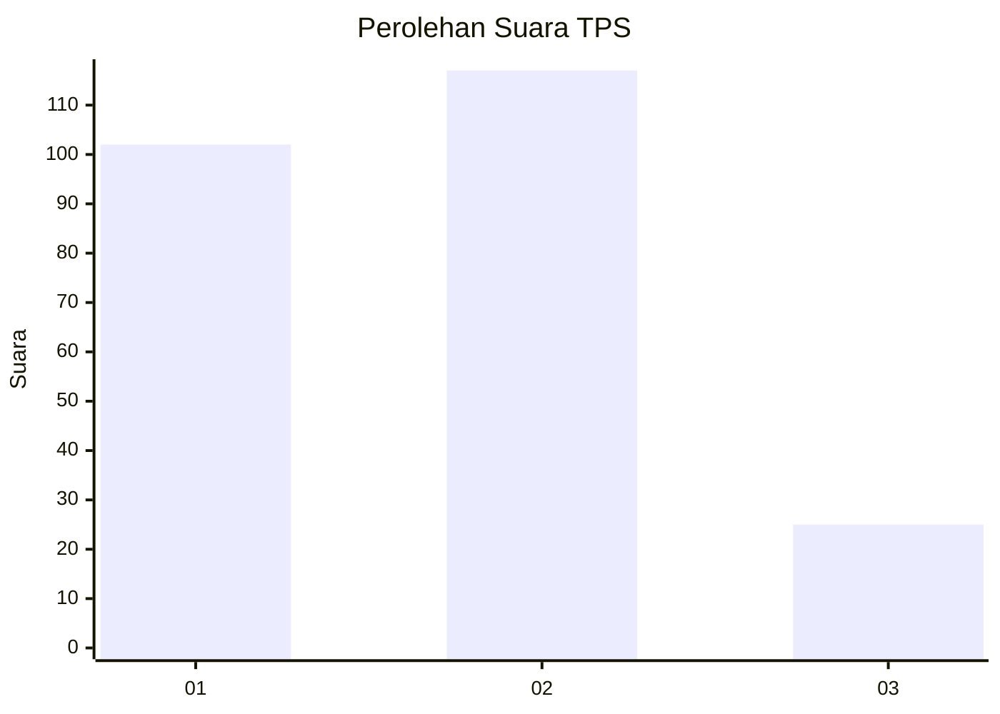
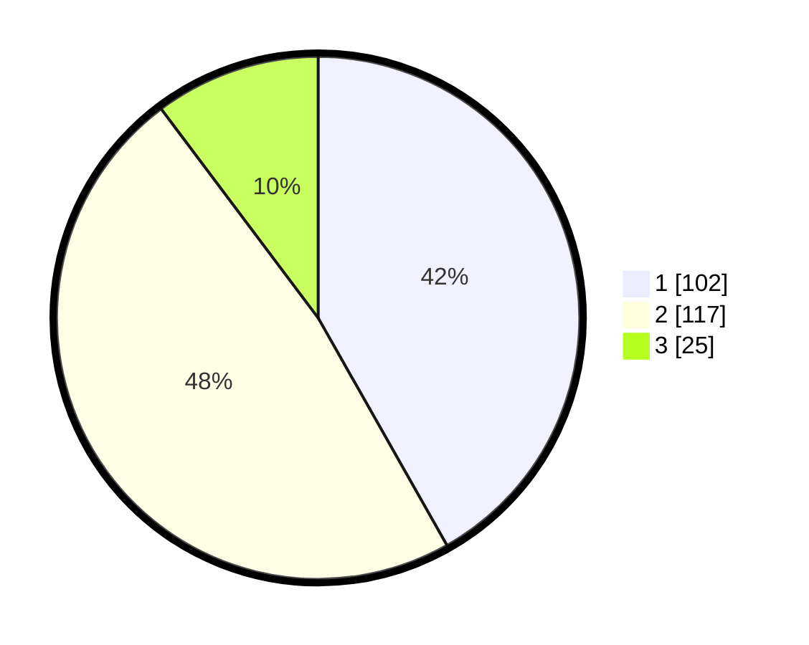

# Hasil

## Grafik

## Tabel

| No. | Nama Paslon    | Suara | Suara (raw) | Persentase |
|:--- |:-------------- | -----:| -----------:| ----------:|
| 1   | ANIES MUHAIMIN | 102   | [102][p-1]  | 41,80      |
| 2   | PRABOWO GIBRAN | 117   | [117][p-2]  | 47,95      |
| 3   | GANJAR MAHFUD  | 25    | [25][p-3]   | 10,25      |

[p-1]: https://github.com/gigit-pemilu/pemilu-2024-35-jawa-timur/blob/main/pilpres/hitung-suara/sub/35-jawa-timur/sub/07-malang/sub/22-dau/sub/2007-landungsari/sub/025-tps/sub/paslon-1.txt
[p-2]: https://github.com/gigit-pemilu/pemilu-2024-35-jawa-timur/blob/main/pilpres/hitung-suara/sub/35-jawa-timur/sub/07-malang/sub/22-dau/sub/2007-landungsari/sub/025-tps/sub/paslon-2.txt
[p-3]: https://github.com/gigit-pemilu/pemilu-2024-35-jawa-timur/blob/main/pilpres/hitung-suara/sub/35-jawa-timur/sub/07-malang/sub/22-dau/sub/2007-landungsari/sub/025-tps/sub/paslon-3.txt

## Foto C Plano

https://sirekap-obj-formc.kpu.go.id/4abd/pemilu/ppwp/35/07/22/20/07/3507222007025-20240215-023554--ee78aed0-c27d-4b71-be80-8335d87d055d.jpg

https://sirekap-obj-formc.kpu.go.id/4abd/pemilu/ppwp/35/07/22/20/07/3507222007025-20240215-023728--77aab678-3288-4f81-96c8-9cf7d5e3cdf2.jpg

https://sirekap-obj-formc.kpu.go.id/4abd/pemilu/ppwp/35/07/22/20/07/3507222007025-20240215-023834--9b8a9d3b-714f-438e-ac5b-83fa848233af.jpg

## Metadata

| Key        | Value               |
| ---------- | ------------------- |
| Time Stamp | 2024-02-24 22:31:28 |

## DATA PEMILIH TETAP

Jumlah pemilih dalam DPT: **279**.
 * L: **138**.
 * P: **141**.

## DATA PENGGUNA HAK PILIH

Jumlah pengguna hak pilih dalam DPT: **206**.
 * L: **97**.
 * P: **109**.

Jumlah pengguna hak pilih dalam DPTb: **19**.
 * L: **7**.
 * P: **12**.

Jumlah pengguna hak pilih dalam DPK: **21**.
 * L: **7**.
 * P: **14**.

Jumlah pengguna hak pilih: **246**.
 * L: **111**.
 * P: **135**.

## JUMLAH SUARA SAH DAN TIDAK SAH

JUMLAH SELURUH SUARA SAH: **244**.

JUMLAH SUARA TIDAK SAH: **2**.

JUMLAH SELURUH SUARA SAH DAN SUARA TIDAK SAH: **246**.

