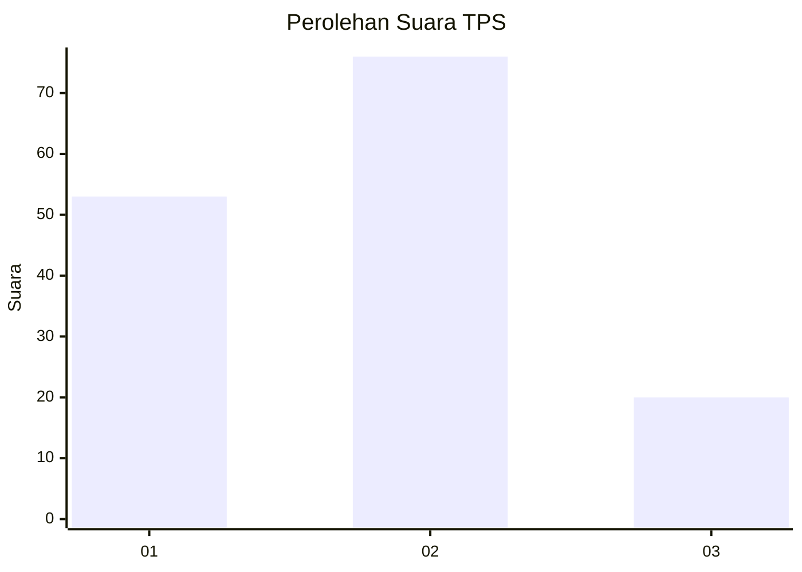
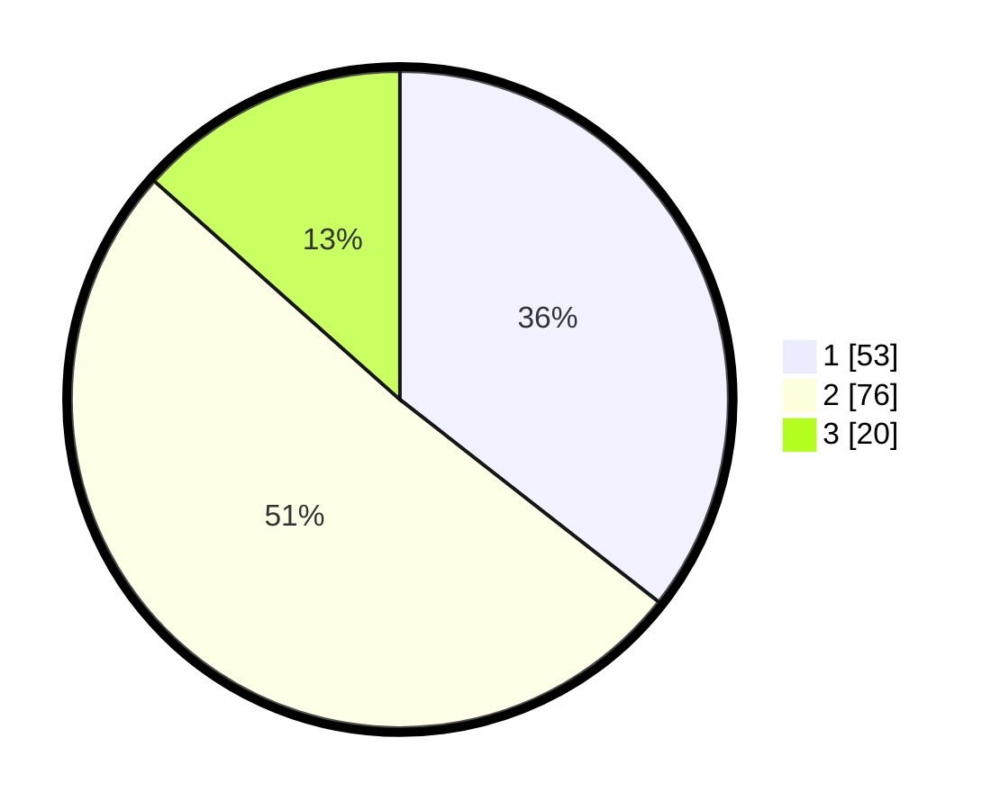

# Hasil

## Grafik

## Tabel

| No. | Nama Paslon    | Suara | Suara (raw) | Persentase |
|:--- |:-------------- | -----:| -----------:| ----------:|
| 1   | ANIES MUHAIMIN | 53    | [53][p-1]   | 35,57      |
| 2   | PRABOWO GIBRAN | 76    | [76][p-2]   | 51,01      |
| 3   | GANJAR MAHFUD  | 20    | [20][p-3]   | 13,42      |

[p-1]: https://github.com/gigit-pemilu/pemilu-2024-35-jawa-timur/blob/main/pilpres/hitung-suara/sub/35-jawa-timur/sub/07-malang/sub/22-dau/sub/2007-landungsari/sub/026-tps/sub/paslon-1.txt
[p-2]: https://github.com/gigit-pemilu/pemilu-2024-35-jawa-timur/blob/main/pilpres/hitung-suara/sub/35-jawa-timur/sub/07-malang/sub/22-dau/sub/2007-landungsari/sub/026-tps/sub/paslon-2.txt
[p-3]: https://github.com/gigit-pemilu/pemilu-2024-35-jawa-timur/blob/main/pilpres/hitung-suara/sub/35-jawa-timur/sub/07-malang/sub/22-dau/sub/2007-landungsari/sub/026-tps/sub/paslon-3.txt

## Foto C Plano

https://sirekap-obj-formc.kpu.go.id/2818/pemilu/ppwp/35/07/22/20/07/3507222007026-20240214-221851--9b2a51d5-6cf6-4d71-b295-638f88fa1ddb.jpg

https://sirekap-obj-formc.kpu.go.id/2818/pemilu/ppwp/35/07/22/20/07/3507222007026-20240214-221938--f5279349-fbc8-4f84-beb6-1913f2aa47da.jpg

https://sirekap-obj-formc.kpu.go.id/2818/pemilu/ppwp/35/07/22/20/07/3507222007026-20240214-222049--4ad5e9cb-4b35-4817-8df9-372ac9f5eeb1.jpg

## Metadata

| Key        | Value               |
| ---------- | ------------------- |
| Time Stamp | 2024-02-15 09:00:24 |

