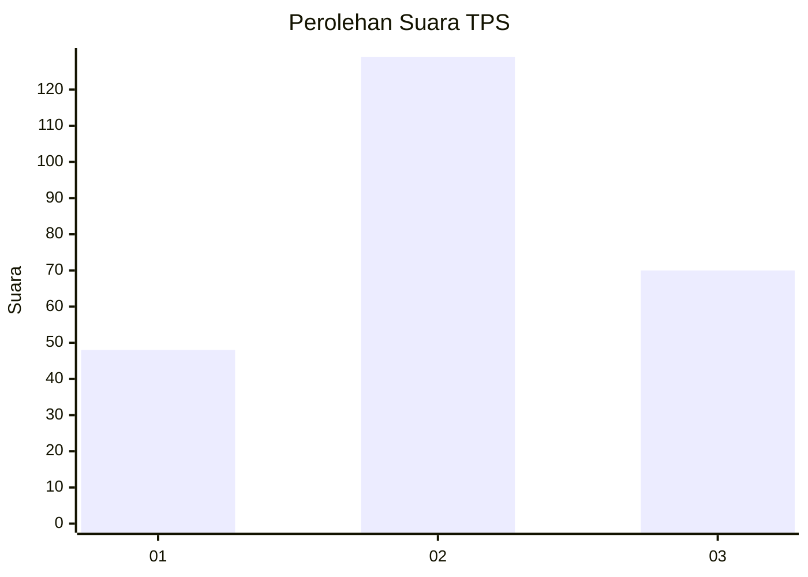
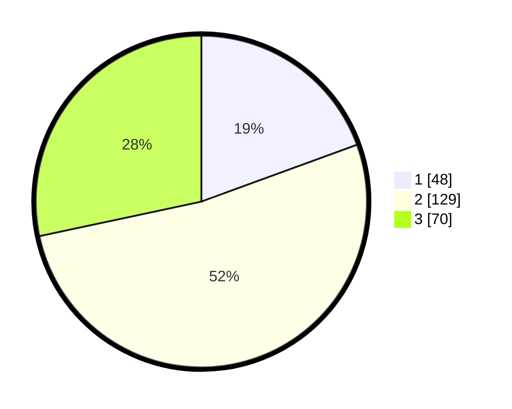

# Hasil

## Grafik

## Tabel

| No. | Nama Paslon    | Suara | Suara (raw) | Persentase |
|:--- |:-------------- | -----:| -----------:| ----------:|
| 1   | ANIES MUHAIMIN | 48    | [48][p-1]   | 19,43      |
| 2   | PRABOWO GIBRAN | 129   | [129][p-2]  | 52,23      |
| 3   | GANJAR MAHFUD  | 70    | [70][p-3]   | 28,34      |

[p-1]: https://github.com/gigit-pemilu/pemilu-2024/blob/main/pilpres/hitung-suara/sub/35-jawa-timur/sub/07-malang/sub/22-dau/sub/2008-mulyoagung/sub/002-tps/sub/paslon-1.txt
[p-2]: https://github.com/gigit-pemilu/pemilu-2024/blob/main/pilpres/hitung-suara/sub/35-jawa-timur/sub/07-malang/sub/22-dau/sub/2008-mulyoagung/sub/002-tps/sub/paslon-2.txt
[p-3]: https://github.com/gigit-pemilu/pemilu-2024/blob/main/pilpres/hitung-suara/sub/35-jawa-timur/sub/07-malang/sub/22-dau/sub/2008-mulyoagung/sub/002-tps/sub/paslon-3.txt

## Foto C Plano

https://sirekap-obj-formc.kpu.go.id/2480/pemilu/ppwp/35/07/22/20/08/3507222008002-20240215-101625--0c70ee1c-6528-4ed6-9e07-dddca16f292a.jpg

https://sirekap-obj-formc.kpu.go.id/2480/pemilu/ppwp/35/07/22/20/08/3507222008002-20240215-101644--48f61dbc-a569-454d-90ae-24aba67495e1.jpg

https://sirekap-obj-formc.kpu.go.id/2480/pemilu/ppwp/35/07/22/20/08/3507222008002-20240215-101653--c22d48b9-6db6-4c8a-9e77-0e9d5a9a8f87.jpg

## Metadata

| Key        | Value               |
| ---------- | ------------------- |
| Time Stamp | 2024-02-25 16:00:00 |

