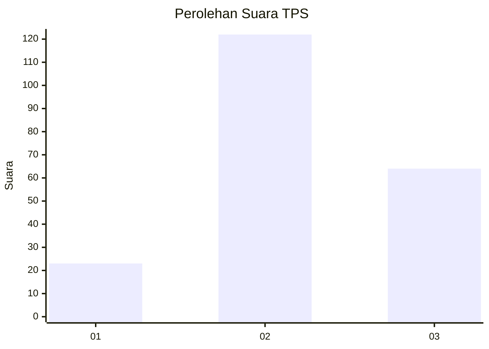
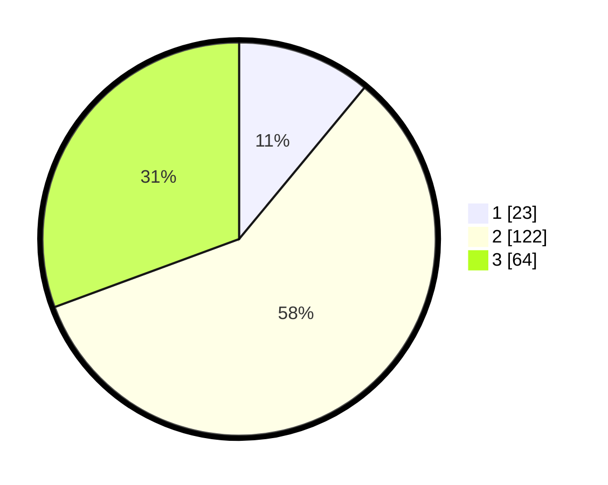

# Hasil

## Grafik

## Tabel

| No. | Nama Paslon    | Suara | Suara (raw) | Persentase |
|:--- |:-------------- | -----:| -----------:| ----------:|
| 1   | ANIES MUHAIMIN | 23    | [23][p-1]   | 11,00      |
| 2   | PRABOWO GIBRAN | 122   | [122][p-2]  | 58,37      |
| 3   | GANJAR MAHFUD  | 64    | [64][p-3]   | 30,62      |

[p-1]: https://github.com/gigit-pemilu/pemilu-2024/blob/main/pilpres/hitung-suara/sub/35-jawa-timur/sub/07-malang/sub/22-dau/sub/2008-mulyoagung/sub/005-tps/sub/paslon-1.txt
[p-2]: https://github.com/gigit-pemilu/pemilu-2024/blob/main/pilpres/hitung-suara/sub/35-jawa-timur/sub/07-malang/sub/22-dau/sub/2008-mulyoagung/sub/005-tps/sub/paslon-2.txt
[p-3]: https://github.com/gigit-pemilu/pemilu-2024/blob/main/pilpres/hitung-suara/sub/35-jawa-timur/sub/07-malang/sub/22-dau/sub/2008-mulyoagung/sub/005-tps/sub/paslon-3.txt

## Foto C Plano

https://sirekap-obj-formc.kpu.go.id/0838/pemilu/ppwp/35/07/22/20/08/3507222008005-20240215-021342--c6c3ba3f-d655-4dfe-9ba3-a0cb1fc5638d.jpg

https://sirekap-obj-formc.kpu.go.id/0838/pemilu/ppwp/35/07/22/20/08/3507222008005-20240215-021542--1b4d3a5e-004d-4386-a446-15a051850d01.jpg

https://sirekap-obj-formc.kpu.go.id/0838/pemilu/ppwp/35/07/22/20/08/3507222008005-20240215-021644--229253b1-4dfe-47d7-aa0b-fde6dd1dcf87.jpg

## Metadata

| Key        | Value               |
| ---------- | ------------------- |
| Time Stamp | 2024-02-24 22:31:28 |

