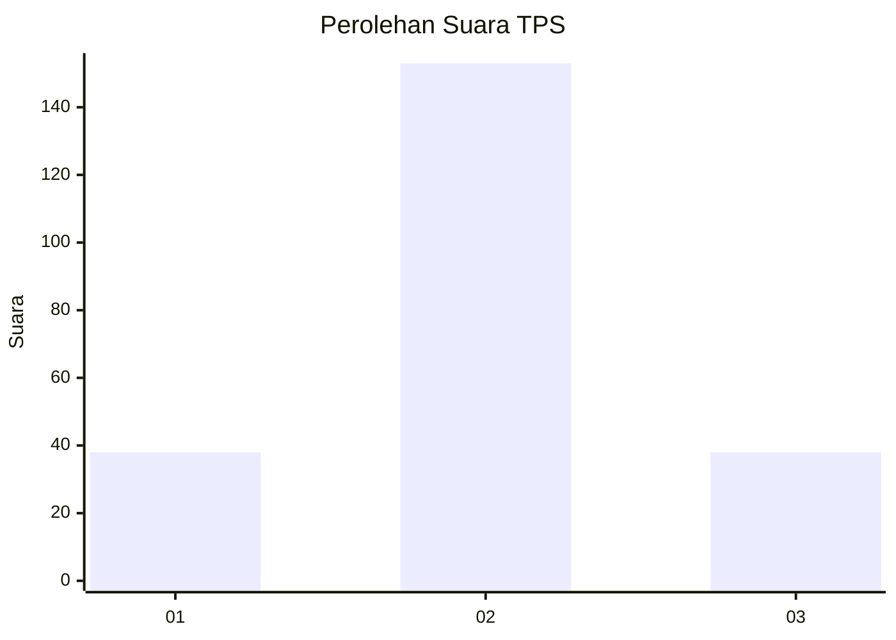
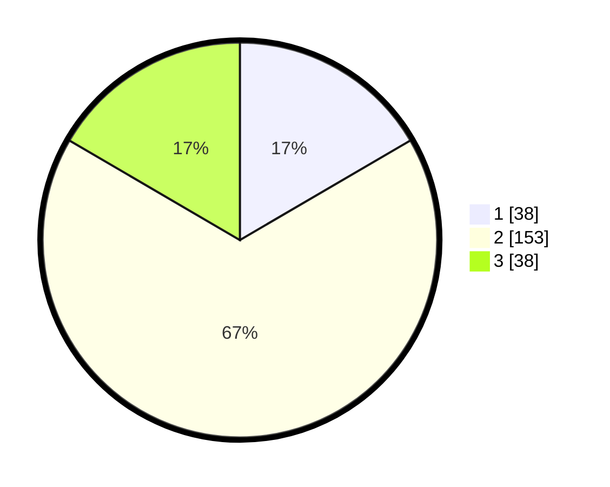

# Hasil

## Grafik

## Tabel

| No. | Nama Paslon    | Suara | Suara (raw) | Persentase |
|:--- |:-------------- | -----:| -----------:| ----------:|
| 1   | ANIES MUHAIMIN | 38    | [38][p-1]   | 16,59      |
| 2   | PRABOWO GIBRAN | 153   | [153][p-2]  | 66,81      |
| 3   | GANJAR MAHFUD  | 38    | [38][p-3]   | 16,59      |

[p-1]: https://github.com/gigit-pemilu/pemilu-2024/blob/main/pilpres/hitung-suara/sub/35-jawa-timur/sub/07-malang/sub/22-dau/sub/2008-mulyoagung/sub/007-tps/sub/paslon-1.txt
[p-2]: https://github.com/gigit-pemilu/pemilu-2024/blob/main/pilpres/hitung-suara/sub/35-jawa-timur/sub/07-malang/sub/22-dau/sub/2008-mulyoagung/sub/007-tps/sub/paslon-2.txt
[p-3]: https://github.com/gigit-pemilu/pemilu-2024/blob/main/pilpres/hitung-suara/sub/35-jawa-timur/sub/07-malang/sub/22-dau/sub/2008-mulyoagung/sub/007-tps/sub/paslon-3.txt

## Foto C Plano

https://sirekap-obj-formc.kpu.go.id/a5ee/pemilu/ppwp/35/07/22/20/08/3507222008007-20240214-233713--5faa41b6-73dd-4f9f-80d0-cbae0215443a.jpg

https://sirekap-obj-formc.kpu.go.id/a5ee/pemilu/ppwp/35/07/22/20/08/3507222008007-20240214-233816--2e850a30-a25f-413d-ae81-f972e6d2eea8.jpg

https://sirekap-obj-formc.kpu.go.id/a5ee/pemilu/ppwp/35/07/22/20/08/3507222008007-20240215-024659--34b95713-3a65-4b84-bbad-15175d89e0c9.jpg

## Metadata

| Key        | Value               |
| ---------- | ------------------- |
| Time Stamp | 2024-02-25 18:00:00 |

