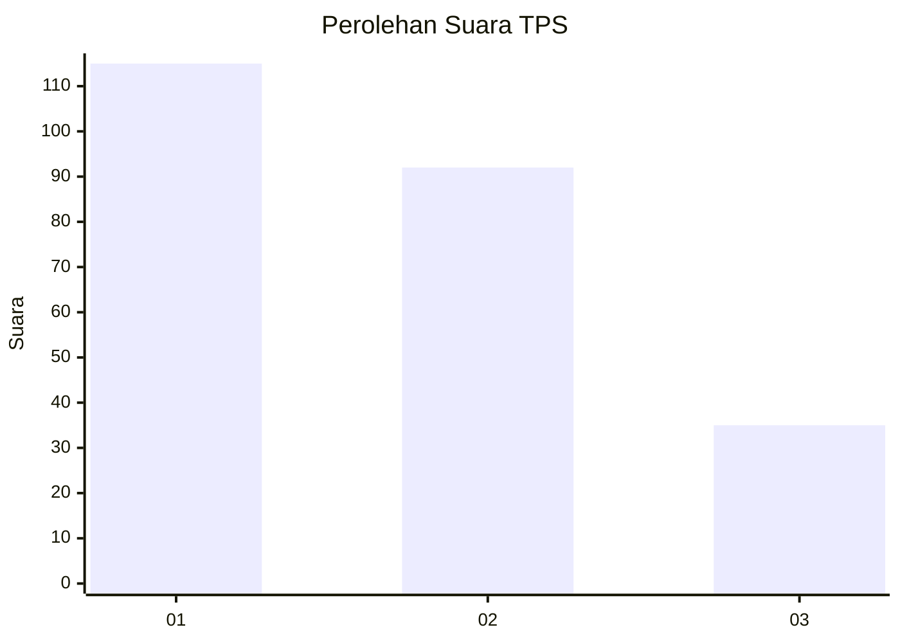
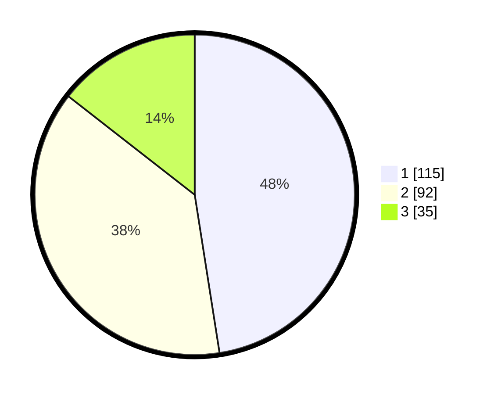

# Hasil

## Grafik

## Tabel

| No. | Nama Paslon    | Suara | Suara (raw) | Persentase |
|:--- |:-------------- | -----:| -----------:| ----------:|
| 1   | ANIES MUHAIMIN | 115   | [115][p-1]  | 47,52      |
| 2   | PRABOWO GIBRAN | 92    | [92][p-2]   | 38,02      |
| 3   | GANJAR MAHFUD  | 35    | [35][p-3]   | 14,46      |

[p-1]: https://github.com/gigit-pemilu/pemilu-2024/blob/main/pilpres/hitung-suara/sub/35-jawa-timur/sub/07-malang/sub/22-dau/sub/2008-mulyoagung/sub/021-tps/sub/paslon-1.txt
[p-2]: https://github.com/gigit-pemilu/pemilu-2024/blob/main/pilpres/hitung-suara/sub/35-jawa-timur/sub/07-malang/sub/22-dau/sub/2008-mulyoagung/sub/021-tps/sub/paslon-2.txt
[p-3]: https://github.com/gigit-pemilu/pemilu-2024/blob/main/pilpres/hitung-suara/sub/35-jawa-timur/sub/07-malang/sub/22-dau/sub/2008-mulyoagung/sub/021-tps/sub/paslon-3.txt

## Foto C Plano

https://sirekap-obj-formc.kpu.go.id/f464/pemilu/ppwp/35/07/22/20/08/3507222008021-20240215-011919--3190d30d-3290-478a-b11c-d1561f438a06.jpg

https://sirekap-obj-formc.kpu.go.id/f464/pemilu/ppwp/35/07/22/20/08/3507222008021-20240215-012212--63c21697-4a7c-426f-99ef-ea7f38f2d808.jpg

https://sirekap-obj-formc.kpu.go.id/f464/pemilu/ppwp/35/07/22/20/08/3507222008021-20240215-012321--2fa6cb19-16d4-4f68-b606-c8575a6dbc1c.jpg

## Metadata

| Key        | Value               |
| ---------- | ------------------- |
| Time Stamp | 2024-02-25 16:00:00 |

