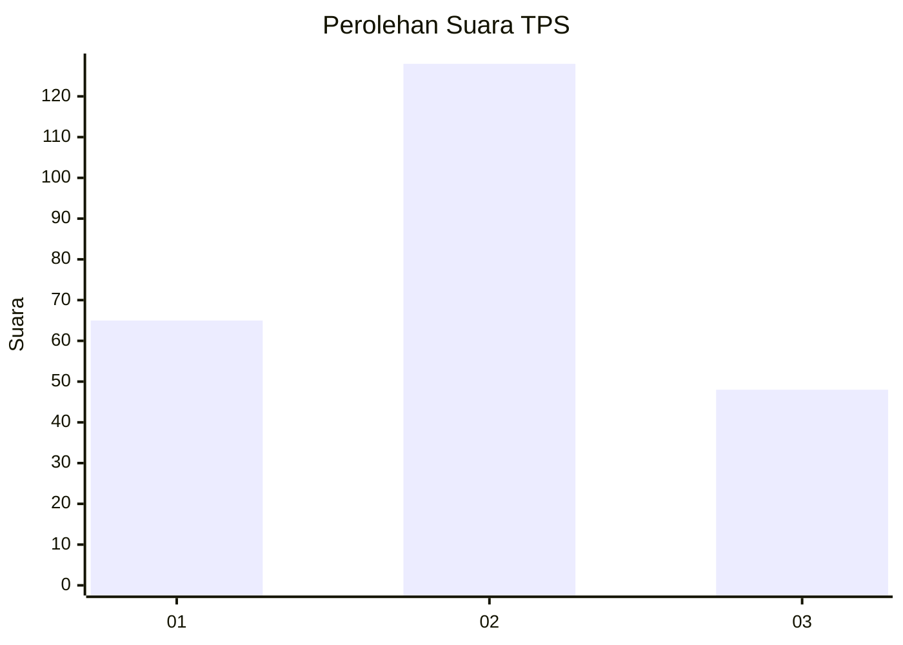
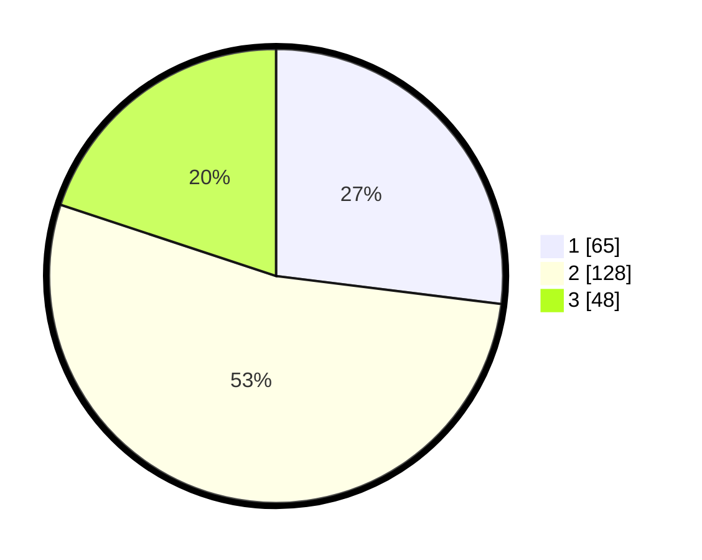

# Hasil

## Grafik

## Tabel

| No. | Nama Paslon    | Suara | Suara (raw) | Persentase |
|:--- |:-------------- | -----:| -----------:| ----------:|
| 1   | ANIES MUHAIMIN | 65    | [65][p-1]   | 26,97      |
| 2   | PRABOWO GIBRAN | 128   | [128][p-2]  | 53,11      |
| 3   | GANJAR MAHFUD  | 48    | [48][p-3]   | 19,92      |

[p-1]: https://github.com/gigit-pemilu/pemilu-2024/blob/main/pilpres/hitung-suara/sub/35-jawa-timur/sub/07-malang/sub/22-dau/sub/2008-mulyoagung/sub/022-tps/sub/paslon-1.txt
[p-2]: https://github.com/gigit-pemilu/pemilu-2024/blob/main/pilpres/hitung-suara/sub/35-jawa-timur/sub/07-malang/sub/22-dau/sub/2008-mulyoagung/sub/022-tps/sub/paslon-2.txt
[p-3]: https://github.com/gigit-pemilu/pemilu-2024/blob/main/pilpres/hitung-suara/sub/35-jawa-timur/sub/07-malang/sub/22-dau/sub/2008-mulyoagung/sub/022-tps/sub/paslon-3.txt

## Foto C Plano

https://sirekap-obj-formc.kpu.go.id/e78b/pemilu/ppwp/35/07/22/20/08/3507222008022-20240215-001311--d14f4b44-c77f-4e80-9d7a-ffdbc6ecf37e.jpg

https://sirekap-obj-formc.kpu.go.id/e78b/pemilu/ppwp/35/07/22/20/08/3507222008022-20240215-001423--f6b9c815-5b97-44a4-9c13-d10765dfc704.jpg

https://sirekap-obj-formc.kpu.go.id/e78b/pemilu/ppwp/35/07/22/20/08/3507222008022-20240215-001507--16402dba-303c-4297-9583-338ee9340196.jpg

## Metadata

| Key        | Value               |
| ---------- | ------------------- |
| Time Stamp | 2024-02-25 22:00:00 |

