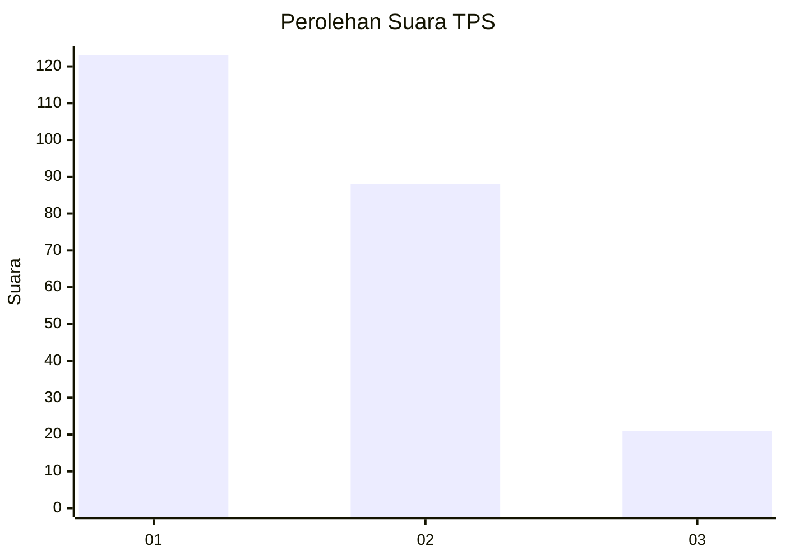
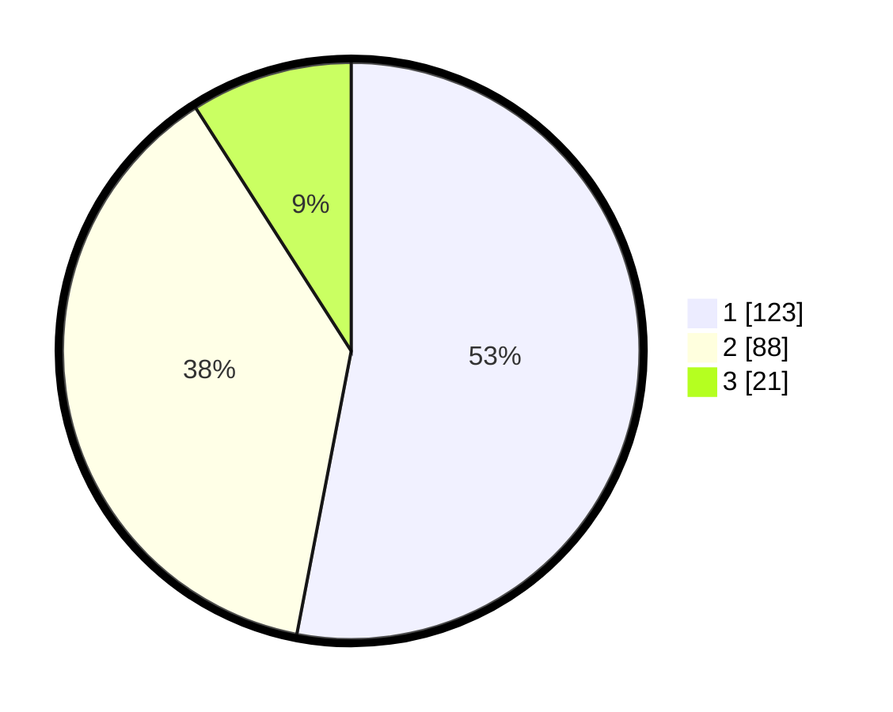

# Hasil

## Grafik

## Tabel

| No. | Nama Paslon    | Suara | Suara (raw) | Persentase |
|:--- |:-------------- | -----:| -----------:| ----------:|
| 1   | ANIES MUHAIMIN | 123   | [123][p-1]  | 53,02      |
| 2   | PRABOWO GIBRAN | 88    | [88][p-2]   | 37,93      |
| 3   | GANJAR MAHFUD  | 21    | [21][p-3]   | 9,05       |

[p-1]: https://github.com/gigit-pemilu/pemilu-2024-35-jawa-timur/blob/main/pilpres/hitung-suara/sub/35-jawa-timur/sub/07-malang/sub/22-dau/sub/2008-mulyoagung/sub/036-tps/sub/paslon-1.txt
[p-2]: https://github.com/gigit-pemilu/pemilu-2024-35-jawa-timur/blob/main/pilpres/hitung-suara/sub/35-jawa-timur/sub/07-malang/sub/22-dau/sub/2008-mulyoagung/sub/036-tps/sub/paslon-2.txt
[p-3]: https://github.com/gigit-pemilu/pemilu-2024-35-jawa-timur/blob/main/pilpres/hitung-suara/sub/35-jawa-timur/sub/07-malang/sub/22-dau/sub/2008-mulyoagung/sub/036-tps/sub/paslon-3.txt

## Foto C Plano

https://sirekap-obj-formc.kpu.go.id/995f/pemilu/ppwp/35/07/22/20/08/3507222008036-20240214-194244--7947b9bd-2f4d-4be9-8f01-b15aad793b4f.jpg

https://sirekap-obj-formc.kpu.go.id/995f/pemilu/ppwp/35/07/22/20/08/3507222008036-20240214-202522--a8714396-d986-4aea-98fe-22f9515360b0.jpg

https://sirekap-obj-formc.kpu.go.id/995f/pemilu/ppwp/35/07/22/20/08/3507222008036-20240214-201907--93cddab0-72eb-4f05-8170-253cc653aa90.jpg

## Metadata

| Key        | Value               |
| ---------- | ------------------- |
| Time Stamp | 2024-02-25 00:00:00 |

