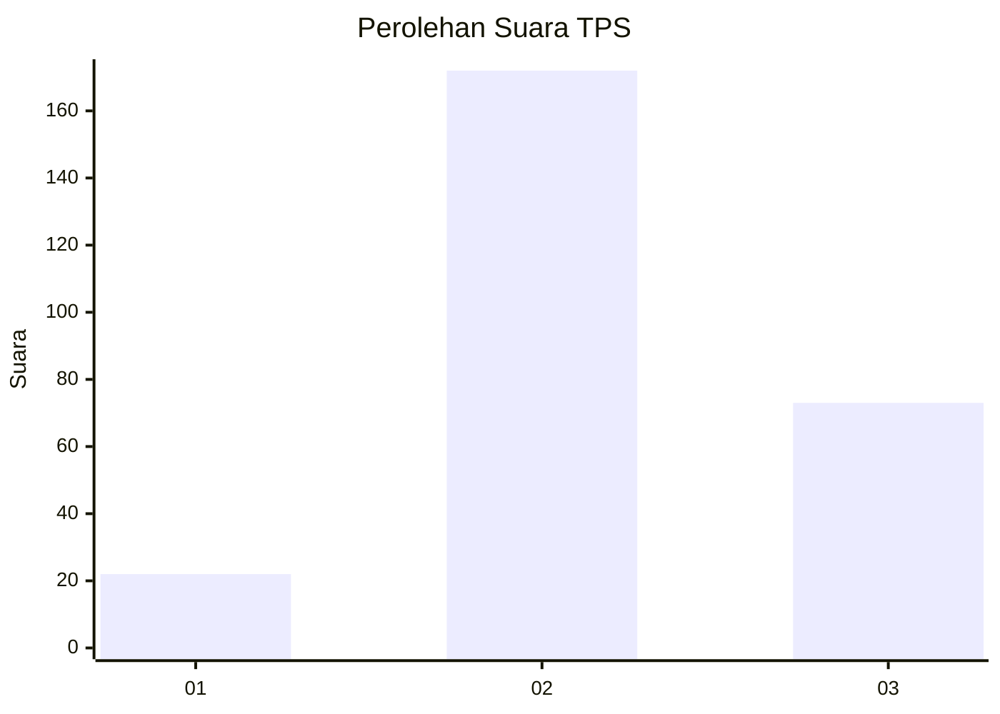

# Hasil

## Grafik

## Tabel

| No. | Nama Paslon    | Suara | Suara (raw) | Persentase |
|:--- |:-------------- | -----:| -----------:| ----------:|
| 1   | ANIES MUHAIMIN | 22    | [22][p-1]   | 8,24       |
| 2   | PRABOWO GIBRAN | 172   | [172][p-2]  | 64,42      |
| 3   | GANJAR MAHFUD  | 73    | [73][p-3]   | 27,34      |

[p-1]: https://github.com/gigit-pemilu/pemilu-2024-35-jawa-timur/blob/main/pilpres/hitung-suara/sub/35-jawa-timur/sub/07-malang/sub/22-dau/sub/2009-gadingkulon/sub/004-tps/sub/paslon-1.txt
[p-2]: https://github.com/gigit-pemilu/pemilu-2024-35-jawa-timur/blob/main/pilpres/hitung-suara/sub/35-jawa-timur/sub/07-malang/sub/22-dau/sub/2009-gadingkulon/sub/004-tps/sub/paslon-2.txt
[p-3]: https://github.com/gigit-pemilu/pemilu-2024-35-jawa-timur/blob/main/pilpres/hitung-suara/sub/35-jawa-timur/sub/07-malang/sub/22-dau/sub/2009-gadingkulon/sub/004-tps/sub/paslon-3.txt

## Foto C Plano

https://sirekap-obj-formc.kpu.go.id/f075/pemilu/ppwp/35/07/22/20/09/3507222009004-20240214-224839--32439030-d57f-429d-9f83-85336f77c4b9.jpg

https://sirekap-obj-formc.kpu.go.id/f075/pemilu/ppwp/35/07/22/20/09/3507222009004-20240214-224958--95a805cf-b339-47f0-b9e4-82845376e234.jpg

https://sirekap-obj-formc.kpu.go.id/f075/pemilu/ppwp/35/07/22/20/09/3507222009004-20240214-225046--7a6915c0-7a78-4449-afcf-43bcb4525c39.jpg

## Metadata

| Key        | Value               |
| ---------- | ------------------- |
| Time Stamp | 2024-02-25 11:00:00 |

